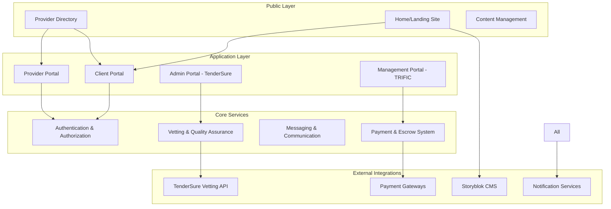

# Getting Started with TRIFIC Platform

Welcome to the TRIFIC Platform! This comprehensive guide will help you understand our marketplace ecosystem, set up your environment, and start using the platform effectively.

## What is TRIFIC Platform?

TRIFIC is a revolutionary curated marketplace that connects corporate clients with pre-qualified service providers through a unique direct engagement model. Unlike traditional bidding platforms, TRIFIC eliminates the need for clients to post jobs and wait for bids - instead, they can directly engage with pre-vetted providers.

### Core Value Propositions

🎯 **For Clients**

-   Access to pre-vetted, high-quality service providers
-   No bidding wars or lengthy selection processes
-   Secure escrow payments with milestone-based releases
-   Direct engagement with transparent pricing

🎯 **For Providers**

-   Skip the vetting queue with TenderSure pre-qualification
-   Access to enterprise clients without bidding
-   Guaranteed payment through escrow system
-   Professional growth through quarterly re-evaluations

🎯 **For the Ecosystem**

-   Quality assurance through rigorous vetting
-   Secure transactions with built-in dispute resolution
-   Transparent rating and review system
-   Continuous improvement through feedback loops

## Platform Architecture Overview



## User Roles & Portals

### 1. **Client Portal** - Corporate Buyers

**Who**: Companies seeking professional services
**Access**: Direct registration with KYC verification
**Key Functions**:

-   Browse vetted provider directory
-   Post job opportunities (optional)
-   Initiate direct provider contracts
-   Manage payments and escrow
-   Track project progress
-   Rate and review providers

### 2. **Provider Portal** - Service Providers

**Who**: Individual professionals and service companies
**Access**: Registration + TenderSure vetting process
**Key Functions**:

-   Complete rigorous onboarding and vetting
-   Manage business profile and portfolio
-   Browse available job opportunities
-   Accept direct contract invitations
-   Submit work and track payments
-   Maintain quality certifications

### 3. **Admin Portal** - TenderSure Team

**Who**: TenderSure staff responsible for vetting
**Access**: Organizational access with role-based permissions
**Key Functions**:

-   Manage provider vetting workflows
-   Conduct quarterly re-evaluations
-   Maintain quality standards and criteria
-   Handle vetting appeals and exceptions
-   Generate compliance reports

### 4. **Management Portal** - TRIFIC Leadership

**Who**: TRIFIC executive and operational teams
**Access**: Internal access with administrative privileges  
**Key Functions**:

-   Platform oversight and analytics
-   Financial operations management
-   Dispute resolution and mediation
-   Strategic planning and reporting
-   System administration

## Quick Start Paths

Choose your journey based on your role:

### 🚀 **I'm a Developer/Integrator**

**Time to first API call: 5 minutes**

1. [Quick Start (5 min)](/getting-started/quick-start) - Get API access and make first calls
2. [API Documentation](/api/) - Explore endpoints and integration patterns
3. [Integration Guides](/integrations/) - Connect with external systems
4. [SDK Documentation](/api/sdks) - Use our official SDKs

### 🏢 **I'm a Client (Buyer)**

**Time to first provider engagement: 15 minutes**

1. [Client Registration](/portals/client/) - Set up your company account
2. [Provider Discovery](/portals/client/provider-discovery/) - Find vetted providers
3. [Contract Management](/portals/client/contract-management/) - Engage providers directly
4. [Payment Setup](/portals/client/payments/) - Configure escrow and billing

### 👨‍💼 **I'm a Service Provider**

**Time to platform approval: 5-7 business days**

1. [Provider Registration](/portals/provider/onboarding/) - Start your application
2. [Vetting Process](/portals/provider/vetting-process/) - Complete TenderSure evaluation
3. [Profile Setup](/portals/provider/profile-management/) - Build your business profile
4. [Finding Work](/portals/provider/job-board/) - Discover opportunities

### ⚙️ **I'm Platform Admin/Management**

**Role-specific access required**

1. [Admin Portal](/portals/admin/) - TenderSure vetting management
2. [Management Portal](/portals/management/) - Platform oversight and operations
3. [Technical Documentation](/technical/) - System architecture and deployment
4. [Monitoring & Analytics](/technical/monitoring/) - Platform health and metrics

## Key Concepts to Understand

### The Vetting Difference

Unlike other marketplaces, every provider is pre-vetted by TenderSure:

-   **Comprehensive Evaluation**: Business verification, skill assessment, background checks
-   **Scoring System**: Standardized quality metrics and thresholds
-   **Continuous Monitoring**: Quarterly re-evaluations ensure ongoing quality
-   **Transparent Results**: Clear pass/fail with detailed feedback

### Direct Engagement Model

Clients don't need to post jobs and wait for bids:

-   **Browse & Select**: Explore provider profiles with transparent pricing
-   **Direct Contact**: Initiate conversations without intermediaries
-   **Custom Contracts**: Negotiate terms directly with chosen providers
-   **Milestone Management**: Structure payments around deliverable milestones

### Secure Payment Ecosystem

Built-in escrow protects both parties:

-   **Automatic Escrow**: Client deposits are held securely
-   **Milestone Releases**: Payments released upon work completion
-   **Multi-Gateway Support**: Flexible payment options for global users
-   **Dispute Resolution**: Built-in mediation for conflict resolution

## Installation & Setup

### System Requirements

-   **Browsers**: Chrome 90+, Firefox 88+, Safari 14+, Edge 90+
-   **API Integration**: RESTful APIs with JWT authentication
-   **Mobile**: Responsive web design, native apps coming soon
-   **Development**: Node.js 18+, Python 3.8+, modern web frameworks

### Development Environment

```bash
# Quick setup with Docker
git clone https://github.com/trific-platform/quick-start
cd quick-start
docker-compose up -d

# Platform available at http://localhost:3000
```

For detailed installation instructions: [Installation Guide](/getting-started/installation)

## Essential Resources

### Documentation

-   **[API Reference](/api/)** - Complete API documentation
-   **[Portal Guides](/portals/)** - User interface documentation
-   **[Workflows](/workflows/)** - Business process documentation
-   **[Integration Guides](/integrations/)** - Third-party integrations

### Support & Community

-   **[FAQ](/support/faq)** - Frequently asked questions
-   **[Troubleshooting](/getting-started/troubleshooting)** - Common issue resolution
-   **[Community Forum](https://community.trific.platform)** - User discussions
-   **[Developer Discord](https://discord.gg/trific-dev)** - Real-time developer support

### Business Resources

-   **[User Handbooks](/guides/user-guides/)** - Role-specific best practices
-   **[Video Tutorials](/support/)** - Visual learning resources
-   **[Case Studies](/support/)** - Success stories and use cases
-   **[Pricing Information](/home-landing/content-pages/pricing)** - Platform costs and fees

## What's Next?

1. **Choose Your Path**: Select the quick start guide for your role above
2. **Complete Setup**: Follow the installation and configuration steps
3. **Explore Features**: Dive into your relevant portal documentation
4. **Join Community**: Connect with other users and get support
5. **Provide Feedback**: Help us improve the platform experience

---

**Ready to get started?** Choose your role above and begin your TRIFIC Platform journey!

**Need help?** Our support team is available at support@trific.platform or through the in-app chat.

-   [API Reference](/api/)
-   [Architecture Overview](/architecture/)

## Technology Stack

| Component    | Technology            |
| ------------ | --------------------- |
| Backend      | Django 4.2 + DRF      |
| Frontend     | Vue.js 3 + TypeScript |
| Database     | PostgreSQL 15         |
| Cache        | Redis 7               |
| Messaging    | Django Channels       |
| File Storage | AWS S3                |
