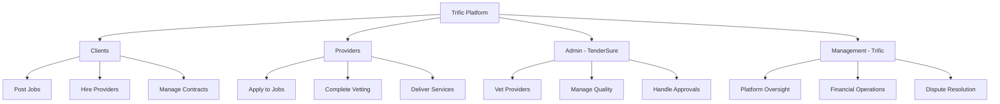

# Quick Start (5 Minutes)

Get up and running with the Trific Platform in just 5 minutes! This guide will have you making your first API call and understanding the core concepts quickly.

## Prerequisites

-   Node.js 18.0.0 or higher
-   npm 9.0.0 or higher
-   Text editor or IDE
-   Modern web browser

## Step 1: Environment Setup (1 minute)

### Option A: Docker Setup (Recommended)

```bash
# Clone the starter template
git clone https://github.com/trific-platform/quick-start-template
cd quick-start-template

# Start with Docker
docker-compose up -d

# The platform will be available at http://localhost:3000
```

### Option B: Local Setup

```bash
# Install dependencies
npm install @trific/platform-sdk

# Create environment file
cp .env.example .env

# Edit .env with your configuration
TRIFIC_API_URL=https://api.trific.platform/v1
TRIFIC_API_KEY=your_api_key_here
```

## Step 2: Get Your API Key (1 minute)

1. **Sign up** at [platform.trific.com](https://platform.trific.com)
2. **Verify your email** and complete basic profile
3. Navigate to **Settings → API Keys**
4. Click **"Generate API Key"**
5. Copy your key and save it securely

**Important**: Store your API key safely - it won't be shown again!

## Step 3: First API Call (1 minute)

Test your setup with a simple API call:

```bash
# Test API connectivity
curl -H "Authorization: Bearer YOUR_API_KEY" \
     -H "Content-Type: application/json" \
     https://api.trific.platform/v1/auth/verify

# Expected response:
# {
#   "status": "success",
#   "user": { ... },
#   "permissions": [ ... ]
# }
```

### Using the SDK

```javascript
// Initialize the SDK
const TrificSDK = require("@trific/platform-sdk");

const client = new TrificSDK({
	apiKey: process.env.TRIFIC_API_KEY,
	baseUrl: "https://api.trific.platform/v1",
});

// Test connection
async function testConnection() {
	try {
		const user = await client.auth.verify();
		console.log("Connected successfully:", user.email);
	} catch (error) {
		console.error("Connection failed:", error.message);
	}
}

testConnection();
```

## Step 4: Core Concepts (2 minutes)

### Understanding User Roles

The Trific Platform has four primary user types:



### Key Platform Flows

1. **Provider Vetting**: All providers undergo TenderSure evaluation
2. **Job Lifecycle**: From posting to completion with escrow
3. **Payment Flow**: Secure escrow with milestone-based releases
4. **Communication**: Built-in messaging and file sharing

## Step 5: Your First Actions

Choose your path based on your role:

### For Developers/Integrators

**Explore Available Endpoints:**

```bash
# List all providers
curl -H "Authorization: Bearer YOUR_API_KEY" \
     https://api.trific.platform/v1/providers

# Get service categories
curl -H "Authorization: Bearer YOUR_API_KEY" \
     https://api.trific.platform/v1/categories

# Create a test job posting
curl -X POST \
     -H "Authorization: Bearer YOUR_API_KEY" \
     -H "Content-Type: application/json" \
     -d '{"title": "Test Project", "category": "web-development", "budget": 1000}' \
     https://api.trific.platform/v1/jobs
```

### For Clients

**Start hiring providers:**

1. Browse vetted providers at [platform.trific.com/providers](https://platform.trific.com/providers)
2. Post your first job or directly engage a provider
3. Set up milestone-based payments with escrow

### For Providers

**Begin your vetting journey:**

1. Complete your business profile with portfolio samples
2. Upload required certifications and documents
3. Pay vetting fee and submit for TenderSure evaluation
4. Once approved, start bidding on jobs

## Next Steps

Now that you're set up, dive deeper:

### Essential Reading

-   [First Steps Guide](/getting-started/first-steps) - Complete setup walkthrough
-   [API Documentation](/api/) - Full API reference
-   [User Portal Guides](/portals/) - Portal-specific tutorials

### Common Use Cases

-   **[Client Onboarding](/workflows/client-journey/)** - Complete client journey
-   **[Provider Onboarding](/workflows/provider-onboarding/)** - Provider approval process
-   **[Payment Processing](/workflows/payment-escrow-flow/)** - Understanding escrow flows

### Advanced Features

-   **[Webhooks](/api/webhooks/)** - Real-time event notifications
-   **[Integration Guides](/integrations/)** - Third-party integrations
-   **[Custom Development](/guides/development/)** - Building on Trific

## Need Help?

-   **Documentation**: Browse our comprehensive guides
-   **API Explorer**: Interactive API testing at [api.trific.platform](https://api.trific.platform)
-   **Support**: Email support@trific.platform or use in-app chat
-   **Community**: Join our developer Discord for peer support

## Sample Project

Want to see a complete example? Check out our sample projects:

-   **[Client Dashboard](https://github.com/trific-platform/client-dashboard-example)** - React-based client interface
-   **[Provider App](https://github.com/trific-platform/provider-mobile-app)** - React Native provider app
-   **[Integration Examples](https://github.com/trific-platform/integration-examples)** - Various integration patterns

---

**Congratulations!** 🎉 You now have the Trific Platform running and understand the core concepts. Ready to build something amazing?

[Continue to First Steps →](/getting-started/first-steps)
