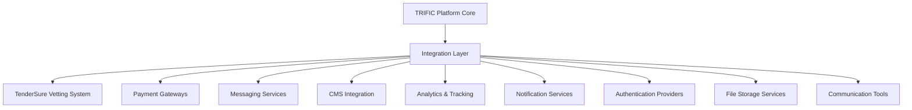

# Platform Integrations

The TRIFIC platform seamlessly integrates with numerous external services and systems to provide a comprehensive, feature-rich marketplace experience. This section documents all integration capabilities, APIs, and third-party service connections.

## Integration Architecture



## Core Integrations

### 🔍 [TenderSure Integration](./tendersure/)

Comprehensive integration with the TenderSure provider vetting and qualification system.

-   **Provider Verification**: Automated background checks and credential validation
-   **Skills Assessment**: Technical competency testing and evaluation
-   **Quality Scoring**: Comprehensive provider scoring and ranking system
-   **Continuous Monitoring**: Ongoing provider performance evaluation

### 💳 [Payment Gateway Integration](./payment-gateways/)

Multi-gateway payment processing with global coverage and local payment methods.

-   **Stripe Integration**: Primary payment processor with global coverage
-   **PayPal Integration**: Alternative payment processing and digital wallet support
-   **Regional Gateways**: Local payment processors for specific markets
-   **Escrow Management**: Secure fund holding and milestone-based releases

### 📧 [Messaging & Communication](./messaging/)

Integrated communication systems for seamless client-provider interaction.

-   **Email Services**: Transactional email and marketing automation
-   **SMS Services**: Global SMS delivery and two-factor authentication
-   **Video Conferencing**: Integrated video calling and screen sharing
-   **File Sharing**: Secure document and asset sharing capabilities

### 📝 [Content Management System](./cms-content/)

Storyblok CMS integration for dynamic content management and optimization.

-   **Storyblok CMS**: Headless CMS for flexible content management
-   **Content Delivery**: Global CDN integration for fast content delivery
-   **SEO Optimization**: Automated SEO optimization and meta tag management
-   **Multi-language Support**: Internationalization and localization capabilities

## Business Intelligence & Analytics

### 📊 [Analytics Integration](./analytics/)

Comprehensive analytics and business intelligence platform integration.

-   **Google Analytics**: Web analytics and user behavior tracking
-   **Mixpanel**: Advanced product analytics and user journey tracking
-   **Custom Analytics**: Platform-specific analytics and reporting
-   **Business Intelligence**: Executive dashboards and strategic reporting

### 📱 [Notification Services](./notification-services/)

Multi-channel notification and communication delivery systems.

-   **Push Notifications**: Mobile app push notification delivery
-   **Email Automation**: Marketing automation and transactional emails
-   **SMS Gateway**: Global SMS delivery and verification services
-   **In-App Notifications**: Real-time platform notification system

## Authentication & Security

### 🔐 [Identity Providers](./identity-providers/)

Comprehensive authentication and identity management integration.

-   **OAuth 2.0/OIDC**: Industry-standard authentication protocols
-   **Social Login**: Google, Facebook, LinkedIn, GitHub integration
-   **Enterprise SSO**: SAML and enterprise identity provider integration
-   **Multi-Factor Authentication**: Enhanced security through MFA integration

### 🛡️ [Security Services](./security-services/)

Advanced security and compliance service integration.

-   **Fraud Detection**: AI-powered fraud detection and prevention
-   **Identity Verification**: KYC/AML compliance and identity validation
-   **Security Monitoring**: Real-time security monitoring and threat detection
-   **Compliance Management**: Regulatory compliance and audit trail management

## Development & Operations

### ⚙️ [CI/CD Integration](./cicd/)

Continuous integration and deployment pipeline integration.

-   **GitHub Actions**: Automated testing and deployment workflows
-   **Docker Integration**: Containerization and deployment automation
-   **Monitoring Integration**: Application performance and error monitoring
-   **Quality Assurance**: Automated testing and code quality enforcement

### 📊 [Monitoring & Observability](./monitoring/)

Comprehensive platform monitoring and observability integration.

-   **Application Performance Monitoring**: Real-time application performance tracking
-   **Infrastructure Monitoring**: Server and infrastructure health monitoring
-   **Log Management**: Centralized logging and log analysis
-   **Error Tracking**: Automated error detection and notification

## Specialized Integrations

### 🏢 [CRM Integration](./crm/)

Customer relationship management and sales process integration.

-   **Salesforce Integration**: Enterprise CRM and sales pipeline management
-   **HubSpot Integration**: Marketing automation and lead management
-   **Custom CRM**: Tailored CRM integration for specific business needs
-   **Contact Synchronization**: Automated contact and interaction synchronization

### 💼 [ERP Integration](./erp/)

Enterprise resource planning and business process integration.

-   **Financial System Integration**: Accounting and financial management integration
-   **HR System Integration**: Human resources and payroll system integration
-   **Inventory Management**: Resource and inventory tracking integration
-   **Business Process Automation**: End-to-end business process integration

## Integration Standards & Protocols

### API Integration Framework

```typescript
interface IntegrationFramework {
	standardProtocols: {
		restAPI: RESTAPISpecification;
		graphQL: GraphQLAPISpecification;
		webhooks: WebhookSpecification;
		oauth: OAuthImplementation;
	};

	dataFormats: {
		json: JSONStandards;
		xml: XMLStandards;
		csv: CSVStandards;
		binary: BinaryDataHandling;
	};

	securityStandards: {
		encryption: EncryptionStandards;
		authentication: AuthenticationStandards;
		authorization: AuthorizationFramework;
		auditTrails: AuditingStandards;
	};

	qualityAssurance: {
		testing: IntegrationTesting;
		monitoring: IntegrationMonitoring;
		errorHandling: ErrorManagement;
		performance: PerformanceStandards;
	};
}
```

### Integration Best Practices

#### Development Standards

-   **API-First Design**: Design integrations with API-first methodology
-   **Version Management**: Systematic API versioning and backward compatibility
-   **Error Handling**: Comprehensive error handling and recovery procedures
-   **Documentation**: Complete integration documentation and examples

#### Security Requirements

-   **Authentication**: Secure authentication for all integration endpoints
-   **Authorization**: Granular authorization and permission management
-   **Data Protection**: End-to-end data encryption and privacy protection
-   **Audit Logging**: Complete audit trail for all integration activities

#### Performance Optimization

-   **Caching Strategy**: Intelligent caching for improved integration performance
-   **Rate Limiting**: Proper rate limiting and throttling implementation
-   **Asynchronous Processing**: Non-blocking integration patterns for scalability
-   **Monitoring**: Real-time monitoring of integration performance and health

## Integration Management

### Integration Lifecycle

1. **Planning & Design**: Requirements analysis and integration architecture design
2. **Development**: Integration development and testing in sandbox environments
3. **Testing**: Comprehensive integration testing and validation
4. **Deployment**: Production deployment with monitoring and rollback capabilities
5. **Monitoring**: Ongoing monitoring, maintenance, and optimization

### Integration Governance

-   **Standards Compliance**: Adherence to integration standards and best practices
-   **Security Review**: Security assessment and approval for all integrations
-   **Performance Validation**: Performance testing and optimization requirements
-   **Documentation**: Complete documentation and change management procedures

## Future Integration Roadmap

### Emerging Technologies

-   **Blockchain Integration**: Exploring blockchain for trust and transparency
-   **AI/ML Services**: Advanced AI and machine learning service integration
-   **IoT Connectivity**: Internet of Things device and sensor integration
-   **Edge Computing**: Edge computing integration for improved performance

### Market Expansion

-   **Regional Integrations**: Local payment methods and services for global expansion
-   **Industry-Specific**: Specialized integrations for specific industry verticals
-   **Compliance Integrations**: Regional compliance and regulatory requirement integrations
-   **Cultural Adaptation**: Cultural and language-specific service integrations
