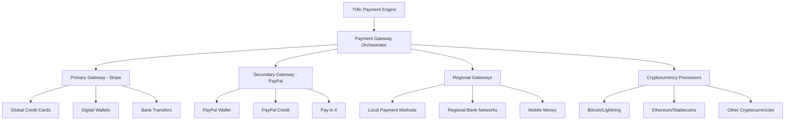
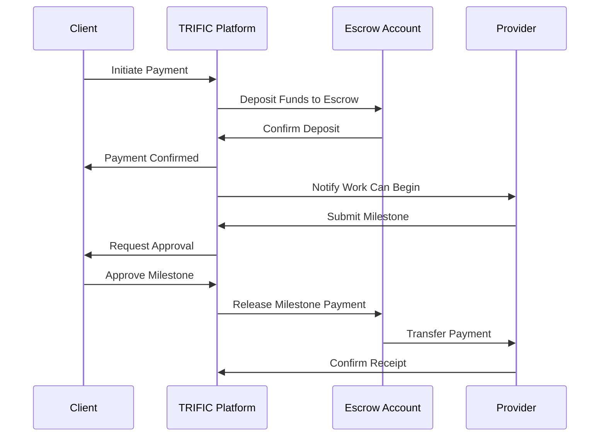

# Payment Gateway Integration

The TRIFIC platform integrates with multiple payment gateways to provide secure, reliable, and globally accessible payment processing. Our multi-gateway approach ensures high availability, competitive rates, and support for diverse payment methods worldwide.

## Payment Architecture



## Gateway Integration Overview

### Primary Payment Gateway: Stripe

#### Core Capabilities

-   **Global Coverage**: 46+ countries with local payment method support
-   **Comprehensive API**: Full-featured REST API with webhooks and real-time events
-   **Security Compliance**: PCI DSS Level 1 certified with advanced fraud detection
-   **Developer Experience**: Extensive documentation, SDKs, and testing tools

#### Stripe Integration Features

```typescript
interface StripeIntegration {
	paymentProcessing: {
		cardPayments: CardPaymentConfig;
		digitalWallets: DigitalWalletConfig;
		bankTransfers: BankTransferConfig;
		buyNowPayLater: BNPLConfig;
	};

	subscriptionManagement: {
		recurringPayments: SubscriptionConfig;
		usageBasedBilling: UsageBasedConfig;
		invoicing: InvoicingConfig;
		taxCalculation: TaxConfig;
	};

	marketplaceFeatures: {
		escrowManagement: EscrowConfig;
		splitPayments: SplitPaymentConfig;
		platformFees: PlatformFeeConfig;
		providerPayouts: PayoutConfig;
	};

	businessIntelligence: {
		realtimeReporting: ReportingConfig;
		fraudDetection: FraudConfig;
		disputeManagement: DisputeConfig;
		complianceTools: ComplianceConfig;
	};
}
```

### Secondary Payment Gateway: PayPal

#### Integration Strategy

-   **Payment Diversification**: Alternative payment processing for redundancy
-   **Wallet Integration**: PayPal wallet and ecosystem integration
-   **Buy Now, Pay Later**: PayPal Pay in 4 and credit options
-   **International Coverage**: Strong international presence and local payment methods

#### PayPal Integration Components

```typescript
interface PayPalIntegration {
	corePayments: {
		paypalWallet: PayPalWalletConfig;
		cardProcessing: PayPalCardConfig;
		expressCheckout: ExpressCheckoutConfig;
		paypalCredit: PayPalCreditConfig;
	};

	merchantServices: {
		invoicing: PayPalInvoicingConfig;
		subscriptions: PayPalSubscriptionConfig;
		marketplacePayments: PayPalMarketplaceConfig;
		payouts: PayPalPayoutConfig;
	};

	buyNowPayLater: {
		payIn4: PayIn4Config;
		paypalCredit: PayPalCreditConfig;
		installments: InstallmentConfig;
		creditApplications: CreditAppConfig;
	};
}
```

## Escrow Management System

### Escrow Architecture

#### Secure Fund Management

```typescript
interface EscrowSystem {
	escrowAccounts: {
		clientEscrowAccount: EscrowAccount;
		platformEscrowAccount: EscrowAccount;
		providerEscrowAccount: EscrowAccount;
		disputeEscrowAccount: EscrowAccount;
	};

	escrowOperations: {
		fundDeposit: EscrowDeposit;
		milestoneRelease: MilestoneRelease;
		disputeHold: DisputeHold;
		refundProcessing: RefundProcessing;
	};

	complianceFeatures: {
		antiMoneyLaundering: AMLCompliance;
		knowYourCustomer: KYCCompliance;
		fraudMonitoring: FraudMonitoring;
		auditTrails: AuditTrailConfig;
	};
}
```

#### Escrow Workflow



### Milestone-Based Payments

#### Payment Structure

-   **Initial Deposit**: Full project amount held in escrow upon contract signing
-   **Milestone Releases**: Graduated payments based on completed milestones
-   **Final Release**: Final payment upon project completion and client approval
-   **Dispute Protection**: Funds held during dispute resolution processes

#### Milestone Configuration

```typescript
interface MilestonePayment {
	milestoneId: string;
	description: string;
	amount: number;
	currency: string;
	dueDate: Date;

	approvalCriteria: {
		deliverables: Deliverable[];
		qualityStandards: QualityStandard[];
		clientApprovalRequired: boolean;
		automaticReleaseDelay: number; // hours
	};

	releaseConditions: {
		clientApproval: boolean;
		qualityCheck: boolean;
		platformReview: boolean;
		timeoutRelease: boolean;
	};

	disputeProtection: {
		disputeWindow: number; // days
		arbitrationAvailable: boolean;
		refundEligibility: RefundEligibility;
		escrowHoldDuration: number; // days
	};
}
```

## Global Payment Methods

### Regional Payment Integration

#### North America

-   **Credit/Debit Cards**: Visa, Mastercard, American Express, Discover
-   **Digital Wallets**: Apple Pay, Google Pay, PayPal, Venmo
-   **Bank Transfers**: ACH, Wire Transfers, Instant Bank Transfers
-   **Buy Now, Pay Later**: Klarna, Affirm, Afterpay, PayPal Pay in 4

#### Europe

-   **SEPA Payments**: Single Euro Payments Area bank transfers
-   **Local Cards**: Carte Bancaire (France), Bancontact (Belgium), iDEAL (Netherlands)
-   **Digital Wallets**: PayPal, Skrill, Neteller, Trustly
-   **Open Banking**: Instant bank verification and payments

#### Asia Pacific

-   **Local Payment Methods**: Alipay, WeChat Pay, GrabPay, DANA
-   **Bank Networks**: UPI (India), FPX (Malaysia), BECS (Australia)
-   **Mobile Wallets**: Paytm, PhonePe, GCash, Touch 'n Go
-   **Cryptocurrency**: Bitcoin, USDT, local crypto exchanges

#### Latin America

-   **Local Cards**: Elo (Brazil), Cartes Bancaires (France), Local Debit
-   **Cash-Based**: OXXO (Mexico), Boleto Bancário (Brazil), PagoEfectivo (Peru)
-   **Bank Transfers**: PIX (Brazil), PSE (Colombia), Khipu (Chile)
-   **Mobile Payments**: MercadoPago, PicPay, Nequi

### Payment Method Configuration

```typescript
interface PaymentMethodConfig {
	region: GeographicRegion;
	supportedMethods: {
		creditCards: CreditCardConfig[];
		digitalWallets: DigitalWalletConfig[];
		bankTransfers: BankTransferConfig[];
		localMethods: LocalPaymentConfig[];
		cryptocurrency: CryptoConfig[];
	};

	processingSettings: {
		primaryGateway: PaymentGateway;
		fallbackGateways: PaymentGateway[];
		currencySupport: Currency[];
		settlementCurrency: Currency;
	};

	riskManagement: {
		fraudDetection: FraudDetectionConfig;
		velocityLimits: VelocityLimitConfig;
		complianceChecks: ComplianceCheckConfig;
		riskScoring: RiskScoringConfig;
	};
}
```

## Advanced Payment Features

### Smart Routing and Optimization

#### Intelligent Gateway Routing

-   **Success Rate Optimization**: Route transactions through gateways with highest success rates
-   **Cost Optimization**: Minimize processing fees through intelligent routing
-   **Regional Optimization**: Route based on geographic location and local preferences
-   **Real-Time Adaptation**: Dynamic routing based on real-time gateway performance

#### Routing Algorithm

```typescript
interface PaymentRouting {
	routingCriteria: {
		successRateWeight: number;
		costWeight: number;
		speedWeight: number;
		reliabilityWeight: number;
		regionalPreferenceWeight: number;
	};

	gatewaySelection: {
		primaryGateway: GatewaySelectionLogic;
		fallbackLogic: FallbackStrategy;
		realTimeOptimization: OptimizationRules;
		performanceMonitoring: PerformanceTracking;
	};

	decisionEngine: {
		machineLearning: MLBasedRouting;
		ruleBasedRouting: RuleBasedLogic;
		manualOverrides: ManualRuleOverrides;
		testingFramework: A_B_Testing;
	};
}
```

### Subscription and Recurring Payments

#### Subscription Management

-   **Flexible Billing Cycles**: Daily, weekly, monthly, quarterly, annual billing
-   **Usage-Based Billing**: Metered billing based on platform usage
-   **Tiered Pricing**: Multiple subscription tiers with different features
-   **Proration and Upgrades**: Automatic proration for mid-cycle changes

#### Subscription Configuration

```typescript
interface SubscriptionManagement {
	billingCycles: {
		recurringBilling: RecurringBillingConfig;
		usageBasedBilling: UsageBasedBillingConfig;
		tieredPricing: TieredPricingConfig;
		customBilling: CustomBillingConfig;
	};

	subscriptionLifecycle: {
		trialPeriods: TrialPeriodConfig;
		gracePeriods: GracePeriodConfig;
		cancellationHandling: CancellationConfig;
		retryLogic: RetryLogicConfig;
	};

	revenueRecognition: {
		revenueScheduling: RevenueScheduleConfig;
		prorationsHandling: ProrationConfig;
		refundManagement: RefundManagementConfig;
		taxCalculation: TaxCalculationConfig;
	};
}
```

### Fraud Detection and Security

#### Multi-Layered Fraud Prevention

-   **Machine Learning Models**: AI-powered fraud detection with real-time scoring
-   **Behavioral Analysis**: User behavior analysis for anomaly detection
-   **Device Fingerprinting**: Device-based fraud detection and risk assessment
-   **Velocity Checking**: Transaction velocity monitoring and limiting

#### Security Implementation

```typescript
interface FraudDetection {
  fraudScoring: {
    machineLearningModels: MLFraudModels;
    ruleBased Detection: RuleBasedFraudDetection;
    behavioralAnalysis: BehavioralFraudAnalysis;
    deviceFingerprinting: DeviceFingerprintingConfig;
  };

  riskManagement: {
    velocityLimits: VelocityLimitingConfig;
    geographicControls: GeographicRiskControls;
    amountLimits: AmountLimitingConfig;
    frequencyLimits: FrequencyLimitingConfig;
  };

  responseActions: {
    automaticDeclines: AutoDeclineRules;
    manualReview: ManualReviewTriggers;
    additionalAuthentication: AuthenticationChallenges;
    accountSuspension: SuspensionRules;
  };
}
```

## Compliance and Regulatory Features

### PCI DSS Compliance

#### Security Standards

-   **Level 1 PCI DSS**: Highest level of payment card industry compliance
-   **Data Encryption**: End-to-end encryption of all payment data
-   **Tokenization**: Secure tokenization of payment credentials
-   **Secure Networks**: Segregated networks and secure data transmission

#### Compliance Management

```typescript
interface PCICompliance {
  dataProtection: {
    encryption: EncryptionStandards;
    tokenization: TokenizationConfig;
    dataMinimization: DataMinimizationPolicies;
    secureStorage: SecureStorageConfig;
  };

  accessControls: {
    roleBasedAccess: RoleBasedAccessConfig;
    authenticationRequirements: AuthenticationConfig;
    auditLogging: AuditLoggingConfig;
    sessionManagement: SessionManagementConfig;
  };

  networkSecurity: {
    firewalConfiguration: FirewallConfig;
    intrusion Detection: IntrusionDetectionConfig;
    vulnerabilityScanning: VulnerabilityConfig;
    penetrationTesting: PenetrationTestingConfig;
  };
}
```

### Anti-Money Laundering (AML)

#### AML Compliance Framework

-   **Customer Due Diligence (CDD)**: Enhanced customer verification and risk assessment
-   **Suspicious Activity Monitoring**: Real-time monitoring for suspicious transactions
-   **Sanctions Screening**: Global sanctions list screening and compliance
-   **Regulatory Reporting**: Automated compliance reporting and audit trails

#### AML Implementation

```typescript
interface AMLCompliance {
	customerDueDiligence: {
		identityVerification: IdentityVerificationConfig;
		riskAssessment: RiskAssessmentConfig;
		enhancedDueDiligence: EnhancedDDConfig;
		continuousMonitoring: ContinuousMonitoringConfig;
	};

	transactionMonitoring: {
		suspiciousActivityDetection: SuspiciousActivityConfig;
		thresholdMonitoring: ThresholdMonitoringConfig;
		patternRecognition: PatternRecognitionConfig;
		riskScoring: TransactionRiskScoringConfig;
	};

	regulatoryCompliance: {
		sanctionsScreening: SanctionsScreeningConfig;
		reportingRequirements: ReportingConfig;
		auditTrails: AMLAuditConfig;
		complianceTraining: ComplianceTrainingConfig;
	};
}
```

## API Integration and Development

### Payment Gateway APIs

#### Unified Payment API

```typescript
interface UnifiedPaymentAPI {
	// Payment processing
	processPayment(paymentRequest: PaymentRequest): Promise<PaymentResponse>;
	capturePayment(paymentId: string): Promise<CaptureResponse>;
	refundPayment(paymentId: string, amount?: number): Promise<RefundResponse>;
	voidPayment(paymentId: string): Promise<VoidResponse>;

	// Escrow management
	createEscrowAccount(
		accountRequest: EscrowAccountRequest
	): Promise<EscrowResponse>;
	depositToEscrow(
		escrowId: string,
		deposit: EscrowDeposit
	): Promise<DepositResponse>;
	releaseFromEscrow(
		escrowId: string,
		release: EscrowRelease
	): Promise<ReleaseResponse>;

	// Subscription management
	createSubscription(
		subscription: SubscriptionRequest
	): Promise<SubscriptionResponse>;
	updateSubscription(
		subscriptionId: string,
		updates: SubscriptionUpdate
	): Promise<UpdateResponse>;
	cancelSubscription(subscriptionId: string): Promise<CancellationResponse>;

	// Reporting and analytics
	getTransactionHistory(
		filters: TransactionFilters
	): Promise<TransactionHistory>;
	getPaymentAnalytics(
		analyticsRequest: AnalyticsRequest
	): Promise<PaymentAnalytics>;
	generateReport(reportRequest: ReportRequest): Promise<PaymentReport>;
}
```

#### Webhook Integration

```typescript
interface PaymentWebhooks {
	transactionEvents: {
		paymentSucceeded: PaymentSucceededWebhook;
		paymentFailed: PaymentFailedWebhook;
		paymentCaptured: PaymentCapturedWebhook;
		paymentRefunded: PaymentRefundedWebhook;
	};

	escrowEvents: {
		escrowDeposited: EscrowDepositedWebhook;
		escrowReleased: EscrowReleasedWebhook;
		disputeInitiated: DisputeInitiatedWebhook;
		disputeResolved: DisputeResolvedWebhook;
	};

	subscriptionEvents: {
		subscriptionCreated: SubscriptionCreatedWebhook;
		subscriptionUpdated: SubscriptionUpdatedWebhook;
		subscriptionCancelled: SubscriptionCancelledWebhook;
		subscriptionRenewed: SubscriptionRenewedWebhook;
	};

	fraudEvents: {
		fraudDetected: FraudDetectedWebhook;
		riskScoreUpdated: RiskScoreUpdatedWebhook;
		manualReviewRequired: ManualReviewWebhook;
		complianceAlert: ComplianceAlertWebhook;
	};
}
```

## Performance and Monitoring

### Payment Performance Monitoring

#### Key Performance Indicators

-   **Success Rate**: Transaction approval rate across different payment methods
-   **Response Time**: Average payment processing response time
-   **Uptime**: Payment gateway availability and uptime monitoring
-   **Error Rate**: Payment processing error rate and failure analysis

#### Monitoring Dashboard

```typescript
interface PaymentMonitoring {
	performanceMetrics: {
		successRate: SuccessRateMetrics;
		responseTime: ResponseTimeMetrics;
		uptimeMonitoring: UptimeMetrics;
		errorRateTracking: ErrorRateMetrics;
	};

	businessMetrics: {
		transactionVolume: VolumeMetrics;
		revenueTracking: RevenueMetrics;
		conversionRate: ConversionMetrics;
		customerSatisfaction: SatisfactionMetrics;
	};

	operationalMetrics: {
		disputeRate: DisputeRateMetrics;
		chargebackRate: ChargebackMetrics;
		refundRate: RefundRateMetrics;
		fraudRate: FraudRateMetrics;
	};

	alerting: {
		performanceAlerts: PerformanceAlertConfig;
		businessAlerts: BusinessAlertConfig;
		securityAlerts: SecurityAlertConfig;
		complianceAlerts: ComplianceAlertConfig;
	};
}
```

### Business Intelligence and Analytics

#### Payment Analytics

-   **Revenue Analysis**: Comprehensive revenue tracking and trend analysis
-   **Customer Behavior**: Payment method preferences and usage patterns
-   **Geographic Analysis**: Regional payment performance and optimization
-   **Seasonal Trends**: Seasonal payment pattern analysis and forecasting

#### Reporting Framework

```typescript
interface PaymentAnalytics {
	revenueAnalytics: {
		totalRevenue: RevenueMetrics;
		revenueTrends: TrendAnalysis;
		revenueByRegion: RegionalAnalysis;
		revenueForecast: ForecastingModels;
	};

	customerAnalytics: {
		paymentMethodPreferences: PreferenceAnalysis;
		customerLifetimeValue: CLVAnalysis;
		churnAnalysis: ChurnPredictionModels;
		segmentationAnalysis: CustomerSegmentation;
	};

	operationalAnalytics: {
		gatewayPerformance: GatewayAnalysis;
		costOptimization: CostAnalysis;
		processingEfficiency: EfficiencyMetrics;
		riskAnalysis: RiskAnalytics;
	};
}
```

## Future Roadmap and Innovation

### Emerging Payment Technologies

#### Blockchain and Cryptocurrency

-   **Cryptocurrency Support**: Bitcoin, Ethereum, stablecoins, and major altcoins
-   **DeFi Integration**: Decentralized finance protocol integration
-   **Smart Contracts**: Automated contract execution and payment release
-   **Cross-Border Payments**: Efficient international payments with cryptocurrency

#### Central Bank Digital Currencies (CBDCs)

-   **CBDC Integration**: Support for government-issued digital currencies
-   **Regulatory Compliance**: Adherence to evolving CBDC regulations
-   **Cross-Border CBDCs**: International CBDC payment processing
-   **Legacy System Integration**: Seamless integration with existing payment infrastructure

### Artificial Intelligence Integration

#### AI-Powered Payment Optimization

-   **Dynamic Routing**: AI-optimized payment routing for maximum success rates
-   **Fraud Prevention**: Advanced AI models for real-time fraud detection
-   **Predictive Analytics**: Predictive models for payment behavior and optimization
-   **Personalized Payment Experiences**: AI-driven personalized payment flows

#### Machine Learning Applications

```typescript
interface AIPaymentFeatures {
	fraudPrevention: {
		realTimeFraudScoring: MLFraudModel;
		behavioralAnalysis: BehavioralMLModel;
		anomalyDetection: AnomalyMLModel;
		adaptiveFraudRules: AdaptiveRuleEngine;
	};

	paymentOptimization: {
		routingOptimization: RoutingMLModel;
		conversionOptimization: ConversionMLModel;
		pricingOptimization: PricingMLModel;
		riskOptimization: RiskMLModel;
	};

	customerExperience: {
		personalization: PersonalizationML;
		predictiveCheckout: PredictiveCheckoutML;
		intelligentRetry: IntelligentRetryML;
		dynamicPricing: DynamicPricingML;
	};
}
```
