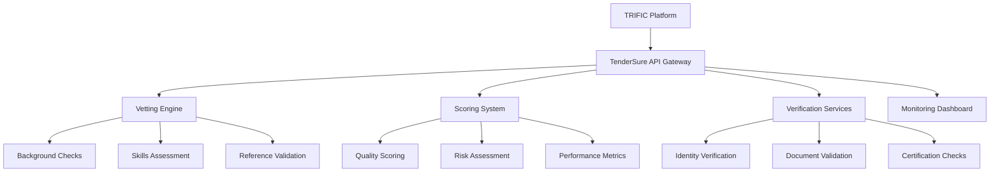

# TenderSure Integration

TenderSure is the comprehensive provider vetting and qualification system that ensures all service providers on the TRIFIC platform meet strict quality, competency, and reliability standards. This integration is fundamental to maintaining platform quality and client trust.

## Overview

The TenderSure integration provides:

-   **Comprehensive Vetting**: Multi-layered provider assessment and qualification
-   **Real-Time Verification**: Instant verification status updates and scoring
-   **Continuous Monitoring**: Ongoing provider performance evaluation and re-vetting
-   **Quality Assurance**: Automated quality control and compliance monitoring
-   **Risk Management**: Risk assessment and mitigation for all provider engagements

## Integration Architecture



### Core Components

#### TenderSure API Gateway

-   **Authentication**: Secure API access with OAuth 2.0 and API keys
-   **Rate Limiting**: Intelligent request throttling and prioritization
-   **Data Encryption**: End-to-end encryption for all data transmission
-   **Audit Logging**: Comprehensive logging of all integration activities

#### Vetting Engine

-   **Multi-Stage Assessment**: Progressive evaluation through multiple assessment stages
-   **Automated Processing**: AI-powered automated evaluation and scoring
-   **Human Review**: Expert human review for complex cases and appeals
-   **Quality Control**: Continuous quality monitoring and improvement

## Vetting Process Integration

### Provider Application Flow

#### Initial Registration

```typescript
interface ProviderApplication {
	applicantInfo: {
		personalInfo: PersonalInformation;
		contactDetails: ContactInformation;
		locationInfo: LocationDetails;
		preferredCategories: ServiceCategory[];
	};

	professionalInfo: {
		experience: ExperienceHistory;
		education: EducationBackground;
		certifications: Certification[];
		portfolio: PortfolioItem[];
	};

	businessInfo: {
		businessRegistration: BusinessDetails;
		insuranceInfo: InsuranceDetails;
		taxInfo: TaxInformation;
		references: Reference[];
	};

	documentation: {
		identityDocuments: Document[];
		professionalCertificates: Document[];
		portfolioSamples: Document[];
		businessDocuments: Document[];
	};
}
```

#### Automated Processing Pipeline

1. **Document Verification**: Automated validation of submitted documents
2. **Identity Verification**: Multi-source identity validation and cross-referencing
3. **Background Checks**: Comprehensive background screening and validation
4. **Skills Assessment**: Technical competency testing and evaluation
5. **Reference Validation**: Automated and manual reference verification
6. **Risk Assessment**: AI-powered risk scoring and evaluation

### Vetting Stages

#### Stage 1: Basic Qualification

**Automated Checks:**

-   Identity document validation and verification
-   Basic background screening and criminal record checks
-   Business registration and licensing verification
-   Contact information validation and confirmation

**Qualification Criteria:**

-   Valid government-issued identification
-   Clean background check with no disqualifying issues
-   Legitimate business registration (where applicable)
-   Verified contact information and communication capability

#### Stage 2: Professional Assessment

**Skills Evaluation:**

```typescript
interface SkillsAssessment {
	technicalSkills: {
		skillTests: SkillTest[];
		practicalExercises: PracticalTest[];
		portfolioReview: PortfolioEvaluation;
		certificationValidation: CertificationCheck[];
	};

	professionalSkills: {
		communicationAssessment: CommunicationEvaluation;
		projectManagementSkills: PMSkillsTest;
		clientServiceOrientation: ServiceOrientationTest;
		problemSolvingAbility: ProblemSolvingAssessment;
	};

	industryKnowledge: {
		industrySpecificTests: IndustryTest[];
		marketAwareness: MarketKnowledgeTest;
		bestPracticesKnowledge: BestPracticesEvaluation;
		regulatoryKnowledge: ComplianceKnowledgeTest;
	};
}
```

**Assessment Methods:**

-   Online technical proficiency tests
-   Practical project-based assessments
-   Portfolio review and validation
-   Video interview and communication assessment
-   Reference checks and validation

#### Stage 3: Quality Verification

**Quality Metrics:**

-   Past project success rates and client satisfaction scores
-   Quality of work samples and portfolio pieces
-   Professional references and recommendation validation
-   Industry certifications and continuing education
-   Market reputation and online presence analysis

**Verification Process:**

-   Portfolio authenticity verification
-   Client reference validation and feedback collection
-   Professional network verification
-   Online reputation analysis and sentiment assessment
-   Certification and credential validation

#### Stage 4: Final Approval

**Comprehensive Review:**

-   Complete application review and final assessment
-   Risk evaluation and mitigation planning
-   Quality score calculation and tier assignment
-   Platform integration and profile activation
-   Initial monitoring plan establishment

## Scoring System Integration

### TenderSure Quality Score

#### Scoring Components

```typescript
interface TenderSureScore {
	overallScore: number; // 0-1000 scale

	componentScores: {
		technicalCompetency: number; // Technical skills and knowledge
		professionalReliability: number; // Past performance and reliability
		communicationSkills: number; // Communication and client interaction
		businessAcumen: number; // Business understanding and practices
		qualityConsistency: number; // Consistency of quality delivery
	};

	riskFactors: {
		financialRisk: RiskLevel; // Financial stability and risk
		reputationalRisk: RiskLevel; // Reputation and market standing
		operationalRisk: RiskLevel; // Operational capability and risk
		complianceRisk: RiskLevel; // Regulatory and compliance risk
	};

	qualityTier: "Bronze" | "Silver" | "Gold" | "Platinum" | "Elite";

	lastUpdated: Date;
	nextReviewDate: Date;
	reviewHistory: ScoreHistory[];
}
```

#### Scoring Algorithm

-   **Weighted Component Scoring**: Different components weighted based on service category
-   **Historical Performance Integration**: Past performance data incorporated into scoring
-   **Market Comparison**: Comparative scoring against market benchmarks
-   **Risk-Adjusted Scoring**: Risk factors incorporated into overall score calculation

### Real-Time Score Updates

#### Continuous Monitoring

-   **Project Performance Tracking**: Real-time tracking of ongoing project performance
-   **Client Feedback Integration**: Immediate integration of client ratings and feedback
-   **Quality Incident Tracking**: Tracking and scoring impact of quality issues
-   **Market Performance Analysis**: Regular analysis of market position and competitiveness

#### Score Adjustment Triggers

```typescript
interface ScoreAdjustmentTriggers {
	performanceTriggers: {
		projectCompletion: ProjectCompletionEvent;
		clientFeedback: ClientFeedbackEvent;
		qualityIssue: QualityIssueEvent;
		timelineAdherence: TimelineEvent;
	};

	marketTriggers: {
		certificationUpdates: CertificationUpdateEvent;
		skillsImprovement: SkillsUpdateEvent;
		marketPositionChange: MarketPositionEvent;
		competitiveAnalysis: CompetitiveAnalysisEvent;
	};

	riskTriggers: {
		financialIssues: FinancialRiskEvent;
		reputationalIssues: ReputationalRiskEvent;
		complianceIssues: ComplianceRiskEvent;
		operationalIssues: OperationalRiskEvent;
	};
}
```

## Verification Services Integration

### Identity Verification

#### Multi-Layer Identity Validation

-   **Government ID Verification**: Automated validation of government-issued identification
-   **Biometric Verification**: Facial recognition and biometric matching
-   **Address Verification**: Physical address validation and confirmation
-   **Phone and Email Verification**: Multi-channel contact verification

#### Identity Verification API

```typescript
interface IdentityVerificationAPI {
	verifyIdentity(
		request: IdentityVerificationRequest
	): Promise<VerificationResult>;
	validateDocument(
		document: DocumentValidationRequest
	): Promise<DocumentValidation>;
	performBiometricMatch(
		biometric: BiometricMatchRequest
	): Promise<BiometricResult>;
	verifyAddress(
		address: AddressVerificationRequest
	): Promise<AddressValidation>;
}

interface VerificationResult {
	verificationId: string;
	status: "verified" | "pending" | "failed" | "requires_manual_review";
	confidence: number; // 0-100 confidence score
	riskLevel: "low" | "medium" | "high";
	verificationDetails: VerificationDetails;
	recommendedActions: RecommendedAction[];
}
```

### Document Validation

#### Automated Document Processing

-   **Document Authentication**: Automated detection of document authenticity and forgery
-   **Data Extraction**: AI-powered extraction of relevant information from documents
-   **Cross-Reference Validation**: Validation of extracted data against multiple sources
-   **Format and Standards Compliance**: Verification of document format and standards compliance

#### Document Types Supported

-   **Identity Documents**: Passports, driver's licenses, national ID cards
-   **Professional Certificates**: Industry certifications, educational diplomas
-   **Business Documents**: Business licenses, tax registrations, insurance certificates
-   **Financial Documents**: Bank statements, tax returns, financial reports

## Continuous Monitoring Integration

### Performance Monitoring

#### Real-Time Performance Tracking

```typescript
interface PerformanceMonitoring {
	projectMetrics: {
		completionRate: number; // Project completion percentage
		onTimeDelivery: number; // On-time delivery percentage
		qualityScore: number; // Average quality rating
		clientSatisfaction: number; // Client satisfaction score
	};

	behavioralMetrics: {
		responseTime: number; // Average response time to client communications
		communicationQuality: number; // Quality of communication interactions
		professionalismScore: number; // Professionalism rating
		adaptabilityScore: number; // Adaptability to changing requirements
	};

	businessMetrics: {
		revenueConsistency: number; // Consistency of revenue generation
		clientRetention: number; // Client retention rate
		referralRate: number; // Rate of client referrals
		marketGrowth: number; // Market position growth
	};
}
```

#### Monitoring Triggers and Alerts

-   **Performance Decline Detection**: Automatic detection of performance degradation
-   **Quality Issue Alerts**: Immediate alerting for quality-related issues
-   **Risk Factor Changes**: Monitoring and alerting for risk factor changes
-   **Compliance Issue Detection**: Automatic detection of compliance violations

### Re-Vetting Process

#### Periodic Re-Assessment

-   **Quarterly Reviews**: Comprehensive quarterly performance and quality reviews
-   **Annual Re-Vetting**: Complete annual re-assessment of provider qualifications
-   **Trigger-Based Reviews**: Event-triggered comprehensive provider re-evaluation
-   **Continuous Improvement**: Ongoing assessment and improvement recommendations

#### Re-Vetting Criteria

```typescript
interface ReVettingCriteria {
	performanceThresholds: {
		minimumQualityScore: number;
		minimumClientSatisfaction: number;
		maximumComplaintRate: number;
		minimumCompletionRate: number;
	};

	riskThresholds: {
		maximumRiskScore: number;
		criticalRiskFactors: RiskFactor[];
		complianceRequirements: ComplianceRequirement[];
		marketPositionRequirements: MarketRequirement[];
	};

	improvementRequirements: {
		mandatoryTraining: TrainingRequirement[];
		certificationUpdates: CertificationRequirement[];
		skillsImprovement: SkillsRequirement[];
		processImprovements: ProcessRequirement[];
	};
}
```

## API Integration Details

### TenderSure API Endpoints

#### Provider Management

```typescript
interface TenderSureProviderAPI {
	// Provider registration and application
	submitApplication(
		application: ProviderApplication
	): Promise<ApplicationResponse>;
	getApplicationStatus(applicationId: string): Promise<ApplicationStatus>;
	updateApplication(
		applicationId: string,
		updates: ApplicationUpdate
	): Promise<UpdateResponse>;

	// Vetting process management
	initiateVetting(
		providerId: string,
		vettingType: VettingType
	): Promise<VettingResponse>;
	getVettingStatus(vettingId: string): Promise<VettingStatus>;
	getVettingResults(vettingId: string): Promise<VettingResults>;

	// Scoring and qualification
	getProviderScore(providerId: string): Promise<TenderSureScore>;
	updateProviderScore(
		providerId: string,
		scoreUpdate: ScoreUpdate
	): Promise<ScoreResponse>;
	getScoreHistory(
		providerId: string,
		timeRange: TimeRange
	): Promise<ScoreHistory[]>;

	// Monitoring and alerts
	getPerformanceMetrics(providerId: string): Promise<PerformanceMetrics>;
	setMonitoringAlerts(
		providerId: string,
		alerts: AlertConfiguration
	): Promise<AlertResponse>;
	getQualityReports(
		providerId: string,
		period: ReportingPeriod
	): Promise<QualityReport>;
}
```

#### Integration Management

```typescript
interface TenderSureIntegrationAPI {
	// Webhook management
	configureWebhooks(
		webhookConfig: WebhookConfiguration
	): Promise<WebhookResponse>;
	getWebhookStatus(): Promise<WebhookStatus>;
	testWebhookDelivery(webhookId: string): Promise<TestResponse>;

	// Data synchronization
	syncProviderData(syncRequest: DataSyncRequest): Promise<SyncResponse>;
	getBulkProviderData(
		dataRequest: BulkDataRequest
	): Promise<BulkDataResponse>;

	// Integration monitoring
	getIntegrationHealth(): Promise<IntegrationHealthReport>;
	getAPIUsageMetrics(timeRange: TimeRange): Promise<APIUsageMetrics>;
}
```

### Webhook Integration

#### Real-Time Event Notifications

```typescript
interface TenderSureWebhooks {
	vettingEvents: {
		vettingCompleted: VettingCompletedWebhook;
		vettingFailed: VettingFailedWebhook;
		vettingRequiresReview: VettingReviewWebhook;
		reVettingTriggered: ReVettingTriggeredWebhook;
	};

	scoringEvents: {
		scoreUpdated: ScoreUpdatedWebhook;
		tierChanged: TierChangedWebhook;
		riskLevelChanged: RiskLevelChangedWebhook;
		qualityAlert: QualityAlertWebhook;
	};

	performanceEvents: {
		performanceDecline: PerformanceDeclineWebhook;
		qualityIssue: QualityIssueWebhook;
		complianceViolation: ComplianceViolationWebhook;
		improvementRequired: ImprovementRequiredWebhook;
	};
}
```

## Security and Compliance

### Data Security

-   **End-to-End Encryption**: All data transmission encrypted using TLS 1.3
-   **Data Privacy**: Strict data privacy controls and GDPR compliance
-   **Access Control**: Role-based access control and authentication
-   **Audit Trails**: Comprehensive audit logging for all integration activities

### Compliance Framework

-   **Regulatory Compliance**: Adherence to relevant industry regulations
-   **Data Protection**: Compliance with data protection regulations (GDPR, CCPA)
-   **Quality Standards**: Adherence to quality management standards (ISO 9001)
-   **Security Standards**: Compliance with security standards (ISO 27001, SOC 2)

## Integration Monitoring and Analytics

### Performance Metrics

-   **Integration Health**: Real-time monitoring of integration performance and availability
-   **API Performance**: Response time, throughput, and error rate monitoring
-   **Data Quality**: Monitoring of data quality and synchronization accuracy
-   **User Experience**: Impact of integration on user experience and satisfaction

### Business Intelligence

-   **Vetting Analytics**: Analysis of vetting process efficiency and effectiveness
-   **Quality Trends**: Long-term analysis of provider quality trends and improvements
-   **Risk Analysis**: Comprehensive risk analysis and mitigation effectiveness
-   **ROI Analysis**: Return on investment analysis for vetting and quality programs

## Future Enhancements

### Planned Improvements

-   **AI-Enhanced Vetting**: Advanced AI and machine learning integration for improved vetting accuracy
-   **Real-Time Risk Assessment**: Real-time risk assessment and dynamic risk scoring
-   **Blockchain Integration**: Blockchain-based credential verification and tamper-proof records
-   **Global Expansion**: Support for international regulations and compliance requirements
