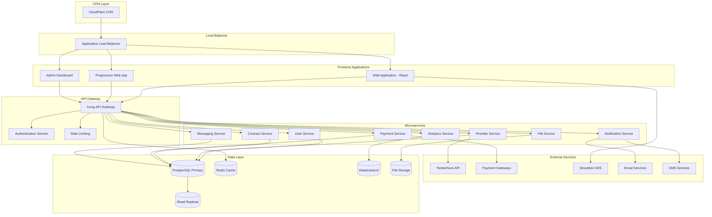
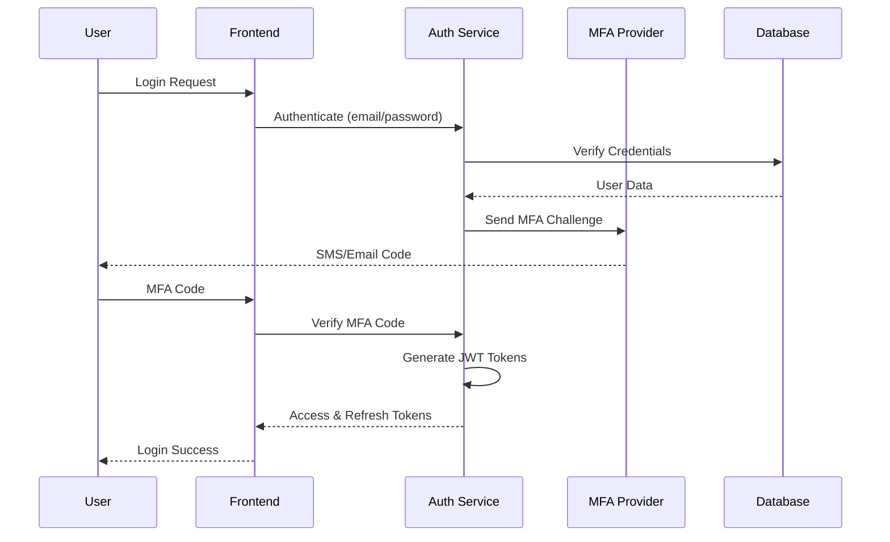

# Platform Architecture

This document provides a comprehensive overview of the TRIFIC Platform's technical architecture, including system design, technology stack, deployment strategy, and integration patterns.

## Architecture Overview

The TRIFIC Platform follows a modern microservices architecture designed for scalability, reliability, and maintainability. The system is built using cloud-native principles with containerization, auto-scaling, and comprehensive monitoring.

### High-Level Architecture Diagram



## Frontend Architecture

### Web Application Stack

**Core Technologies**

-   **Framework**: React 18+ with TypeScript
-   **Build Tool**: Vite for fast development and optimized builds
-   **Styling**: Tailwind CSS with custom design system
-   **State Management**: Redux Toolkit with RTK Query
-   **Routing**: React Router v6 with lazy loading
-   **Forms**: React Hook Form with Zod validation

**Component Architecture**

```
src/
├── components/           # Reusable UI components
│   ├── ui/              # Base components (Button, Input, etc.)
│   ├── forms/           # Form-specific components
│   ├── layout/          # Layout components (Header, Sidebar)
│   └── features/        # Feature-specific components
├── pages/               # Route-level components
├── hooks/               # Custom React hooks
├── services/            # API integration layer
├── store/               # Redux store configuration
├── types/               # TypeScript type definitions
├── utils/               # Utility functions
└── assets/              # Static assets
```

**Key Features**

-   **Progressive Web App**: Offline capability and app-like experience
-   **Responsive Design**: Mobile-first approach with adaptive UI
-   **Internationalization**: Multi-language support with react-i18next
-   **Accessibility**: WCAG 2.1 AA compliance
-   **Performance**: Code splitting, lazy loading, and optimized bundling

### Portal-Specific Applications

Each portal is built as a separate application with shared components:

**Client Portal**

-   Dashboard with spending analytics
-   Provider discovery and filtering
-   Job posting and management
-   Contract lifecycle management
-   Payment and escrow interface

**Provider Portal**

-   Profile management and portfolio
-   Job board and application system
-   Contract management and delivery
-   Earnings tracking and withdrawals
-   Performance metrics and feedback

**Admin Portal (TenderSure)**

-   Vetting workflow management
-   Provider evaluation interface
-   Quality assurance tools
-   Compliance reporting
-   Bulk operations interface

**Management Portal (Trific)**

-   Executive dashboard with KPIs
-   Financial operations management
-   User and platform oversight
-   Dispute resolution interface
-   System administration tools

## Backend Architecture

### Microservices Design

The backend follows Domain-Driven Design (DDD) principles with bounded contexts:

**User Service**

```typescript
// Core responsibilities
- User authentication and authorization
- Profile management (clients, providers, admins)
- Role-based access control (RBAC)
- Session management and JWT handling
- Account verification and KYC

// API endpoints
GET    /api/users/profile
PUT    /api/users/profile
POST   /api/users/verify
GET    /api/users/permissions
POST   /api/auth/login
POST   /api/auth/logout
POST   /api/auth/refresh
```

**Provider Service**

```typescript
// Core responsibilities
- Provider registration and onboarding
- Vetting workflow management
- Portfolio and capability management
- Search and discovery algorithms
- Performance tracking and metrics

// API endpoints
GET    /api/providers/search
GET    /api/providers/:id/profile
PUT    /api/providers/:id/profile
POST   /api/providers/vetting/submit
GET    /api/providers/vetting/status
PUT    /api/providers/portfolio
```

**Contract Service**

```typescript
// Core responsibilities
- Contract lifecycle management
- Milestone definition and tracking
- Deliverable submission and approval
- Contract templates and terms
- Performance measurement

// API endpoints
POST   /api/contracts
GET    /api/contracts/:id
PUT    /api/contracts/:id/milestones
POST   /api/contracts/:id/deliverables
PUT    /api/contracts/:id/approve
```

**Payment Service**

```typescript
// Core responsibilities
- Escrow account management
- Payment processing and gateways
- Milestone-based releases
- Transaction history and reporting
- Refund and dispute handling

// API endpoints
POST   /api/payments/escrow/deposit
POST   /api/payments/milestones/release
GET    /api/payments/transactions
POST   /api/payments/withdraw
POST   /api/payments/refund
```

### Service Communication

**Synchronous Communication**

-   REST APIs for client-server communication
-   GraphQL for complex queries (future enhancement)
-   gRPC for internal service-to-service communication

**Asynchronous Communication**

-   Redis Pub/Sub for real-time notifications
-   Message queues (Redis) for task processing
-   Event sourcing for audit trails and analytics

**Data Consistency**

-   Database transactions for ACID operations
-   Eventual consistency for cross-service operations
-   Saga pattern for distributed transactions

## Database Design

### Primary Database Schema

**PostgreSQL** serves as the primary database with the following key entities:

```sql
-- Core user entities
CREATE TABLE users (
    id UUID PRIMARY KEY DEFAULT gen_random_uuid(),
    email VARCHAR(255) UNIQUE NOT NULL,
    password_hash VARCHAR(255) NOT NULL,
    role user_role NOT NULL,
    verified_at TIMESTAMP,
    created_at TIMESTAMP DEFAULT NOW(),
    updated_at TIMESTAMP DEFAULT NOW()
);

-- Provider-specific information
CREATE TABLE providers (
    id UUID PRIMARY KEY DEFAULT gen_random_uuid(),
    user_id UUID REFERENCES users(id),
    business_name VARCHAR(255) NOT NULL,
    vetting_status vetting_status DEFAULT 'pending',
    vetting_score INTEGER,
    verification_date TIMESTAMP,
    next_review_date TIMESTAMP,
    created_at TIMESTAMP DEFAULT NOW()
);

-- Contract management
CREATE TABLE contracts (
    id UUID PRIMARY KEY DEFAULT gen_random_uuid(),
    client_id UUID REFERENCES users(id),
    provider_id UUID REFERENCES providers(id),
    title VARCHAR(255) NOT NULL,
    description TEXT,
    total_value DECIMAL(10,2),
    status contract_status DEFAULT 'draft',
    created_at TIMESTAMP DEFAULT NOW()
);

-- Milestone tracking
CREATE TABLE milestones (
    id UUID PRIMARY KEY DEFAULT gen_random_uuid(),
    contract_id UUID REFERENCES contracts(id),
    title VARCHAR(255) NOT NULL,
    description TEXT,
    amount DECIMAL(10,2),
    due_date TIMESTAMP,
    status milestone_status DEFAULT 'pending',
    approved_at TIMESTAMP
);
```

### Data Partitioning Strategy

**Horizontal Partitioning**

-   User data partitioned by region/tenant
-   Transaction data partitioned by date ranges
-   Analytics data partitioned by time windows

**Read Replicas**

-   Geographic distribution for reduced latency
-   Read-only queries routed to replicas
-   Automatic failover to primary if replica fails

**Caching Strategy**

-   Redis for session data and API responses
-   Application-level caching for frequently accessed data
-   CDN caching for static assets and content

## Security Architecture

### Authentication & Authorization

**Multi-Factor Authentication**



**Role-Based Access Control (RBAC)**

```typescript
// Permission system
const permissions = {
	// Client permissions
	"contracts:create": ["client"],
	"contracts:manage": ["client"],
	"payments:deposit": ["client"],

	// Provider permissions
	"profile:manage": ["provider"],
	"jobs:apply": ["provider"],
	"deliverables:submit": ["provider"],

	// Admin permissions
	"providers:vet": ["admin"],
	"providers:approve": ["admin"],
	"reports:compliance": ["admin"],

	// Management permissions
	"platform:oversight": ["management"],
	"disputes:resolve": ["management"],
	"analytics:executive": ["management"],
};
```

### Data Protection

**Encryption**

-   **At Rest**: AES-256 encryption for sensitive data
-   **In Transit**: TLS 1.3 for all API communications
-   **Application Level**: Field-level encryption for PII

**Data Privacy**

-   GDPR compliance with right to erasure
-   Data anonymization for analytics
-   Consent management for data processing
-   Regular privacy audits and assessments

**Security Monitoring**

-   Real-time threat detection
-   API rate limiting and DDoS protection
-   Automated security scanning
-   Incident response procedures

## Integration Architecture

### External Service Integration

**TenderSure Vetting Integration**

```typescript
interface TenderSureAPI {
	// Submit provider for vetting
	submitVetting(
		providerId: string,
		documents: Document[]
	): Promise<VettingSubmission>;

	// Check vetting status
	getVettingStatus(submissionId: string): Promise<VettingStatus>;

	// Receive webhook notifications
	handleWebhook(payload: VettingWebhook): Promise<void>;
}

// Integration flow
class VettingService {
	async initiateVetting(providerId: string) {
		// 1. Collect provider documents
		const documents = await this.collectDocuments(providerId);

		// 2. Submit to TenderSure
		const submission = await this.tenderSureAPI.submitVetting(
			providerId,
			documents
		);

		// 3. Store submission reference
		await this.storeSubmissionReference(providerId, submission.id);

		// 4. Set up status monitoring
		await this.scheduleStatusChecks(submission.id);
	}
}
```

**Payment Gateway Integration**

```typescript
interface PaymentGateway {
	processPayment(
		amount: number,
		method: PaymentMethod
	): Promise<PaymentResult>;
	createEscrow(
		amount: number,
		parties: EscrowParties
	): Promise<EscrowAccount>;
	releaseEscrow(escrowId: string, amount: number): Promise<void>;
}

// Multi-gateway support
class PaymentOrchestrator {
	private gateways: Map<string, PaymentGateway> = new Map([
		["stripe", new StripeGateway()],
		["mpesa", new MPesaGateway()],
		["dpo", new DPOGateway()],
	]);

	async processPayment(request: PaymentRequest): Promise<PaymentResult> {
		const gateway = this.selectOptimalGateway(request);
		return await gateway.processPayment(request.amount, request.method);
	}
}
```

### API Design Principles

**RESTful Design**

-   Resource-based URLs
-   HTTP verbs for operations
-   Consistent response formats
-   Proper status codes

**API Versioning**

-   URL-based versioning (/api/v1/, /api/v2/)
-   Backward compatibility maintenance
-   Deprecation notices and migration guides
-   Version sunset timeline communication

**Error Handling**

```typescript
interface APIError {
  code: string;
  message: string;
  details?: Record<string, any>;
  timestamp: string;
  requestId: string;
}

// Consistent error responses
{
  "error": {
    "code": "PROVIDER_NOT_FOUND",
    "message": "Provider with ID 12345 does not exist",
    "details": {
      "providerId": "12345",
      "suggestions": ["Check provider ID", "Verify permissions"]
    },
    "timestamp": "2024-01-15T10:30:00Z",
    "requestId": "req_abc123"
  }
}
```

## Deployment Architecture

### Infrastructure Overview

**Container Orchestration**

```yaml
# Kubernetes deployment example
apiVersion: apps/v1
kind: Deployment
metadata:
    name: trific-api
spec:
    replicas: 3
    selector:
        matchLabels:
            app: trific-api
    template:
        metadata:
            labels:
                app: trific-api
        spec:
            containers:
                - name: api
                  image: trific/api:v1.2.3
                  ports:
                      - containerPort: 3000
                  env:
                      - name: DATABASE_URL
                        valueFrom:
                            secretKeyRef:
                                name: trific-secrets
                                key: database-url
```

**Multi-Environment Strategy**

-   **Development**: Local Docker Compose setup
-   **Staging**: Kubernetes cluster with reduced resources
-   **Production**: Multi-zone Kubernetes with auto-scaling
-   **DR Site**: Cross-region backup with automated failover

### Monitoring & Observability

**Application Monitoring**

-   Prometheus for metrics collection
-   Grafana for visualization and alerting
-   Jaeger for distributed tracing
-   ELK stack for centralized logging

**Key Metrics**

```typescript
// Performance metrics
- API response times (p50, p95, p99)
- Database query performance
- Cache hit/miss ratios
- Error rates by endpoint

// Business metrics
- User registration rates
- Transaction volumes
- Provider vetting throughput
- Platform utilization rates

// Infrastructure metrics
- CPU/Memory utilization
- Disk I/O and storage usage
- Network throughput
- Container health and uptime
```

**Alerting Rules**

-   API error rate > 5% for 5 minutes
-   Database connection pool > 80% utilization
-   Payment processing failures > 1% rate
-   Disk space < 20% remaining

## Performance Optimization

### Frontend Optimization

**Code Splitting & Lazy Loading**

```typescript
// Route-based code splitting
const ClientPortal = lazy(() => import("./pages/ClientPortal"));
const ProviderPortal = lazy(() => import("./pages/ProviderPortal"));

// Component-level splitting
const HeavyChart = lazy(() => import("./components/HeavyChart"));
```

**Caching Strategies**

-   Browser caching with cache busting
-   Service Worker for offline functionality
-   CDN caching for static assets
-   API response caching with TTL

### Backend Optimization

**Database Optimization**

```sql
-- Indexing strategy
CREATE INDEX CONCURRENTLY idx_providers_vetting_status
ON providers(vetting_status) WHERE vetting_status IN ('pending', 'in_review');

CREATE INDEX CONCURRENTLY idx_contracts_client_status
ON contracts(client_id, status) WHERE status = 'active';

-- Query optimization
EXPLAIN ANALYZE SELECT p.*, u.email
FROM providers p
JOIN users u ON p.user_id = u.id
WHERE p.vetting_status = 'approved'
AND u.created_at > NOW() - INTERVAL '30 days';
```

**API Optimization**

-   Response compression (gzip/brotli)
-   Database connection pooling
-   Query result caching
-   Background job processing for heavy operations

## Scalability Considerations

### Horizontal Scaling

**Load Balancing**

-   Application Load Balancer with health checks
-   Geographic distribution with edge caching
-   Auto-scaling based on CPU/memory metrics
-   Database read replica distribution

**Microservice Scaling**

-   Independent scaling per service
-   Resource-based scaling policies
-   Queue-based load leveling
-   Circuit breakers for fault tolerance

### Data Scaling

**Database Scaling**

-   Read replicas for query distribution
-   Connection pooling and query optimization
-   Horizontal partitioning for large tables
-   Archive strategy for historical data

**Cache Scaling**

-   Redis cluster for distributed caching
-   Cache warming strategies
-   TTL optimization based on usage patterns
-   Cache invalidation strategies

---

**Next Steps**: Explore our [Security Architecture](/platform/security) for detailed security implementation, or review [Deployment Guide](/deployment/) for environment setup instructions.
