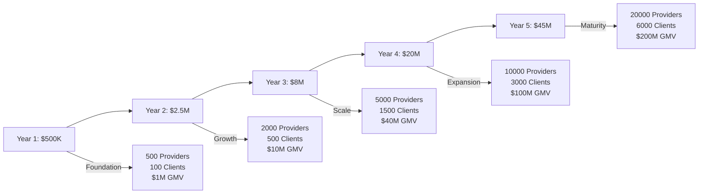

# Business Model

The Trific Platform operates on a curated marketplace model that generates value through quality assurance, direct engagement, and secure transaction facilitation. Our multi-sided platform creates sustainable revenue while delivering exceptional value to all participants.

## Platform Value Proposition

### Core Value Creation

```mermaid
graph TB
    subgraph "Value Creation Cycle"
        A[Quality Vetting] --> B[Client Trust]
        B --> C[Premium Pricing]
        C --> D[Provider Quality]
        D --> E[Better Outcomes]
        E --> F[Platform Growth]
        F --> A
    end

    subgraph "Stakeholder Value"
        G[Clients: Risk Reduction]
        H[Providers: Market Access]
        I[TenderSure: Revenue Growth]
        J[Trific: Sustainable Business]
    end

    B --> G
    D --> H
    A --> I
    F --> J
```



### Unique Value Propositions

**For Corporate Clients**

-   **Risk Mitigation**: Pre-vetted providers reduce project failure risk by 70%
-   **Time Efficiency**: Skip bidding process, saving 5-10 days per project
-   **Quality Assurance**: Consistent service quality through continuous monitoring
-   **Cost Predictability**: Transparent pricing without bidding wars
-   **Secure Transactions**: Built-in escrow eliminates payment risk

**For Service Providers**

-   **Market Access**: Direct access to enterprise clients without bidding
-   **Premium Positioning**: Association with quality and professionalism
-   **Guaranteed Payments**: Secure escrow system eliminates payment risk
-   **Professional Growth**: Continuous feedback and development opportunities
-   **Reduced Competition**: No race-to-the-bottom pricing dynamics

**For TenderSure (Vetting Partner)**

-   **Market Expansion**: Access to new client base needing vetting services
-   **Recurring Revenue**: Quarterly re-evaluation provides ongoing income
-   **Brand Enhancement**: Association with innovative marketplace model
-   **Data Insights**: Valuable market intelligence on service provider landscape

## Revenue Model

### Primary Revenue Streams

#### 1. Transaction Fees

**Client Transaction Fee**

-   **Rate**: 5% of contract value
-   **Cap**: Maximum $500 per transaction
-   **Application**: Charged on successful contract completion
-   **Rationale**: Clients value risk reduction and quality assurance

**Provider Service Fee**

-   **Rate**: 3% of earnings
-   **Application**: Deducted from provider payments
-   **Minimum**: $25 per completed transaction
-   **Rationale**: Providers benefit from secure payments and market access

**Fee Structure Examples**:

```typescript
// Transaction fee calculation
function calculateTransactionFees(contractValue: number): TransactionFees {
	const clientFee = Math.min(contractValue * 0.05, 500);
	const providerFee = Math.max(contractValue * 0.03, 25);

	return {
		clientFee,
		providerFee,
		totalPlatformRevenue: clientFee + providerFee,
		netProviderEarnings: contractValue - providerFee,
	};
}

// Example calculations
const examples = [
	{ value: 1000, clientFee: 50, providerFee: 30, platformRevenue: 80 },
	{ value: 5000, clientFee: 250, providerFee: 150, platformRevenue: 400 },
	{ value: 15000, clientFee: 500, providerFee: 450, platformRevenue: 950 },
];
```

#### 2. Vetting and Quality Assurance Fees

**Initial Provider Vetting**

-   **Standard Processing**: $150 (5-7 business days)
-   **Expedited Processing**: $300 (48 hours)
-   **Re-application Fee**: $100 (after rejection)
-   **Coverage**: TenderSure evaluation, background checks, skill assessment

**Quarterly Re-evaluation**

-   **Regular Review**: $50 per provider (if changes detected)
-   **Triggered Review**: $75 (performance concerns, client complaints)
-   **Premium Review**: $125 (enhanced evaluation for premium providers)

**Revenue Sharing with TenderSure**

-   **Split**: 60% Trific, 40% TenderSure
-   **Volume Bonuses**: Additional incentives for high-volume vetting
-   **Performance Bonuses**: Quality-based revenue sharing adjustments

#### 3. Premium Services

**Provider Premium Services**

-   **Priority Listing**: $50/month for enhanced visibility
-   **Featured Profile**: $25/month for homepage featuring
-   **Advanced Analytics**: $75/month for detailed performance metrics
-   **Premium Support**: $100/month for dedicated account management

**Client Premium Services**

-   **Enterprise Dashboard**: $200/month for advanced project management
-   **Custom Reporting**: $150/month for tailored business intelligence
-   **Dedicated Account Manager**: $500/month for white-glove service
-   **API Access**: $300/month for custom integrations

**Platform-wide Premium Features**

-   **Advanced Search**: $30/month for enhanced filtering and matching
-   **Priority Support**: $50/month for faster response times
-   **Extended History**: $20/month for extended transaction history
-   **White-label Options**: Custom pricing for branded experiences

### Secondary Revenue Streams

#### 4. Partnership and Integration Revenue

**Payment Gateway Partnerships**

-   **Revenue Sharing**: 0.1-0.3% of processed transactions
-   **Volume Bonuses**: Tiered rates based on monthly volume
-   **Preferred Gateway**: Additional revenue for preferred routing

**Technology Integration Partnerships**

-   **Referral Fees**: Commission on referred customers
-   **Co-marketing**: Shared marketing costs and revenue
-   **API Licensing**: Revenue from third-party platform integrations

**Financial Services Partnerships**

-   **Trade Finance**: Commission on Sidian Bank trade finance products
-   **Insurance Products**: Revenue from professional liability insurance
-   **Business Loans**: Referral fees for provider financing options

#### 5. Data and Analytics Services

**Market Intelligence** (Future Revenue Stream)

-   **Industry Reports**: $500-2000 per report
-   **Custom Research**: $5000-15000 per project
-   **Benchmarking Services**: $200/month per company
-   **Trend Analysis**: Subscription-based analytics services

**Advertising and Promotion** (Limited Implementation)

-   **Sponsored Listings**: Premium placement in search results
-   **Category Sponsorship**: Brand association with service categories
-   **Newsletter Sponsorship**: Targeted advertising in communications

## Financial Projections

### Revenue Growth Model



### Revenue Breakdown by Stream

**Year 3 Projection ($8M Total Revenue)**:

-   Transaction Fees: $6.4M (80%)
-   Vetting Fees: $1.0M (12.5%)
-   Premium Services: $0.48M (6%)
-   Partnership Revenue: $0.12M (1.5%)

**Year 5 Projection ($45M Total Revenue)**:

-   Transaction Fees: $36M (80%)
-   Vetting Fees: $4.5M (10%)
-   Premium Services: $3.6M (8%)
-   Partnership Revenue: $0.9M (2%)

### Unit Economics

**Customer Acquisition Cost (CAC)**:

-   Clients: $250 (through content marketing and referrals)
-   Providers: $125 (through vetting partner channel)

**Customer Lifetime Value (CLV)**:

-   Active Clients: $8,500 (average 3-year engagement)
-   Approved Providers: $3,200 (average 2-year active period)

**Key Metrics**:

-   **LTV/CAC Ratio**: 15:1 (clients), 25:1 (providers)
-   **Payback Period**: 3 months (clients), 2 months (providers)
-   **Gross Margin**: 85% (after payment processing costs)
-   **Net Margin**: 25% (after all operational expenses)

## Market Opportunity

### Total Addressable Market (TAM)

**African Professional Services Market**

-   **Size**: $12 billion annually
-   **Growth**: 15% CAGR
-   **Digital Penetration**: 25% (growing to 60% by 2028)

**Serviceable Addressable Market (SAM)**

-   **Target Segments**: Corporate services, digital services, consulting
-   **Size**: $3.2 billion annually
-   **Online Marketplace Share**: 8% ($256M)

**Serviceable Obtainable Market (SOM)**

-   **5-Year Target**: 15% of SAM ($480M GMV)
-   **Revenue Potential**: $38.4M (8% take rate)
-   **Market Position**: #2 in curated professional services

### Competitive Analysis

**Traditional Marketplaces (Upwork, Fiverr)**

-   **Advantages**: Large user base, established brand
-   **Disadvantages**: Quality inconsistency, bidding fatigue
-   **Our Differentiation**: Pre-vetting, direct engagement

**Local African Platforms**

-   **Advantages**: Market knowledge, local connections
-   **Disadvantages**: Limited scale, basic vetting
-   **Our Differentiation**: Rigorous quality standards, enterprise focus

**Enterprise Service Providers**

-   **Advantages**: Established relationships, proven quality
-   **Disadvantages**: High costs, limited flexibility
-   **Our Differentiation**: Marketplace efficiency with enterprise quality

## Business Strategy

### Go-to-Market Strategy

**Phase 1: Foundation (Months 1-12)**

-   Launch in Kenya with 500 vetted providers
-   Focus on digital services and consulting
-   Target SME and startup clients
-   Achieve $1M GMV with 80% client satisfaction

**Phase 2: Regional Expansion (Months 13-24)**

-   Expand to Uganda, Tanzania, Rwanda
-   Add construction, logistics, and marketing services
-   Target mid-market and enterprise clients
-   Scale to 2,000 providers and $10M GMV

**Phase 3: Continental Scale (Months 25-36)**

-   Expand to Nigeria, South Africa, Ghana
-   Add financial services and healthcare categories
-   Develop enterprise partnerships
-   Scale to 5,000 providers and $40M GMV

### Customer Acquisition Strategy

**For Clients**:

-   **Content Marketing**: Industry reports, best practices guides
-   **Partnership Channel**: Integration with business software providers
-   **Referral Program**: 10% fee reduction for successful referrals
-   **Direct Sales**: Enterprise sales team for large accounts

**For Providers**:

-   **Vetting Partner Channel**: TenderSure drives provider applications
-   **Professional Networks**: Partnerships with industry associations
-   **Success Stories**: Case studies and testimonials
-   **Referral Rewards**: Financial incentives for provider referrals

### Competitive Advantages

**Sustainable Moats**:

1. **Quality Network Effects**: Better providers attract better clients
2. **Data and Learning**: Vetting expertise improves over time
3. **Brand Trust**: Association with quality becomes defensible asset
4. **Integration Ecosystem**: Deep integration with business tools
5. **Regulatory Compliance**: Meeting enterprise compliance requirements

**Operational Excellence**:

-   **Technology Platform**: Continuous product development and innovation
-   **Vetting Expertise**: Partnership with TenderSure creates quality differentiation
-   **Customer Success**: High touch service for enterprise clients
-   **Financial Infrastructure**: Robust escrow and payment systems

## Risk Analysis and Mitigation

### Business Risks

**Market Risk**

-   **Economic Downturn**: Reduced B2B spending
-   **Mitigation**: Diversified service categories, global expansion

**Competition Risk**

-   **Large Platform Entry**: Upwork/Fiverr African expansion
-   **Mitigation**: Quality differentiation, local market expertise

**Regulatory Risk**

-   **Payment Regulations**: Changes in financial services law
-   **Mitigation**: Compliance expertise, regulatory partnerships

**Technology Risk**

-   **Security Breaches**: Data or financial security incidents
-   **Mitigation**: Enterprise-grade security, comprehensive insurance

### Operational Risks

**Quality Risk**

-   **Vetting Failures**: Approved providers delivering poor quality
-   **Mitigation**: Robust quality monitoring, continuous improvement

**Partner Risk**

-   **TenderSure Relationship**: Over-dependence on vetting partner
-   **Mitigation**: Backup vetting capabilities, diversified partnerships

**Scaling Risk**

-   **Operational Complexity**: Managing growth across multiple markets
-   **Mitigation**: Scalable technology platform, local market expertise

## Success Metrics and KPIs

### Financial Metrics

-   **Revenue Growth**: Month-over-month and year-over-year
-   **Gross Margin**: Revenue minus direct costs
-   **Customer Acquisition Cost**: Cost per new active user
-   **Customer Lifetime Value**: Total value per customer relationship

### Operational Metrics

-   **Provider Approval Rate**: Percentage passing initial vetting
-   **Project Completion Rate**: Successfully completed contracts
-   **Platform Utilization**: Active users / total registered users
-   **Response Times**: Platform performance and support metrics

### Quality Metrics

-   **Client Satisfaction**: Net Promoter Score and satisfaction ratings
-   **Provider Ratings**: Average provider ratings from clients
-   **Dispute Rate**: Percentage of contracts requiring mediation
-   **Re-evaluation Success**: Provider improvement over time

---

**Next Steps**: Explore our [Security Overview](/platform/security) to understand how we protect all stakeholders, or review our [Platform Overview](/platform/) for the complete picture.
