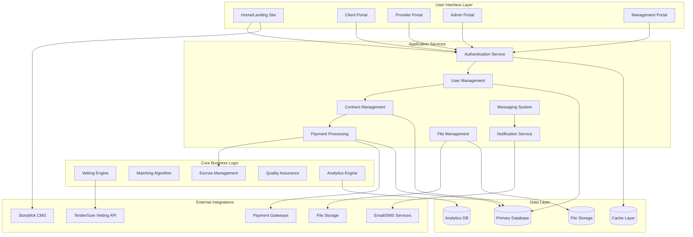

# Platform Overview

The Trific Platform is a revolutionary curated marketplace that transforms how businesses connect with service providers through a unique direct engagement model powered by rigorous quality assurance.

## Platform Vision

**"Connecting excellence with opportunity through trusted partnerships"**

Trific eliminates the inefficiencies of traditional bidding marketplaces by creating a curated ecosystem where:

-   **Quality is guaranteed** through comprehensive vetting
-   **Efficiency is maximized** through direct engagement
-   **Trust is built-in** through secure transactions and continuous monitoring
-   **Growth is supported** through ongoing professional development

## What Makes Trific Different

### Traditional Marketplaces vs. Trific

| Traditional Platforms | Trific Platform                 |
| --------------------- | ------------------------------- |
| Open registration     | Rigorous vetting required       |
| Bid-based competition | Direct engagement model         |
| Variable quality      | Consistent quality standards    |
| One-time verification | Quarterly re-evaluation         |
| Generic profiles      | Curated professional portfolios |
| Basic escrow          | Advanced milestone management   |
| Minimal oversight     | Continuous quality monitoring   |

### Core Differentiators

**1. Curated Excellence**

-   Every provider undergoes TenderSure's comprehensive evaluation
-   Multi-dimensional scoring across expertise, reliability, and professionalism
-   Continuous quality monitoring and quarterly re-assessments
-   Transparent quality metrics for informed decision-making

**2. Direct Engagement Model**

-   Skip the bidding process entirely
-   Browse vetted providers with transparent pricing
-   Initiate direct conversations and negotiations
-   Custom contract terms tailored to specific needs

**3. Secure Transaction Ecosystem**

-   Built-in escrow system for all transactions
-   Milestone-based payment releases
-   Multi-gateway payment processing
-   Comprehensive dispute resolution process

**4. Comprehensive Platform Ecosystem**

-   Role-specific portals optimized for different user types
-   Integrated communication and file-sharing systems
-   Real-time project tracking and collaboration tools
-   Advanced analytics and reporting capabilities

## Platform Architecture

### High-Level System Design

### Technology Stack

**Frontend Technologies**

-   **Web Application**: React.js with TypeScript
-   **Mobile**: Progressive Web App (PWA) with native app planned
-   **Styling**: Tailwind CSS with custom design system
-   **State Management**: Redux Toolkit with RTK Query

**Backend Services**

-   **API Framework**: Node.js with Express.js/Fastify
-   **Authentication**: JWT with refresh token rotation
-   **Real-time Communication**: WebSocket with Socket.io
-   **File Processing**: Sharp for image processing, FFmpeg for video

**Database & Storage**

-   **Primary Database**: PostgreSQL with read replicas
-   **Caching**: Redis for sessions and API caching
-   **File Storage**: AWS S3/DigitalOcean Spaces
-   **Search**: Elasticsearch for provider and job search

**Infrastructure**

-   **Deployment**: Docker containers with Kubernetes
-   **Cloud Provider**: Multi-cloud (AWS primary, DigitalOcean backup)
-   **CDN**: CloudFlare for global content delivery
-   **Monitoring**: Prometheus + Grafana + ELK stack

## Business Model

### Revenue Streams

**1. Transaction Fees**

-   **Client Fee**: 5% of contract value (capped at $500 per transaction)
-   **Provider Fee**: 3% of earnings (after successful project completion)
-   **Minimum Fee**: $25 per completed transaction

**2. Vetting Fees**

-   **Initial Vetting**: $150 per provider (one-time)
-   **Quarterly Re-evaluation**: $50 per provider (if changes detected)
-   **Expedited Vetting**: $300 for 48-hour processing

**3. Premium Services**

-   **Priority Listing**: $50/month for enhanced provider visibility
-   **Advanced Analytics**: $100/month for detailed performance metrics
-   **Dedicated Account Management**: $500/month for enterprise clients

**4. Partnership Revenue**

-   **TenderSure Partnership**: Revenue sharing on vetting services
-   **Payment Gateway Partnerships**: Transaction fee rebates
-   **Integration Partnerships**: Revenue from third-party integrations

### Value Proposition by User Type

**For Clients (Companies)**

-   **Time Savings**: No need to review dozens of bids
-   **Quality Assurance**: Pre-vetted providers reduce project risk
-   **Cost Predictability**: Transparent pricing without bidding wars
-   **Security**: Built-in escrow and dispute resolution
-   **Scalability**: Easy to find providers for multiple projects

**For Providers (Service Companies)**

-   **Market Access**: Direct access to enterprise clients
-   **Premium Positioning**: Association with quality and professionalism
-   **Reduced Competition**: No bidding wars or race to the bottom
-   **Guaranteed Payments**: Secure escrow system eliminates payment risk
-   **Professional Growth**: Continuous feedback and development opportunities

**For TenderSure (Vetting Partner)**

-   **Market Expansion**: Access to new client base needing vetting services
-   **Recurring Revenue**: Quarterly re-evaluation provides ongoing income
-   **Brand Enhancement**: Association with innovative marketplace model
-   **Data Insights**: Valuable market intelligence on service provider landscape

## Platform Governance

### Quality Standards

**Provider Excellence Framework**

-   **Technical Competency**: Skill-based assessments and portfolio review
-   **Business Reliability**: Financial stability and operational capacity
-   **Professional Standards**: Communication, ethics, and client service
-   **Continuous Improvement**: Response to feedback and skill development

**Client Success Metrics**

-   **Project Completion Rate**: Percentage of contracts successfully completed
-   **Quality Satisfaction**: Average rating from providers
-   **Payment Reliability**: Timely milestone payments and escrow funding
-   **Communication Quality**: Professional interaction standards

### Compliance & Regulatory Framework

**Data Protection**

-   GDPR compliance for European users
-   CCPA compliance for California residents
-   Industry-standard data encryption and security
-   Regular security audits and penetration testing

**Financial Compliance**

-   PCI DSS compliance for payment processing
-   Know Your Customer (KYC) procedures
-   Anti-Money Laundering (AML) monitoring
-   Multi-jurisdiction financial reporting

**Platform Policies**

-   Terms of Service and Privacy Policy
-   Code of Conduct for all platform users
-   Dispute resolution procedures
-   Content moderation and community standards

## Success Metrics & KPIs

### Platform Health Metrics

**User Growth**

-   Monthly Active Users (MAU) by user type
-   New user registration and activation rates
-   User retention rates (30-day, 90-day, annual)
-   Geographic distribution and market penetration

**Transaction Metrics**

-   Gross Merchandise Value (GMV) growth
-   Average transaction value by category
-   Transaction completion rates
-   Payment processing success rates

**Quality Metrics**

-   Provider vetting success rates
-   Client satisfaction scores (NPS)
-   Project completion rates
-   Dispute resolution time and outcomes

### Business Performance

**Revenue Metrics**

-   Monthly Recurring Revenue (MRR) growth
-   Transaction fee revenue
-   Vetting fee revenue
-   Customer Lifetime Value (CLV)

**Operational Efficiency**

-   Cost per acquisition (CPA) by user type
-   Support ticket volume and resolution time
-   Platform uptime and performance
-   API response times and reliability

**Market Position**

-   Market share in target segments
-   Competitive positioning analysis
-   Brand awareness and recognition
-   Industry partnership development

## Future Roadmap

### Short-term Goals (6 months)

-   Complete provider vetting automation
-   Launch mobile-responsive interface improvements
-   Expand payment gateway integrations
-   Implement advanced search and filtering

### Medium-term Goals (12 months)

-   Launch native mobile applications
-   Expand to additional African markets
-   Implement AI-powered provider matching
-   Launch enterprise client management tools

### Long-term Vision (24+ months)

-   Global marketplace expansion
-   Industry-specific specialization (FinTech, HealthTech, etc.)
-   Advanced analytics and business intelligence platform
-   Ecosystem expansion with additional service offerings

---

**Ready to explore the platform?** Continue to our [User Roles Guide](/platform/user-roles) to understand how different users interact with the system, or jump into the [Architecture Documentation](/platform/architecture) for technical details.
