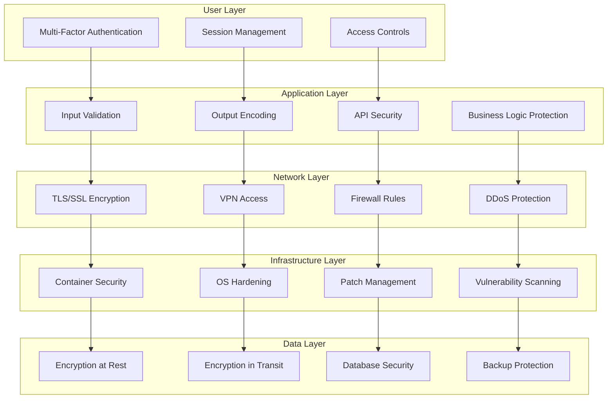
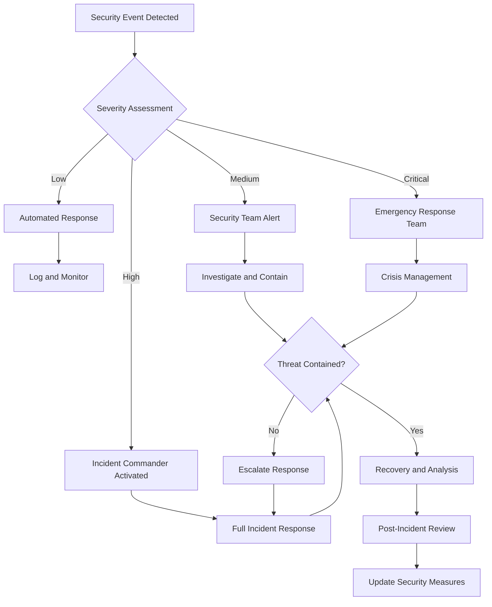

# Security Overview

Security is fundamental to the TRIFIC Platform's operation, given our role in facilitating financial transactions and handling sensitive business information. Our comprehensive security framework protects all stakeholders while ensuring regulatory compliance and maintaining user trust.

## Security Philosophy

### Core Security Principles

**Defense in Depth**

-   Multiple layers of security controls
-   No single point of failure
-   Continuous monitoring and improvement
-   Proactive threat detection and response

**Zero Trust Architecture**

-   Never trust, always verify
-   Least privilege access principles
-   Continuous authentication and authorization
-   Network segmentation and micro-segmentation

**Privacy by Design**

-   Data protection built into system architecture
-   Minimal data collection and retention
-   User control over personal information
-   Transparent privacy practices

**Compliance First**

-   Regulatory requirements as minimum baseline
-   Industry best practices implementation
-   Regular audits and assessments
-   Continuous compliance monitoring

## Security Architecture

### Multi-Layer Security Model



## Authentication and Authorization

### Multi-Factor Authentication (MFA)

**Implementation Strategy**

```typescript
interface MFAConfiguration {
	// Primary authentication factors
	primaryFactors: ["password", "biometric"];

	// Secondary authentication factors
	secondaryFactors: ["sms", "email", "authenticator", "hardware_token"];

	// Role-based MFA requirements
	mfaRequiredRoles: ["admin", "management"];

	// Risk-based MFA triggers
	riskTriggers: [
		"unusual_location",
		"new_device",
		"high_value_transaction",
		"administrative_action"
	];
}

// MFA flow implementation
class MFAService {
	async initiateAuthentication(
		credentials: UserCredentials
	): Promise<MFAChallenge> {
		// Verify primary factor
		const user = await this.verifyPrimaryFactor(credentials);

		// Assess risk level
		const riskLevel = await this.assessRisk(user, credentials.context);

		// Determine MFA requirement
		const mfaRequired = this.requiresMFA(user.role, riskLevel);

		if (mfaRequired) {
			return await this.sendMFAChallenge(user);
		}

		return this.generateAuthToken(user);
	}
}
```

### Role-Based Access Control (RBAC)

**Permission Framework**

```typescript
// Hierarchical permission structure
interface PermissionMatrix {
	resources: {
		providers: ["read", "write", "approve", "suspend"];
		contracts: ["create", "manage", "approve", "terminate"];
		payments: ["deposit", "release", "refund", "audit"];
		reports: ["generate", "export", "schedule"];
		system: ["configure", "monitor", "maintain"];
	};

	roles: {
		client: ["providers:read", "contracts:create", "payments:deposit"];
		provider: ["contracts:manage", "payments:withdraw"];
		admin: ["providers:approve", "reports:generate"];
		management: ["system:configure", "payments:audit"];
	};
}

// Dynamic permission checking
class AuthorizationService {
	async checkPermission(
		userId: string,
		resource: string,
		action: string
	): Promise<boolean> {
		const user = await this.getUserWithRole(userId);
		const requiredPermission = `${resource}:${action}`;

		// Check direct permissions
		if (user.permissions.includes(requiredPermission)) {
			return true;
		}

		// Check inherited role permissions
		const rolePermissions = this.getRolePermissions(user.role);
		if (rolePermissions.includes(requiredPermission)) {
			return true;
		}

		// Check context-specific permissions
		return await this.checkContextualPermission(user, resource, action);
	}
}
```

## Data Protection

### Encryption Standards

**Encryption at Rest**

-   **Algorithm**: AES-256-GCM for data encryption
-   **Key Management**: AWS KMS/HashiCorp Vault for key storage
-   **Database**: Transparent Data Encryption (TDE) for PostgreSQL
-   **File Storage**: Server-side encryption for all stored files

**Encryption in Transit**

-   **TLS Version**: TLS 1.3 minimum for all communications
-   **Certificate Management**: Automated certificate renewal via Let's Encrypt
-   **API Communications**: mTLS for service-to-service communication
-   **Perfect Forward Secrecy**: Ephemeral key exchange protocols

**Field-Level Encryption**

```typescript
// Sensitive data encryption
interface EncryptedField {
	value: string; // Encrypted value
	keyId: string; // Key identifier
	algorithm: string; // Encryption algorithm
	nonce: string; // Cryptographic nonce
}

class DataEncryption {
	async encryptSensitiveData(data: SensitiveData): Promise<EncryptedData> {
		const encryptionKey = await this.keyManager.getCurrentKey();

		return {
			personalInfo: await this.encryptField(
				data.personalInfo,
				encryptionKey
			),
			financialData: await this.encryptField(
				data.financialData,
				encryptionKey
			),
			documents: await this.encryptFiles(data.documents, encryptionKey),
		};
	}

	async decryptForAuthorizedUser(
		encryptedData: EncryptedData,
		userId: string
	): Promise<SensitiveData> {
		// Verify user authorization
		await this.verifyDataAccess(userId, encryptedData.resourceId);

		// Decrypt with appropriate key
		const decryptionKey = await this.keyManager.getKey(encryptedData.keyId);

		return await this.decryptFields(encryptedData, decryptionKey);
	}
}
```

### Data Privacy and Compliance

**GDPR Compliance**

-   **Data Minimization**: Collect only necessary data
-   **Purpose Limitation**: Use data only for stated purposes
-   **Right to Erasure**: Complete data deletion capabilities
-   **Data Portability**: Export user data in standard formats
-   **Consent Management**: Granular consent tracking and management

**CCPA Compliance**

-   **Data Transparency**: Clear data collection disclosures
-   **Opt-out Rights**: Easy opt-out mechanisms
-   **Data Sale Prohibition**: No sale of personal information
-   **Non-discrimination**: Equal service regardless of privacy choices

**Industry-Specific Requirements**

```typescript
// Compliance framework implementation
interface ComplianceRequirement {
	regulation: string;
	requirements: string[];
	implementation: ComplianceControl[];
	auditFrequency: string;
}

class ComplianceManager {
	private regulations: ComplianceRequirement[] = [
		{
			regulation: "GDPR",
			requirements: [
				"data_minimization",
				"consent_management",
				"right_to_erasure",
				"data_portability",
			],
			implementation: [
				new ConsentManager(),
				new DataRetentionPolicy(),
				new ErasureService(),
			],
			auditFrequency: "quarterly",
		},
		{
			regulation: "PCI_DSS",
			requirements: [
				"secure_payment_processing",
				"network_security",
				"access_controls",
				"security_monitoring",
			],
			implementation: [
				new PaymentSecurity(),
				new NetworkSegmentation(),
				new AccessControls(),
			],
			auditFrequency: "annual",
		},
	];
}
```

## Financial Security

### Payment Card Industry (PCI) DSS Compliance

**Level 1 PCI DSS Requirements**

-   **Secure Network**: Firewalls and network segmentation
-   **Data Protection**: No storage of sensitive payment data
-   **Vulnerability Management**: Regular security testing
-   **Access Controls**: Restricted access to cardholder data
-   **Network Monitoring**: Regular monitoring and testing
-   **Security Policies**: Comprehensive security program

**Tokenization and Payment Processing**

```typescript
// Secure payment processing
interface PaymentToken {
	tokenId: string;
	maskedPAN: string; // Masked Primary Account Number
	expiryDate: string;
	tokenType: "single_use" | "multi_use";
	createdAt: Date;
}

class SecurePaymentProcessor {
	async processPayment(
		paymentRequest: PaymentRequest
	): Promise<PaymentResult> {
		// Tokenize sensitive payment data
		const paymentToken = await this.tokenizationService.tokenize(
			paymentRequest.cardDetails
		);

		// Process payment through secure gateway
		const result = await this.paymentGateway.charge({
			token: paymentToken.tokenId,
			amount: paymentRequest.amount,
			currency: paymentRequest.currency,
		});

		// Log for audit without sensitive data
		await this.auditLogger.logPayment({
			transactionId: result.transactionId,
			amount: paymentRequest.amount,
			maskedCard: paymentToken.maskedPAN,
			status: result.status,
		});

		return result;
	}
}
```

### Escrow Security

**Multi-Signature Escrow Accounts**

```typescript
// Secure escrow implementation
interface EscrowAccount {
	escrowId: string;
	clientId: string;
	providerId: string;
	amount: number;
	status: EscrowStatus;
	requiredSignatures: number;
	signatures: EscrowSignature[];
}

class EscrowSecurity {
	async createSecureEscrow(
		clientId: string,
		providerId: string,
		amount: number
	): Promise<EscrowAccount> {
		// Generate secure escrow account
		const escrowAccount = await this.generateEscrowAccount();

		// Set up multi-signature requirements
		const signers = [
			{ role: "client", userId: clientId },
			{ role: "provider", userId: providerId },
			{ role: "platform", userId: "system" },
		];

		// Initialize escrow with security controls
		return await this.initializeEscrow({
			escrowId: escrowAccount.id,
			amount,
			signers,
			releaseConditions: this.getStandardReleaseConditions(),
		});
	}

	async releaseEscrowFunds(
		escrowId: string,
		releaseRequest: EscrowRelease
	): Promise<void> {
		// Verify signature requirements
		await this.verifyRequiredSignatures(escrowId, releaseRequest);

		// Check release conditions
		await this.validateReleaseConditions(escrowId, releaseRequest);

		// Execute secure fund transfer
		await this.transferFunds(escrowId, releaseRequest);

		// Audit trail logging
		await this.logEscrowRelease(escrowId, releaseRequest);
	}
}
```

## Network and Infrastructure Security

### Network Security Architecture

**Network Segmentation**

```yaml
# Network security configuration
network_zones:
    dmz:
        - load_balancers
        - reverse_proxies
        - cdn_endpoints

    application:
        - web_servers
        - api_gateways
        - application_services

    database:
        - primary_database
        - read_replicas
        - cache_servers

    management:
        - monitoring_systems
        - backup_services
        - administration_tools

security_controls:
    inter_zone_access:
        - explicit_allow_rules
        - encrypted_connections
        - authentication_required

    external_access:
        - vpn_required
        - multi_factor_auth
        - ip_whitelisting
```

**DDoS Protection and Rate Limiting**

```typescript
// Advanced rate limiting implementation
interface RateLimitRule {
	identifier: string;
	window: number; // Time window in seconds
	maxRequests: number; // Maximum requests per window
	penalties: RateLimitPenalty[];
}

class SecurityMiddleware {
	async applyRateLimiting(request: Request): Promise<void> {
		const clientId = this.extractClientIdentifier(request);
		const endpoint = this.extractEndpoint(request);

		// Check multiple rate limiting rules
		const rules = await this.getRateLimitRules(clientId, endpoint);

		for (const rule of rules) {
			const currentUsage = await this.redis.get(
				`rate_limit:${rule.identifier}`
			);

			if (currentUsage >= rule.maxRequests) {
				await this.applyRateLimitPenalty(clientId, rule);
				throw new RateLimitExceedException();
			}
		}

		// Increment usage counters
		await this.incrementUsageCounters(rules);
	}
}
```

### Container and Application Security

**Container Security Best Practices**

```dockerfile
# Secure container configuration
FROM node:18-alpine AS base

# Create non-root user
RUN addgroup -g 1001 -S nodejs
RUN adduser -S trific -u 1001

# Set working directory
WORKDIR /app

# Copy package files and install dependencies
COPY package*.json ./
RUN npm ci --only=production && npm cache clean --force

# Copy application code
COPY --chown=trific:nodejs . .

# Remove unnecessary packages
RUN apk del wget curl

# Switch to non-root user
USER trific

# Expose port
EXPOSE 3000

# Health check
HEALTHCHECK --interval=30s --timeout=3s --start-period=5s --retries=3 \
  CMD node healthcheck.js

# Start application
CMD ["node", "server.js"]
```

**Application Security Scanning**

```typescript
// Security scanning integration
interface SecurityScan {
	scanType: "sast" | "dast" | "dependency" | "container";
	severity: "critical" | "high" | "medium" | "low";
	findings: SecurityFinding[];
	scanDate: Date;
}

class SecurityScanner {
	async runContinuousScanning(): Promise<void> {
		// Static Application Security Testing
		const sastResults = await this.runSAST();

		// Dynamic Application Security Testing
		const dastResults = await this.runDAST();

		// Dependency vulnerability scanning
		const depResults = await this.scanDependencies();

		// Container vulnerability scanning
		const containerResults = await this.scanContainers();

		// Aggregate and prioritize findings
		const findings = this.prioritizeFindings([
			...sastResults,
			...dastResults,
			...depResults,
			...containerResults,
		]);

		// Auto-remediation for low-risk findings
		await this.autoRemediate(findings.filter((f) => f.autoRemediable));

		// Alert for critical findings
		await this.alertSecurityTeam(
			findings.filter((f) => f.severity === "critical")
		);
	}
}
```

## Monitoring and Incident Response

### Security Monitoring

**Real-time Threat Detection**

```typescript
// Security event monitoring
interface SecurityEvent {
	eventType: string;
	severity: "low" | "medium" | "high" | "critical";
	sourceIP: string;
	userId?: string;
	timestamp: Date;
	details: Record<string, any>;
}

class SecurityMonitoring {
	async monitorSecurityEvents(): Promise<void> {
		// Monitor authentication events
		this.monitorAuthenticationAnomales();

		// Monitor API abuse
		this.monitorAPIAbusePatterns();

		// Monitor financial transaction anomalies
		this.monitorTransactionAnomalies();

		// Monitor system intrusion attempts
		this.monitorIntrusionAttempts();
	}

	private async detectAnomalousActivity(
		events: SecurityEvent[]
	): Promise<Alert[]> {
		const alerts: Alert[] = [];

		// Machine learning-based anomaly detection
		const anomalies = await this.mlAnomalyDetector.detect(events);

		// Rule-based detection
		const ruleViolations = await this.ruleEngine.evaluate(events);

		// Geographic anomaly detection
		const geoAnomalies = await this.geoAnalyzer.detectSuspiciousLocations(
			events
		);

		return [...anomalies, ...ruleViolations, ...geoAnomalies];
	}
}
```

### Incident Response Framework

**Security Incident Response Plan**



**Automated Incident Response**

```typescript
// Incident response automation
class IncidentResponse {
	async handleSecurityIncident(incident: SecurityIncident): Promise<void> {
		// Immediate containment
		await this.containThreat(incident);

		// Evidence preservation
		await this.preserveEvidence(incident);

		// Stakeholder notification
		await this.notifyStakeholders(incident);

		// Recovery initiation
		await this.initiateRecovery(incident);

		// Documentation
		await this.documentIncident(incident);
	}

	private async containThreat(incident: SecurityIncident): Promise<void> {
		switch (incident.type) {
			case "brute_force_attack":
				await this.blockAttackerIP(incident.sourceIP);
				await this.enforceAccountLockout(incident.targetUser);
				break;

			case "suspicious_transaction":
				await this.freezeTransaction(incident.transactionId);
				await this.alertFinancialTeam(incident);
				break;

			case "data_breach_attempt":
				await this.isolateAffectedSystems(incident.affectedSystems);
				await this.revokeCompromisedCredentials(incident.credentials);
				break;
		}
	}
}
```

## Business Continuity and Disaster Recovery

### Backup and Recovery Strategy

**Data Backup Architecture**

```yaml
backup_strategy:
    database:
        primary:
            type: "continuous_replication"
            rpo: "0 seconds"
            rto: "30 seconds"

        snapshots:
            frequency: "hourly"
            retention: "30 days"
            encryption: "AES-256"

        long_term:
            frequency: "daily"
            retention: "7 years"
            storage: "glacier"

    application_data:
        files:
            frequency: "real-time"
            replication: "cross-region"
            versioning: "enabled"

        configurations:
            frequency: "on-change"
            version_control: "git"
            automation: "infrastructure-as-code"
```

**Disaster Recovery Testing**

```typescript
// DR testing automation
class DisasterRecoveryTesting {
	async runDRTest(
		testType: "tabletop" | "simulation" | "full_failover"
	): Promise<DRTestResult> {
		const testStart = new Date();

		try {
			// Initialize DR environment
			await this.initializeDREnvironment();

			// Execute test scenarios
			const scenarios = await this.getTestScenarios(testType);
			const results = await Promise.all(
				scenarios.map((scenario) => this.executeScenario(scenario))
			);

			// Validate recovery objectives
			const rtoMet = await this.validateRTO(testStart);
			const rpoMet = await this.validateRPO();

			return {
				testType,
				duration: Date.now() - testStart.getTime(),
				rtoMet,
				rpoMet,
				scenarios: results,
				recommendations: await this.generateRecommendations(results),
			};
		} finally {
			// Cleanup test environment
			await this.cleanupDREnvironment();
		}
	}
}
```

## Security Governance

### Security Training and Awareness

**Employee Security Training**

-   **Onboarding**: Mandatory security training for all new hires
-   **Ongoing Education**: Quarterly security awareness updates
-   **Role-Specific Training**: Specialized training based on job functions
-   **Phishing Simulation**: Monthly phishing tests and education
-   **Incident Response Training**: Annual tabletop exercises

**Third-Party Security Assessment**

```typescript
// Vendor security assessment
interface VendorSecurityAssessment {
	vendorName: string;
	assessmentDate: Date;
	securityControls: SecurityControl[];
	certifications: string[];
	riskRating: "low" | "medium" | "high";
	recommendations: string[];
}

class VendorSecurityManager {
	async assessVendorSecurity(
		vendor: Vendor
	): Promise<VendorSecurityAssessment> {
		// Security questionnaire
		const questionnaire = await this.sendSecurityQuestionnaire(vendor);

		// Certification verification
		const certifications = await this.verifyCertifications(vendor);

		// Penetration testing results
		const penTestResults = await this.requestPenTestResults(vendor);

		// Risk assessment
		const riskRating = this.calculateRiskRating(
			questionnaire,
			certifications,
			penTestResults
		);

		return {
			vendorName: vendor.name,
			assessmentDate: new Date(),
			securityControls: questionnaire.controls,
			certifications: certifications,
			riskRating: riskRating,
			recommendations: this.generateRecommendations(riskRating),
		};
	}
}
```

### Continuous Improvement

**Security Metrics and KPIs**

-   **Mean Time to Detection (MTTD)**: Average time to detect security incidents
-   **Mean Time to Response (MTTR)**: Average time to respond to incidents
-   **Vulnerability Management**: Time to patch critical vulnerabilities
-   **Security Training**: Employee training completion rates
-   **Compliance Posture**: Percentage of compliance requirements met

**Security Review Process**

```typescript
// Regular security review cycle
class SecurityGovernance {
	async conductQuarterlySecurityReview(): Promise<SecurityReviewReport> {
		// Threat landscape analysis
		const threatAnalysis = await this.analyzeThreatLandscape();

		// Security control effectiveness
		const controlEffectiveness = await this.assessControlEffectiveness();

		// Incident analysis
		const incidentTrends = await this.analyzeIncidentTrends();

		// Compliance status
		const complianceStatus = await this.assessComplianceStatus();

		// Risk assessment update
		const riskAssessment = await this.updateRiskAssessment();

		return {
			reviewPeriod: this.getCurrentQuarter(),
			threatAnalysis,
			controlEffectiveness,
			incidentTrends,
			complianceStatus,
			riskAssessment,
			recommendations: this.generateActionPlan(),
		};
	}
}
```

---

**Next Steps**: Explore our [API Security](/api/authentication) documentation for technical implementation details, or review our [Compliance Reports](/support/) for regulatory information.
