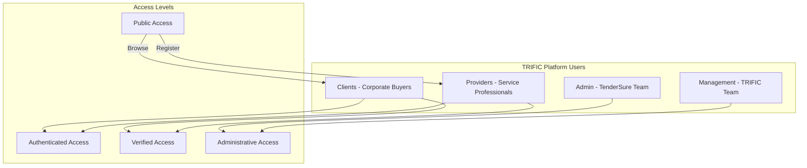
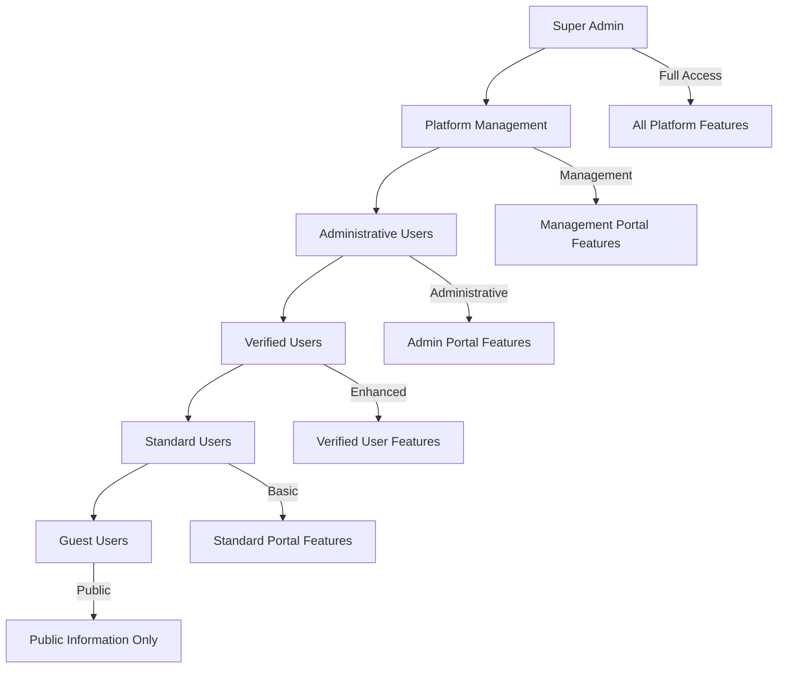

# User Roles & Permissions

The TRIFIC Platform is designed around four distinct user roles, each with specific responsibilities, permissions, and access levels. This role-based approach ensures security, efficiency, and an optimal user experience tailored to each user type's needs.

## Overview of User Roles



## Role Definitions

### 1. Clients (Corporate Buyers)

**Primary Purpose**: Companies and organizations seeking professional services

**User Profile**:

-   Corporate entities of various sizes
-   Government agencies and NGOs
-   Startups to enterprise organizations
-   Procurement and project managers

**Core Responsibilities**:

-   Define project requirements and budgets
-   Select and engage vetted service providers
-   Manage contracts and milestone approvals
-   Provide feedback and ratings
-   Ensure timely payments through escrow

### 2. Providers (Service Professionals)

**Primary Purpose**: Individual professionals and service companies offering expertise

**User Profile**:

-   Individual consultants and freelancers
-   Small to medium service companies
-   Specialized professional firms
-   Technical and creative service providers

**Core Responsibilities**:

-   Complete rigorous vetting and verification process
-   Maintain comprehensive business profiles
-   Deliver high-quality services per contract terms
-   Meet milestone deadlines and requirements
-   Maintain professional standards and certifications

### 3. Admin Users (TenderSure Team)

**Primary Purpose**: External vetting specialists responsible for provider quality assurance

**User Profile**:

-   TenderSure evaluation specialists
-   Industry experts and assessors
-   Compliance and quality assurance professionals
-   Vetting workflow administrators

**Core Responsibilities**:

-   Conduct comprehensive provider evaluations
-   Manage vetting workflows and criteria
-   Perform quarterly re-evaluations
-   Maintain quality standards and thresholds
-   Generate compliance and performance reports

### 4. Management Users (TRIFIC Team)

**Primary Purpose**: Internal platform operators and executives

**User Profile**:

-   TRIFIC executive leadership
-   Platform operations team
-   Financial operations specialists
-   Customer success managers
-   Technical administrators

**Core Responsibilities**:

-   Platform strategic oversight and governance
-   Financial operations and revenue management
-   Dispute resolution and mediation
-   User relationship management
-   System administration and configuration

## Detailed Role Permissions

### Client Permissions

```typescript
interface ClientPermissions {
	// Profile Management
	"profile:read": boolean; // View own profile
	"profile:update": boolean; // Update company information
	"team:manage": boolean; // Manage team members and roles

	// Provider Discovery
	"providers:browse": boolean; // Browse provider directory
	"providers:search": boolean; // Search and filter providers
	"providers:view": boolean; // View detailed provider profiles
	"providers:contact": boolean; // Initiate provider contact

	// Job Management
	"jobs:create": boolean; // Post job opportunities
	"jobs:edit": boolean; // Modify posted jobs
	"jobs:delete": boolean; // Remove job postings
	"jobs:applications": boolean; // Review job applications

	// Contract Management
	"contracts:initiate": boolean; // Start new contracts
	"contracts:manage": boolean; // Modify contract terms
	"contracts:approve": boolean; // Approve milestones
	"contracts:terminate": boolean; // End contracts (with cause)

	// Financial Operations
	"payments:deposit": boolean; // Fund escrow accounts
	"payments:approve": boolean; // Approve milestone payments
	"payments:history": boolean; // View payment history
	"payments:refund": boolean; // Request refunds (limited)

	// Communication
	"messaging:send": boolean; // Send messages to providers
	"messaging:files": boolean; // Share files with providers
	"messaging:history": boolean; // Access message history

	// Reviews & Ratings
	"reviews:create": boolean; // Rate and review providers
	"reviews:edit": boolean; // Modify own reviews
	"reviews:view": boolean; // View all reviews
}
```

### Provider Permissions

```typescript
interface ProviderPermissions {
	// Profile Management
	"profile:read": boolean; // View own profile
	"profile:update": boolean; // Update business information
	"portfolio:manage": boolean; // Manage work samples
	"certifications:upload": boolean; // Upload/update certifications

	// Vetting Process
	"vetting:submit": boolean; // Submit vetting applications
	"vetting:status": boolean; // Check vetting status
	"vetting:documents": boolean; // Upload vetting documents
	"vetting:reapply": boolean; // Resubmit after rejection

	// Job Board Access
	"jobs:browse": boolean; // Browse available jobs
	"jobs:search": boolean; // Search and filter jobs
	"jobs:apply": boolean; // Apply to job postings
	"jobs:track": boolean; // Track application status

	// Contract Management
	"contracts:accept": boolean; // Accept contract invitations
	"contracts:negotiate": boolean; // Negotiate contract terms
	"contracts:deliver": boolean; // Submit deliverables
	"contracts:track": boolean; // Monitor contract progress

	// Financial Operations
	"earnings:view": boolean; // View earnings and payments
	"payments:withdraw": boolean; // Withdraw available funds
	"payments:history": boolean; // Access payment history
	"tax:documents": boolean; // Download tax documents

	// Communication
	"messaging:receive": boolean; // Receive messages from clients
	"messaging:send": boolean; // Send messages to clients
	"messaging:files": boolean; // Share files with clients

	// Performance Tracking
	"ratings:view": boolean; // View own ratings
	"performance:track": boolean; // Monitor performance metrics
	"feedback:receive": boolean; // Receive client feedback
}
```

### Admin Permissions (TenderSure)

```typescript
interface AdminPermissions {
	// Vetting Management
	"vetting:review": boolean; // Review vetting applications
	"vetting:evaluate": boolean; // Conduct provider evaluations
	"vetting:approve": boolean; // Approve/reject providers
	"vetting:criteria": boolean; // Manage vetting criteria
	"vetting:bulk": boolean; // Bulk vetting operations

	// Provider Management
	"providers:list": boolean; // View all providers
	"providers:search": boolean; // Search provider database
	"providers:suspend": boolean; // Suspend provider accounts
	"providers:reinstate": boolean; // Reinstate suspended providers
	"providers:blacklist": boolean; // Manage blacklisted providers

	// Quality Assurance
	"quality:monitor": boolean; // Monitor provider quality
	"quality:reevaluate": boolean; // Conduct re-evaluations
	"quality:standards": boolean; // Set quality standards
	"quality:alerts": boolean; // Manage quality alerts

	// Compliance & Reporting
	"compliance:audit": boolean; // Conduct compliance audits
	"reports:generate": boolean; // Generate vetting reports
	"reports:export": boolean; // Export compliance data
	"reports:schedule": boolean; // Schedule automated reports

	// System Configuration
	"settings:vetting": boolean; // Configure vetting settings
	"settings:scoring": boolean; // Manage scoring algorithms
	"settings:templates": boolean; // Manage evaluation templates

	// User Management (Limited)
	"users:view": boolean; // View user information
	"users:verify": boolean; // Verify user accounts
	"users:notes": boolean; // Add evaluation notes
}
```

### Management Permissions (TRIFIC)

```typescript
interface ManagementPermissions {
	// Platform Oversight
	"platform:analytics": boolean; // Access platform analytics
	"platform:metrics": boolean; // View performance metrics
	"platform:health": boolean; // Monitor system health
	"platform:users": boolean; // User management oversight

	// Financial Management
	"finance:overview": boolean; // Financial dashboard access
	"finance:transactions": boolean; // Transaction monitoring
	"finance:escrow": boolean; // Escrow account management
	"finance:payouts": boolean; // Large payout approvals
	"finance:reconciliation": boolean; // Financial reconciliation

	// User Administration
	"users:manage": boolean; // Full user management
	"users:suspend": boolean; // Suspend user accounts
	"users:verify": boolean; // Account verification override
	"users:permissions": boolean; // Manage user permissions

	// Dispute Resolution
	"disputes:view": boolean; // Access all disputes
	"disputes:mediate": boolean; // Mediate dispute resolution
	"disputes:decide": boolean; // Make final decisions
	"disputes:evidence": boolean; // Access evidence and logs

	// System Administration
	"system:configure": boolean; // Platform configuration
	"system:maintenance": boolean; // Maintenance mode control
	"system:backups": boolean; // Backup management
	"system:integrations": boolean; // External integrations

	// Advanced Reporting
	"reports:executive": boolean; // Executive-level reports
	"reports:financial": boolean; // Financial reporting
	"reports:operational": boolean; // Operational metrics
	"reports:custom": boolean; // Custom report generation
}
```

## Role-Based Access Control (RBAC) Implementation

### Permission Hierarchy



### Permission Inheritance

```typescript
// Base permissions for all authenticated users
const basePermissions = [
	"profile:read",
	"messaging:receive",
	"notifications:read",
	"help:access",
];

// Role-specific permission extensions
const rolePermissions = {
	client: [
		...basePermissions,
		"providers:browse",
		"contracts:initiate",
		"payments:deposit",
	],
	provider: [
		...basePermissions,
		"jobs:browse",
		"contracts:accept",
		"earnings:view",
	],
	admin: [
		...basePermissions,
		"vetting:review",
		"providers:manage",
		"reports:generate",
	],
	management: [
		...basePermissions,
		"platform:analytics",
		"users:manage",
		"disputes:mediate",
	],
};
```

### Dynamic Permission Checking

```typescript
class PermissionService {
	async checkPermission(
		userId: string,
		permission: string
	): Promise<boolean> {
		// Get user role and status
		const user = await this.userService.getUser(userId);

		// Check role-based permissions
		const hasRolePermission = this.hasRolePermission(user.role, permission);

		// Check account status restrictions
		const accountActive = await this.checkAccountStatus(user);

		// Check feature-specific restrictions
		const featureAllowed = await this.checkFeatureAccess(user, permission);

		return hasRolePermission && accountActive && featureAllowed;
	}

	private hasRolePermission(role: UserRole, permission: string): boolean {
		return rolePermissions[role]?.includes(permission) ?? false;
	}
}
```

## Account Status and Restrictions

### Account Verification Levels

**Level 0: Unverified**

-   Basic registration completed
-   Email verification pending
-   Limited read-only access

**Level 1: Email Verified**

-   Email address confirmed
-   Basic profile access enabled
-   Can browse public information

**Level 2: Identity Verified (KYC)**

-   Identity documents verified
-   Enhanced transaction limits
-   Full platform feature access

**Level 3: Business Verified (KYB)**

-   Business documents verified
-   Corporate account features
-   Higher transaction limits

**Level 4: Fully Vetted (Providers Only)**

-   TenderSure vetting completed
-   Provider marketplace access
-   Eligible for direct contracts

### Account Status Impact on Permissions

```typescript
interface AccountStatus {
	isActive: boolean;
	verificationLevel: number;
	suspensionReason?: string;
	restrictions: string[];
	expirationDate?: Date;
}

// Permission modifier based on account status
function applyStatusRestrictions(
	basePermissions: string[],
	status: AccountStatus
): string[] {
	if (!status.isActive) {
		return ["profile:read"]; // Suspended account - read-only access
	}

	if (
		status.verificationLevel < 2 &&
		basePermissions.includes("payments:deposit")
	) {
		// Remove payment permissions for unverified accounts
		return basePermissions.filter((p) => !p.startsWith("payments:"));
	}

	// Apply specific restrictions
	return basePermissions.filter((p) => !status.restrictions.includes(p));
}
```

## Security Considerations

### Role Transition Security

**Client to Provider**

-   Not permitted (separate registration required)
-   Prevents conflicts of interest
-   Maintains clear role boundaries

**Permission Escalation**

-   Admin roles require internal approval
-   Multi-factor authentication mandatory
-   Regular access reviews and audits

**Session Management**

```typescript
// Role-based session configuration
const sessionConfig = {
	client: {
		maxAge: 8 * 60 * 60 * 1000, // 8 hours
		requireMFA: false,
		autoLogout: true,
	},
	provider: {
		maxAge: 8 * 60 * 60 * 1000, // 8 hours
		requireMFA: false,
		autoLogout: true,
	},
	admin: {
		maxAge: 4 * 60 * 60 * 1000, // 4 hours
		requireMFA: true,
		autoLogout: true,
	},
	management: {
		maxAge: 2 * 60 * 60 * 1000, // 2 hours
		requireMFA: true,
		autoLogout: true,
	},
};
```

### Audit and Compliance

**Permission Changes**

-   All permission modifications logged
-   Approval workflow for role changes
-   Regular permission audits
-   Compliance reporting

**Access Monitoring**

```typescript
// Permission usage tracking
interface PermissionAudit {
	userId: string;
	permission: string;
	granted: boolean;
	timestamp: Date;
	resourceAccessed?: string;
	ipAddress: string;
	userAgent: string;
}

// Log all permission checks
async function logPermissionCheck(audit: PermissionAudit) {
	await auditService.logPermissionAccess(audit);

	// Alert on suspicious patterns
	if (await detectAnomalousAccess(audit)) {
		await alertingService.triggerSecurityAlert(audit);
	}
}
```

## Best Practices

### For Platform Users

**Clients**

-   Complete KYC verification for full access
-   Use team accounts for organizational use
-   Regularly review team member permissions
-   Monitor account activity and transactions

**Providers**

-   Maintain current certifications and documents
-   Keep business profile updated and accurate
-   Respond promptly to re-evaluation requests
-   Follow professional communication standards

### For Administrators

**Access Management**

-   Follow principle of least privilege
-   Regular access reviews and cleanup
-   Strong authentication requirements
-   Monitor for privilege escalation attempts

**Security Monitoring**

-   Track failed permission attempts
-   Monitor cross-role access patterns
-   Regular security audits
-   Incident response procedures

---

**Next Steps**: Learn more about [Business Model](/platform/business-model) or dive into specific portal documentation in [Portals Section](/portals/).
