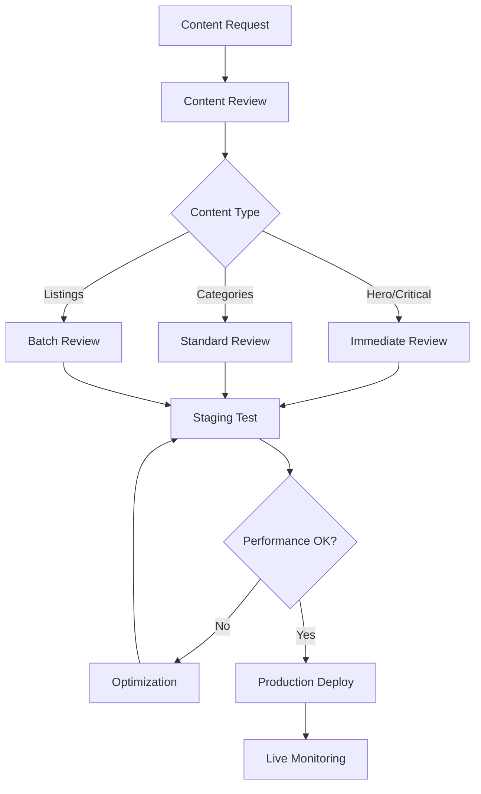

# Landing Page Content Management

The Trific eCommerce Landing Page content management system handles dynamic content delivery for the public marketplace entry point. This system ensures fast, reliable content updates while maintaining performance and user experience standards.

## Content Management Overview

### Core Content Modules

The landing page consists of essential content modules that must be managed:

1. **Header Module** - Global navigation and branding
2. **Hero Section** - Primary value proposition and CTAs
3. **Featured Categories** - Product category showcase
4. **Featured Listings** - Product/service highlights
5. **Promotions & Trust Signals** - Marketing banners and trust badges
6. **Content Blocks** - Value propositions and testimonials
7. **Footer** - Secondary navigation and policies

### Content Management Principles

-   **Performance First** - All content changes must maintain Core Web Vitals standards
-   **Resilience** - Content failures should not break the user experience
-   **Accessibility** - All content must meet WCAG 2.1 AA standards
-   **Mobile-First** - Content must work across all device types

## Content Architecture

### Hero Section Management

```typescript
interface HeroContent {
	headline: string; // Primary message
	subheadline: string; // Supporting text
	primaryCTA: {
		label: string; // e.g., "Start Browsing"
		target: string; // Route/URL - I don't know exact target
		tracking: string; // Analytics event ID
	};
	secondaryCTA?: {
		label: string; // e.g., "Learn More"
		target: string;
		tracking: string;
	};
	backgroundMedia?: {
		image: string; // Hero background image
		video?: string; // Optional hero video
		alt: string; // Accessibility description
	};
	animation?: {
		enabled: boolean;
		type: string; // Animation style - I don't know specifics
	};
}
```

### Featured Categories Management

```typescript
interface CategoryCard {
	id: string;
	title: string;
	description?: string;
	image: {
		src: string;
		alt: string;
		placeholder: string; // Low-quality placeholder for lazy loading
	};
	link: {
		url: string; // Category results page - I don't know URL pattern
		params?: Record<string, string>;
	};
	displayOrder: number;
	isActive: boolean;
	analytics: {
		trackingId: string;
		position: number;
	};
}
```

### Featured Listings Management

```typescript
interface FeaturedListing {
	id: string;
	title: string;
	price?: {
		amount: number;
		currency: string; // Currency handling - I don't know format
		display: string; // Formatted price display
	};
	image: {
		src: string;
		alt: string;
		loading: "lazy" | "eager";
	};
	rating?: {
		average: number;
		count: number;
	};
	cta: {
		label: string; // e.g., "View Details"
		action: string; // Listing detail route - I don't know pattern
	};
	badges?: string[]; // Featured, New, Sale badges
	displayPriority: number;
	isVisible: boolean;
}
```

### Promotion Banner Management

```typescript
interface PromotionBanner {
	id: string;
	title: string;
	description: string;
	image?: string;
	cta: {
		label: string;
		target: string; // Promo landing page - I don't know URL
	};
	schedule: {
		start: Date;
		end?: Date;
		timezone: string;
	};
	targeting?: {
		userType?: "new" | "returning";
		location?: string;
		device?: "mobile" | "desktop";
	};
	displayRules: {
		position: "top" | "middle" | "bottom";
		dismissible: boolean;
		maxViews?: number;
	};
}
```

## Content States Management

### Loading States

```typescript
interface LoadingStates {
	hero: {
		skeleton: boolean; // Show skeleton while loading
		fallback: HeroContent; // Minimal fallback content
	};
	categories: {
		showPlaceholders: boolean;
		minCards: number; // Minimum cards to show
	};
	listings: {
		lazyLoad: boolean;
		batchSize: number; // Items per lazy load batch
		placeholder: string; // Placeholder image
	};
}
```

### Error States

```typescript
interface ErrorHandling {
	hero: {
		fallback: HeroContent;
		showRetry: boolean;
	};
	categories: {
		hideOnError: boolean;
		emptyStateMessage: string;
	};
	listings: {
		retryButton: boolean;
		errorMessage: string;
		fallbackContent?: FeaturedListing[];
	};
	promotions: {
		gracefulHide: boolean;
		expiredHandling: "hide" | "placeholder";
	};
}
```

### Empty States

```typescript
interface EmptyStates {
	categories: {
		show: boolean;
		message: string;
		fallbackAction?: {
			label: string;
			target: string;
		};
	};
	listings: {
		show: boolean;
		message: string;
		suggestedActions: Array<{
			label: string;
			target: string;
		}>;
	};
	promotions: {
		hideSection: boolean;
	};
}
```

## Content Delivery Strategy

### Performance Requirements

-   **Above-the-fold content** must load within performance budgets (**I don't know** exact thresholds)
-   **Lazy loading** for below-the-fold content
-   **Image optimization** with responsive breakpoints
-   **Content chunking** for progressive enhancement

### Caching Strategy

```typescript
interface CachePolicy {
	static: {
		maxAge: number; // Static assets cache duration
		immutable: boolean;
	};
	dynamic: {
		staleWhileRevalidate: number;
		maxAge: number; // Dynamic content cache - I don't know duration
	};
	api: {
		categories: number; // Category data cache
		listings: number; // Listings data cache
		promotions: number; // Promotion data cache
	};
}
```

### CDN Configuration

-   **Global distribution** for fast content delivery
-   **Image optimization** with automatic format selection
-   **Cache invalidation** for content updates
-   **Bandwidth optimization** with adaptive delivery

## Content Workflows

### Content Update Process



### Emergency Content Updates

1. **Critical Issues** - Immediate content fixes
2. **Performance Problems** - Content-related performance degradation
3. **Compliance Issues** - Legal or regulatory content changes
4. **Security Concerns** - Content that poses security risks

### A/B Testing Framework

```typescript
interface ContentTesting {
	testId: string;
	module: "hero" | "categories" | "listings" | "promotions";
	variants: Array<{
		id: string;
		content: any; // Module-specific content
		traffic: number; // Percentage of traffic
	}>;
	metrics: {
		primary: string; // Primary success metric
		secondary: string[]; // Additional metrics
	};
	duration: {
		start: Date;
		end: Date;
		minSampleSize: number;
	};
}
```

## Content Quality Assurance

### Pre-Launch Checklist

-   [ ] All content modules load without errors
-   [ ] CTAs have valid targets and tracking
-   [ ] Images have proper alt text and loading attributes
-   [ ] No broken links in navigation or footer
-   [ ] Content meets brand guidelines
-   [ ] Performance budgets are met
-   [ ] Mobile responsive display verified
-   [ ] Accessibility standards validated

### Content Validation Rules

```typescript
interface ValidationRules {
	hero: {
		headlineMaxLength: number;
		ctaRequired: boolean;
		backgroundImageRequired: boolean;
	};
	categories: {
		minCategories: number;
		maxCategories: number;
		imageRequired: boolean;
		titleMaxLength: number;
	};
	listings: {
		minListings: number;
		maxListings: number;
		priceFormat: RegExp; // Price validation - I don't know format
		imageRequired: boolean;
	};
	promotions: {
		schedulingRequired: boolean;
		ctaRequired: boolean;
		maxActive: number;
	};
}
```

### Performance Monitoring

-   **Core Web Vitals** tracking for all content changes
-   **Error rate monitoring** for content API failures
-   **User engagement metrics** for content effectiveness
-   **Conversion tracking** for CTA performance

## Messaging & Notifications Integration

### Toast Notification Content

```typescript
interface ToastContent {
	type: "info" | "success" | "warning" | "error";
	message: string;
	duration?: number; // Auto-hide duration
	dismissible: boolean;
	actions?: Array<{
		label: string;
		handler: () => void;
	}>;
	accessibility: {
		ariaLive: "polite" | "assertive";
		role: string;
	};
}
```

### System Messaging

The backend messaging system (**ready**) integrates with frontend configuration (**ongoing**) to surface:

-   **Error notifications** - API failures and system issues
-   **Informational messages** - Feature announcements and updates
-   **Promotional alerts** - Time-sensitive offers and campaigns
-   **Maintenance notices** - Scheduled downtime communications

### Consent & Privacy Banners

Cookie consent and privacy messaging (**I don't know** if required):

```typescript
interface ConsentBanner {
	required: boolean; // Jurisdictional requirement
	content: {
		message: string;
		acceptLabel: string;
		declineLabel?: string;
		policyLink: string; // Privacy policy URL - I don't know
	};
	behavior: {
		blocking: boolean; // Block interaction until consent
		persistent: boolean; // Remember user choice
		expiry: number; // Consent expiry duration
	};
}
```

## Content Security

### Input Sanitization

-   **XSS Prevention** - All content inputs sanitized
-   **CSRF Protection** - Content update endpoints protected
-   **Content Validation** - Schema validation for all content types
-   **Image Security** - Image uploads scanned and validated

### Access Control

```typescript
interface ContentPermissions {
	roles: {
		admin: string[]; // Full content management access
		editor: string[]; // Content creation and editing
		reviewer: string[]; // Content approval only
		viewer: string[]; // Read-only access
	};
	modules: {
		hero: string[]; // Roles that can edit hero
		categories: string[]; // Roles that can manage categories
		listings: string[]; // Roles that can feature listings
		promotions: string[]; // Roles that can create promotions
	};
}
```

### Audit Trail

-   **Content Changes** - Track all content modifications
-   **User Attribution** - Record who made changes
-   **Timestamp Tracking** - When changes were made
-   **Rollback Capability** - Ability to revert content changes

## Integration Points

### External Systems

-   **Analytics Platform** - Content performance tracking (**I don't know** which platform)
-   **Search Index** - Content searchability updates
-   **CDN** - Content distribution and caching
-   **Monitoring** - Performance and error tracking

### API Endpoints

Content management API endpoints (**I don't know** exact URLs):

```typescript
interface ContentAPI {
	getHeroContent: () => Promise<HeroContent>;
	updateHeroContent: (content: HeroContent) => Promise<void>;
	getFeaturedCategories: () => Promise<CategoryCard[]>;
	updateCategoryOrder: (ids: string[]) => Promise<void>;
	getFeaturedListings: () => Promise<FeaturedListing[]>;
	updateListingPriority: (updates: ListingUpdate[]) => Promise<void>;
	getPromotions: () => Promise<PromotionBanner[]>;
	schedulePromotion: (promo: PromotionBanner) => Promise<void>;
}
```

## Troubleshooting Guide

### Common Issues

**Content not updating:**

-   Check cache invalidation
-   Verify API endpoints are responsive
-   Confirm user permissions

**Performance degradation:**

-   Review image optimization
-   Check lazy loading implementation
-   Validate caching strategy

**Missing content modules:**

-   Verify API responses
-   Check error handling implementation
-   Review fallback content configuration

**Broken links/CTAs:**

-   Validate target URLs
-   Check route configuration
-   Verify tracking implementation

### Emergency Procedures

1. **Content Rollback** - Revert to last known good version
2. **Cache Purge** - Clear CDN cache for immediate updates
3. **Fallback Activation** - Switch to minimal content mode
4. **Support Escalation** - Contact technical support for critical issues

## Future Considerations

### Personalization

Planned content personalization features:

-   **User-based content** - Returning visitor personalization (**I don't know** if implemented)
-   **Location-based content** - Geographic content variations
-   **Behavior-based content** - Content based on user actions

### Internationalization

Multi-language content support:

-   **Content translation** - Multiple language versions
-   **Cultural adaptation** - Region-specific content
-   **Currency localization** - Local pricing display
-   **Date/time formatting** - Regional format preferences

---

_Next: [Content Pages Documentation](../content-pages/) →_
