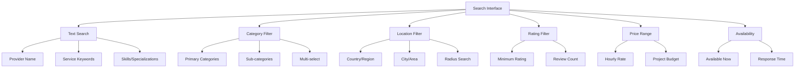

# Landing Page Provider Directory Integration

The Provider Directory integration with the Trific eCommerce Landing Page showcases vetted service providers as part of the main marketplace entry experience. This integration supports provider discovery from the landing page while maintaining optimal performance.

## Landing Page Integration Overview

### Provider Directory Touchpoints

The landing page integrates with the provider directory through:

1. **Featured Categories** - Category cards that link to provider results
2. **Provider Spotlights** - Featured provider showcases on homepage
3. **Search Integration** - Header search that includes provider results
4. **Browse CTAs** - Calls-to-action that route to provider directory

### Integration Architecture

```typescript
interface ProviderDirectoryIntegration {
	landingPageComponents: {
		featuredCategories: CategoryCard[]; // Links to provider categories
		providerSpotlights: ProviderTeaser[]; // Featured provider showcases
		headerSearch: SearchIntegration; // Provider search capability
		browseCTAs: DirectoryAction[]; // Navigation to full directory
	};

	performanceRequirements: {
		lazyLoading: boolean; // Lazy load provider content
		caching: CachePolicy; // Provider data caching
		fallbacks: FallbackContent; // Error state handling
		accessibility: A11yRequirements; // Accessibility standards
	};
}
```

## Directory Structure

## Featured Categories Integration

### Category Card Display

Category cards on the landing page link to filtered provider directory views:

```typescript
interface CategoryToDirectoryLink {
	categoryCard: {
		id: string;
		title: string; // Category display name
		description?: string; // Category description
		image: CategoryImage; // Category visual
		providerCount: number; // Number of providers in category
	};

	linkTarget: {
		url: string; // Provider directory URL - I don't know exact pattern
		filters: {
			category: string; // Pre-applied category filter
			location?: string; // Optional location context
			sortBy: "rating" | "recent"; // Default sort order
		};
		tracking: {
			event: "category_card_click"; // Analytics event
			category_id: string; // Category identifier
			position: number; // Card position on page
		};
	};
}
```

### Category Performance Requirements

**Loading Strategy:**

-   **Above-fold categories** - Load immediately with hero section
-   **Below-fold categories** - Lazy load as user scrolls
-   **Category images** - Optimized with responsive breakpoints
-   **Provider counts** - Cached data with periodic updates

**Error Handling:**

```typescript
interface CategoryErrorHandling {
	apiFailure: {
		showPlaceholder: boolean; // Show category card without count
		fallbackImage: string; // Generic category image
		disableLink: boolean; // Disable broken links
	};

	imageFailure: {
		placeholder: string; // Category placeholder image
		altText: string; // Accessibility description
		maintainLayout: boolean; // Prevent layout shift
	};

	countFailure: {
		hideCount: boolean; // Hide provider count on error
		showGeneric: boolean; // Show "Browse" instead of count
	};
}
```

## Provider Spotlights Integration

### Featured Provider Display

Landing page showcases selected providers to build trust and demonstrate quality:

```typescript
interface ProviderSpotlight {
	provider: {
		id: string;
		businessName: string;
		displayName: string;
		logo: string; // Provider logo image
		specialization: string[]; // Key service areas
		location: string; // Primary location
		rating: {
			average: number; // Provider rating
			reviewCount: number; // Number of reviews
		};
	};

	spotlight: {
		tagline: string; // Marketing tagline
		description: string; // Brief provider description
		featuredImage?: string; // Showcase image
		trustIndicators: TrustBadge[]; // Verification badges
	};

	engagement: {
		cta: {
			label: string; // "View Provider" or similar
			target: string; // Provider profile URL - I don't know pattern
		};
		tracking: {
			event: "provider_spotlight_click";
			provider_id: string;
			position: number; // Spotlight position
		};
	};
}
```

### Spotlight Content Management

**Selection Criteria:**

-   High TenderSure rating and client reviews
-   Active and responsive providers
-   Diverse service category representation
-   Geographic distribution consideration

**Content Requirements:**

```typescript
interface SpotlightContentRules {
	provider: {
		minimumRating: number; // Minimum required rating
		minimumReviews: number; // Minimum review count
		verificationRequired: boolean; // Must be verified provider
		activeStatus: boolean; // Currently accepting work
	};

	content: {
		taglineMaxLength: number; // Character limit for tagline
		descriptionMaxLength: number; // Character limit for description
		imageRequired: boolean; // Require featured image
		logoRequired: boolean; // Require provider logo
	};

	display: {
		maxSpotlights: number; // Maximum spotlights on page
		rotationSchedule?: string; // Automatic rotation schedule
		priority: "rating" | "manual"; // Selection method
	};
}
```

## Search Integration

### Header Search Provider Integration

The landing page header search includes provider results alongside product/service searches:

```typescript
interface SearchIntegration {
	searchTypes: {
		unified: boolean; // Single search for all content
		tabbed: boolean; // Separate tabs for providers/products
		filtered: boolean; // Filter options in results
	};

	providerResults: {
		includedInMainSearch: boolean; // Mix providers with other results
		separateSection: boolean; // Dedicated provider section
		maxResults: number; // Maximum providers in search results
		resultFormat: "card" | "list"; // Provider result display format
	};

	searchFeatures: {
		typeahead: boolean; // Auto-suggest provider names
		locationAware: boolean; // Prioritize local providers
		categoryFilter: boolean; // Filter by provider categories
		ratingFilter: boolean; // Filter by provider ratings
	};
}
```

### Search Performance

**Provider Search Optimization:**

```typescript
interface ProviderSearchPerformance {
	caching: {
		searchIndex: {
			duration: number; // Search index cache duration - I don't know
			updateStrategy: "incremental" | "full";
		};

		results: {
			duration: number; // Search results cache
			userSpecific: boolean; // Personalized result caching
		};
	};

	performance: {
		responseTime: number; // Maximum search response time - I don't know target
		debouncing: {
			delay: number; // Input debounce delay (300ms)
			minQuery: number; // Minimum search query length (2)
		};
		pagination: {
			initialResults: number; // First page result count
			lazyLoad: boolean; // Load more results on scroll
		};
	};
}
```

## Browse CTAs Integration

### Directory Navigation Actions

Landing page CTAs that direct users to the provider directory:

```typescript
interface DirectoryNavigationCTAs {
	heroCTA: {
		primary: {
			label: string; // "Start Browsing" - I don't know exact label
			target: string; // Main provider directory URL
			tracking: "hero_cta_primary";
		};
		secondary?: {
			label: string; // "Find Providers" - I don't know exact label
			target: string; // Provider directory or category page
			tracking: "hero_cta_secondary";
		};
	};

	sectionCTAs: {
		afterCategories: DirectoryCTA; // CTA after category section
		afterSpotlights: DirectoryCTA; // CTA after provider spotlights
		footerCTA: DirectoryCTA; // Final directory CTA
	};
}

interface DirectoryCTA {
	label: string;
	target: string; // Directory URL with context
	context?: {
		utm_source: "landing_page";
		utm_medium: "cta";
		utm_campaign: string; // Specific campaign tracking
	};
	styling: {
		variant: "primary" | "secondary" | "outline";
		size: "small" | "medium" | "large";
	};
}
```

## Provider Directory Routes

### URL Structure Integration

**Landing Page to Directory Navigation:**

```typescript
interface DirectoryRoutingIntegration {
	routes: {
		main: string; // "/providers" - I don't know exact route
		category: string; // "/providers/category/{slug}"
		search: string; // "/providers/search?q={query}"
		location: string; // "/providers/location/{area}"
		provider: string; // "/provider/{id}" or "/provider/{slug}"
	};

	parameters: {
		category: {
			slug: string; // Category URL slug
			filters?: ProviderFilter[]; // Additional filters
			sort?: SortOption; // Default sort order
		};
		search: {
			query: string; // Search query
			type?: "provider" | "service"; // Search type
			location?: string; // Location filter
		};
		referral: {
			source: "landing_page"; // Traffic source tracking
			campaign?: string; // Campaign identifier
			position?: number; // Element position on landing
		};
	};
}
```

### Navigation Context Preservation

**User Journey Tracking:**

```typescript
interface NavigationContext {
	landingPageContext: {
		entryPoint: "hero" | "category" | "spotlight" | "search";
		userIntent: "browse" | "search" | "specific_provider";
		previousInteractions: UserAction[];
	};

	directoryPreferences: {
		preferredLocation?: string; // Inferred or selected location
		preferredCategories?: string[]; // Interest indicators
		priceRange?: PriceRange; // Budget preferences
	};

	personalization: {
		returningUser: boolean; // Previous visitor identification - I don't know if implemented
		savedPreferences?: UserPreferences; // Stored user preferences
		behaviorSignals: BehaviorData; // User interaction patterns
	};
}
```

## Data Integration & APIs

### Provider Data Sources

**API Integration:**

```typescript
interface ProviderDataIntegration {
	landingPageAPIs: {
		featuredProviders: {
			endpoint: string; // Featured provider API - I don't know URL
			caching: CachePolicy;
			fallback: FallbackProvider[];
		};

		categoryProviderCounts: {
			endpoint: string; // Category statistics API
			updateFrequency: string; // "hourly" | "daily"
			caching: CachePolicy;
		};

		searchSuggestions: {
			endpoint: string; // Provider search suggestions
			preload: boolean; // Preload common suggestions
			caching: CachePolicy;
		};
	};

	dataConsistency: {
		providerStatus: "realtime" | "cached"; // Provider availability updates
		ratings: "realtime" | "cached"; // Rating and review updates
		inventory: "realtime" | "cached"; // Service availability
	};
}
```

### Content Synchronization

**Provider Content Updates:**

```typescript
interface ProviderContentSync {
	syncTriggers: {
		providerStatusChange: boolean; // Provider availability changes
		ratingUpdate: boolean; // New reviews or rating changes
		profileUpdate: boolean; // Provider profile modifications
		verificationChange: boolean; // Verification status changes
	};

	updateStrategy: {
		immediate: string[]; // Fields requiring immediate updates
		batched: string[]; // Fields updated in batches
		scheduled: string[]; // Fields updated on schedule
	};

	cacheInvalidation: {
		targeted: boolean; // Invalidate specific provider data
		cascade: boolean; // Invalidate related content
		graceful: boolean; // Avoid breaking user experience
	};
}
```

## Performance Considerations

### Provider Content Loading

**Loading Strategy:**

-   **Featured provider data** - Preload during initial page load
-   **Category provider counts** - Load with category cards
-   **Search provider data** - Load on search interaction
-   **Additional provider details** - Load on user interaction

**Performance Optimization:**

```typescript
interface ProviderContentPerformance {
	loading: {
		priorityContent: ["featured_providers", "category_counts"];
		deferredContent: ["search_index", "detailed_profiles"];
		lazyContent: ["provider_images", "extended_details"];
	};

	caching: {
		browserCache: {
			providerImages: "1 hour";
			providerData: "15 minutes";
			searchResults: "5 minutes";
		};

		cdnCache: {
			staticContent: "1 day";
			dynamicContent: "1 hour";
			searchIndex: "30 minutes";
		};
	};

	optimization: {
		imageCompression: boolean; // Optimize provider images
		dataMinification: boolean; // Minimize API response size
		requestBatching: boolean; // Batch multiple provider requests
	};
}
```

### Error Handling & Fallbacks

**Resilient Provider Integration:**

```typescript
interface ProviderIntegrationResilience {
	apiFailures: {
		featuredProviders: {
			fallback: "cached_data" | "placeholder" | "hide_section";
			retryStrategy: RetryConfig;
			userNotification: boolean;
		};

		search: {
			fallback: "basic_search" | "cached_results" | "error_message";
			degradedMode: boolean; // Simplified search functionality
			recovery: AutoRecoveryConfig;
		};
	};

	contentFailures: {
		providerImages: {
			placeholder: string; // Generic provider placeholder
			altText: string; // Accessible image description
			layoutMaintenance: boolean; // Prevent layout shift
		};

		providerData: {
			minimalDisplay: ProviderMinimal; // Essential provider info only
			errorIndicator: boolean; // Show data freshness warning
		};
	};
}
```

## Analytics & Tracking

### Provider Directory Analytics

**Landing Page Provider Interactions:**

```typescript
interface ProviderDirectoryAnalytics {
	landingPageEvents: {
		category_card_click: {
			category_id: string;
			category_name: string;
			position: number;
			provider_count: number;
		};

		provider_spotlight_click: {
			provider_id: string;
			provider_name: string;
			position: number;
			source_section: "featured" | "category";
		};

		browse_cta_click: {
			cta_location: "hero" | "section" | "footer";
			cta_label: string;
			user_intent: "browse" | "search";
		};

		search_provider_result_click: {
			query: string;
			provider_id: string;
			result_position: number;
			search_type: "unified" | "provider_only";
		};
	};

	conversionTracking: {
		landingToDirectory: boolean; // Track landing page to directory navigation
		directoryEngagement: boolean; // Track directory usage from landing visitors
		providerContacts: boolean; // Track provider contact conversions
	};
}
```

### User Journey Analysis

**Provider Discovery Patterns:**

```typescript
interface ProviderDiscoveryAnalytics {
	userJourneys: {
		entry_point: "hero" | "category" | "search" | "spotlight";
		interaction_sequence: UserAction[];
		conversion_point?: "contact" | "bookmark" | "exit";
		session_duration: number;
	};

	performanceImpact: {
		loading_time_correlation: boolean; // Performance vs engagement correlation
		error_rate_impact: boolean; // Error impact on provider discovery
		search_success_rate: boolean; // Provider search effectiveness
	};
}
```

## Testing & Quality Assurance

### Provider Directory E2E Testing

**Landing Page Integration Tests:**

```gherkin
Feature: Provider directory integration on landing page

  Scenario: Featured categories navigate to provider directory
    Given I open the landing page
    When I click a featured category card
    Then I should be on the provider directory page
    And the category filter should be pre-applied
    And provider results should be relevant to the category

  Scenario: Provider spotlights display correctly
    Given I open the landing page
    When I scroll to provider spotlights
    Then I should see featured provider information
    And provider ratings should be displayed
    And "View Provider" CTAs should be functional

  Scenario: Header search includes providers
    Given I open the landing page
    When I search for "web design" in the header
    Then I should see relevant provider results
    And I should be able to click through to provider profiles
```

**Performance Integration Tests:**

```gherkin
Feature: Provider content performance on landing page

  Scenario: Provider content loads within performance budget
    Given I open the landing page
    When provider content loads
    Then featured provider data should load within 2 seconds
    And provider images should lazy load appropriately
    And no layout shift should occur during provider content loading
```

### Content Quality Assurance

**Provider Content Validation:**

-   Provider information accuracy and freshness
-   Image quality and optimization validation
-   Link functionality and target validation
-   Rating and review data consistency
-   Accessibility compliance for provider content

---

_Next: [SEO Features Documentation](../seo-features/) →_

### Category Organization

```typescript
interface ServiceCategory {
	id: string;
	name: string;
	slug: string;
	description: string;
	icon: string;
	parentCategory?: string;
	subCategories: ServiceCategory[];

	// Display Settings
	displayOrder: number;
	featuredProviders: ProviderListing[];
	backgroundColor: string;

	// Metadata
	providerCount: number;
	averageRating: number;
	priceRange: {
		min: number;
		max: number;
		currency: string;
	};
}
```

## Search & Filtering System

### Advanced Search Interface



### Search Functionality

```typescript
interface SearchParams {
	// Text Search
	query?: string;

	// Category Filtering
	categories?: string[];
	skills?: string[];

	// Location Filtering
	location?: {
		country?: string;
		region?: string;
		city?: string;
		coordinates?: {
			lat: number;
			lng: number;
			radius: number; // in kilometers
		};
	};

	// Quality Filtering
	minRating?: number;
	minReviews?: number;
	verifiedOnly?: boolean;

	// Business Filtering
	businessType?: ("individual" | "company" | "agency")[];
	teamSize?: ("solo" | "small" | "medium" | "large")[];
	yearsInBusiness?: {
		min?: number;
		max?: number;
	};

	// Availability
	availability?: ("available" | "busy")[];
	maxResponseTime?: number; // in hours

	// Pricing
	priceRange?: {
		min?: number;
		max?: number;
		currency: string;
		type: "hourly" | "project";
	};

	// Sorting
	sortBy?: "relevance" | "rating" | "reviews" | "recent" | "price";
	sortOrder?: "asc" | "desc";

	// Pagination
	page?: number;
	limit?: number;
}
```

### Search Implementation

```typescript
export const searchProviders = async (
	params: SearchParams
): Promise<SearchResults> => {
	const query = buildSearchQuery(params);

	// Execute search with Elasticsearch/Algolia
	const results = await searchEngine.search({
		index: "providers",
		query,
		filters: buildFilters(params),
		sort: buildSortCriteria(params),
		facets: [
			"categories",
			"location.country",
			"location.region",
			"rating",
			"businessType",
			"priceRange",
		],
	});

	return {
		providers: results.hits.map((hit) => transformProvider(hit)),
		totalCount: results.total,
		facets: results.facets,
		searchTime: results.searchTime,
	};
};
```

## Provider Profile Previews

### Card Layout

```typescript
interface ProviderCard {
	layout: "compact" | "standard" | "featured";

	header: {
		logo: string;
		businessName: string;
		tagline: string;
		verificationBadges: Badge[];
	};

	body: {
		specializations: string[];
		location: string;
		rating: {
			score: number;
			reviewCount: number;
			display: "stars" | "numeric" | "both";
		};
		keyStats: {
			completedProjects: number;
			responseTime: string;
			availability: AvailabilityStatus;
		};
	};

	footer: {
		actions: Action[];
		priceIndicator?: {
			range: string;
			type: "hourly" | "project";
		};
	};
}
```

### Preview Information Display

```typescript
interface ProviderPreview {
	// Essential Information
	basicInfo: {
		name: string;
		logo: string;
		tagline: string;
		location: string;
	};

	// Quality Indicators
	qualityMetrics: {
		tenderSureScore: number;
		clientRating: number;
		reviewCount: number;
		completedProjects: number;
		successRate: number;
	};

	// Service Information
	serviceInfo: {
		primaryServices: string[];
		specializations: string[];
		industryExperience: string[];
	};

	// Availability & Pricing
	engagement: {
		availability: AvailabilityStatus;
		responseTime: string;
		priceRange?: PriceRange;
		preferredProjectSize: string;
	};

	// Trust Signals
	trustSignals: {
		verificationBadges: Badge[];
		certifications: Certification[];
		yearsInBusiness: number;
		clientTestimonial?: string;
	};
}
```

## Geographic Search Features

### Location-Based Discovery

```typescript
interface LocationSearch {
	// Address Search
	addressSearch: {
		query: string;
		suggestions: AddressSuggestion[];
		geocoding: GeocodeResult;
	};

	// Radius Search
	radiusSearch: {
		center: Coordinates;
		radius: number;
		unit: "km" | "miles";
		providers: ProviderListing[];
	};

	// Regional Browsing
	regionalBrowsing: {
		countries: Country[];
		regions: Region[];
		cities: City[];
		providerCounts: Record<string, number>;
	};
}
```

### Map Integration

```typescript
interface MapConfig {
	provider: "google" | "mapbox" | "openstreetmap";

	display: {
		zoom: {
			default: number;
			min: number;
			max: number;
		};
		center: Coordinates;
		style: "roadmap" | "satellite" | "terrain";
	};

	markers: {
		providers: {
			icon: string;
			cluster: boolean;
			popup: PopupConfig;
		};
		userLocation: {
			icon: string;
			accuracy: boolean;
		};
	};

	controls: {
		search: boolean;
		zoom: boolean;
		fullscreen: boolean;
		streetView: boolean;
	};
}
```

## Ratings & Reviews Display

### Review System Integration

```typescript
interface ReviewDisplay {
	summary: {
		averageRating: number;
		totalReviews: number;
		ratingDistribution: {
			5: number;
			4: number;
			3: number;
			2: number;
			1: number;
		};
	};

	featuredReviews: {
		review: Review;
		client: {
			name: string;
			avatar?: string;
			projectType: string;
			verifiedClient: boolean;
		};
		project: {
			category: string;
			completionDate: Date;
			projectValue?: string;
		};
	}[];

	reviewMetrics: {
		communication: number;
		quality: number;
		timeliness: number;
		value: number;
		overall: number;
	};
}
```

### Trust Indicators

```typescript
interface TrustIndicators {
	verificationBadges: {
		identityVerified: boolean;
		businessVerified: boolean;
		skillsVerified: boolean;
		backgroundChecked: boolean;
	};

	certifications: {
		name: string;
		issuer: string;
		validUntil: Date;
		verified: boolean;
	}[];

	businessCredentials: {
		businessRegistration: boolean;
		taxCompliance: boolean;
		insuranceCoverage: boolean;
		bondedStatus: boolean;
	};

	platformMetrics: {
		memberSince: Date;
		projectsCompleted: number;
		repeatClientRate: number;
		responseTime: string;
	};
}
```

## Performance Optimization

### Search Performance

```typescript
interface SearchOptimization {
	// Caching Strategy
	cache: {
		searchResults: {
			ttl: number; // 300 seconds
			key: string;
			invalidation: string[];
		};

		filters: {
			ttl: number; // 3600 seconds
			categories: boolean;
			locations: boolean;
		};

		providers: {
			ttl: number; // 1800 seconds
			profiles: boolean;
			ratings: boolean;
		};
	};

	// Search Index Optimization
	indexing: {
		realTimeUpdates: boolean;
		batchSize: number;
		refreshInterval: number;
		fieldWeighting: Record<string, number>;
	};

	// Query Optimization
	queryOptimization: {
		autoComplete: boolean;
		typoTolerance: boolean;
		synonyms: boolean;
		facetedSearch: boolean;
	};
}
```

### Loading Strategies

```typescript
interface LoadingStrategy {
	// Initial Load
	initialLoad: {
		providerCount: number;
		lazyLoading: boolean;
		skeletonScreens: boolean;
	};

	// Progressive Loading
	progressiveLoading: {
		scrollTrigger: boolean;
		prefetchNext: boolean;
		chunkSize: number;
	};

	// Image Optimization
	imageOptimization: {
		lazyLoading: boolean;
		responsiveImages: boolean;
		webpSupport: boolean;
		placeholder: "blur" | "empty";
	};
}
```

## SEO Optimization

### Search Engine Optimization

```typescript
interface DirectorySEO {
	// Page-Level SEO
	pageStructure: {
		title: string;
		description: string;
		canonicalUrl: string;
		breadcrumbs: Breadcrumb[];
	};

	// Schema Markup
	structuredData: {
		localBusiness: LocalBusiness[];
		aggregateRating: AggregateRating;
		itemList: ItemList;
		organization: Organization;
	};

	// Content SEO
	contentOptimization: {
		headingStructure: boolean;
		keywordDensity: number;
		altTexts: boolean;
		internalLinking: boolean;
	};

	// Technical SEO
	technicalSEO: {
		sitemapGeneration: boolean;
		robotsDirectives: string[];
		hrefLangTags: boolean;
		coreWebVitals: boolean;
	};
}
```

### Local SEO Features

```typescript
interface LocalSEO {
	// Geographic Optimization
	geographic: {
		cityPages: boolean;
		regionPages: boolean;
		localKeywords: string[];
		geoTagging: boolean;
	};

	// Business Listings
	businessListings: {
		googleMyBusiness: boolean;
		bingPlaces: boolean;
		yelpIntegration: boolean;
		industryDirectories: boolean;
	};

	// Local Content
	localContent: {
		citySpecificContent: boolean;
		localTestimonials: boolean;
		regionalCaseStudies: boolean;
		localPartners: boolean;
	};
}
```

## Analytics & Tracking

### User Behavior Analytics

```typescript
interface DirectoryAnalytics {
	// Search Analytics
	searchMetrics: {
		queryVolume: number;
		popularSearches: string[];
		zeroResultSearches: string[];
		searchToContactRate: number;
	};

	// Provider Performance
	providerMetrics: {
		viewCounts: Record<string, number>;
		clickThroughRates: Record<string, number>;
		contactRates: Record<string, number>;
		conversionRates: Record<string, number>;
	};

	// User Engagement
	engagementMetrics: {
		timeOnDirectory: number;
		pagesPerSession: number;
		bounceRate: number;
		returnVisitorRate: number;
	};

	// Conversion Tracking
	conversionMetrics: {
		directoryToRegistration: number;
		directoryToContact: number;
		directoryToHire: number;
		averageValuePerConversion: number;
	};
}
```

### Performance Monitoring

```typescript
interface PerformanceMonitoring {
	// Core Web Vitals
	coreWebVitals: {
		largestContentfulPaint: number;
		firstInputDelay: number;
		cumulativeLayoutShift: number;
	};

	// Search Performance
	searchPerformance: {
		averageResponseTime: number;
		searchSuccessRate: number;
		errorRate: number;
		cacheHitRate: number;
	};

	// User Experience
	userExperience: {
		taskCompletionRate: number;
		userSatisfactionScore: number;
		supportTicketVolume: number;
		usabilityScore: number;
	};
}
```

---

_Next: [User Registration Flows](/home-landing/user-registration/) →_
