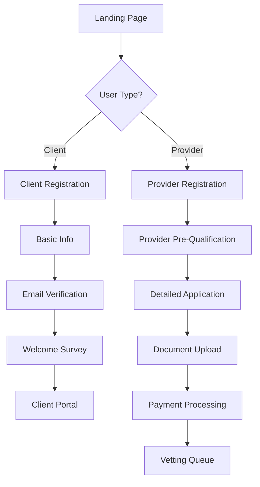

# User Registration Flows

The Trific Platform provides streamlined registration experiences for both clients and service providers, with optimized user journeys designed to maximize conversion while ensuring data quality and security.

## Overview

The registration system features:

-   **Dual Registration Paths** - Separate optimized flows for clients and providers
-   **Progressive Profiling** - Multi-step information collection to reduce abandonment
-   **Social Authentication** - OAuth integration with major providers
-   **Email Verification** - Secure account activation and validation
-   **Mobile-Optimized** - Responsive design for all device types

## Registration Architecture

### User Flow Overview



### Registration Types

```typescript
interface RegistrationType {
	client: {
		steps: ["basic-info", "verification", "survey", "onboarding"];
		requiredFields: ClientBasicInfo;
		optionalFields: ClientExtendedInfo;
		skipOptions: string[];
	};

	provider: {
		steps: [
			"prequalification",
			"application",
			"documents",
			"payment",
			"verification"
		];
		requiredFields: ProviderApplicationInfo;
		optionalFields: ProviderExtendedInfo;
		skipOptions: never[]; // All steps required
	};
}
```

## Client Registration Flow

### Step 1: Basic Information Collection

```typescript
interface ClientBasicInfo {
	// Personal Information
	personalInfo: {
		firstName: string;
		lastName: string;
		email: string;
		phone?: string;
		timeZone: string;
	};

	// Account Setup
	accountSetup: {
		password: string;
		acceptTerms: boolean;
		subscribeToUpdates: boolean;
	};

	// Initial Preferences
	preferences: {
		primaryLanguage: string;
		communicationPreferences: CommunicationMethod[];
		projectTypes?: string[];
	};
}
```

#### Form Implementation

```typescript
export const ClientBasicInfoForm = () => {
	const form = useForm<ClientBasicInfo>({
		resolver: zodResolver(clientBasicInfoSchema),
		defaultValues: {
			personalInfo: {
				timeZone: Intl.DateTimeFormat().resolvedOptions().timeZone,
			},
		},
	});

	const onSubmit = async (data: ClientBasicInfo) => {
		try {
			// Create initial account
			const account = await createClientAccount(data);

			// Send verification email
			await sendVerificationEmail(account.email);

			// Track registration event
			trackEvent("client_registration_started", {
				userId: account.id,
				source: "direct",
			});

			// Redirect to verification
			router.push(`/verify-email?token=${account.verificationToken}`);
		} catch (error) {
			handleRegistrationError(error);
		}
	};

	return <Form {...form}>{/* Form fields implementation */}</Form>;
};
```

### Step 2: Email Verification

```typescript
interface EmailVerification {
	process: {
		tokenGeneration: {
			algorithm: "JWT";
			expiration: number; // 24 hours
			secrets: string[];
		};

		emailTemplate: {
			subject: string;
			template: "welcome-verification";
			personalization: PersonalizationData;
		};

		verification: {
			maxAttempts: number;
			resendCooldown: number; // 60 seconds
			successRedirect: string;
		};
	};

	fallback: {
		manualVerification: boolean;
		supportContact: ContactInfo;
		alternativeMethod: "sms" | "phone";
	};
}
```

#### Verification Implementation

```typescript
export const EmailVerificationHandler = () => {
	const [verificationStatus, setVerificationStatus] = useState<
		"pending" | "success" | "error"
	>("pending");
	const { token } = useSearchParams();

	useEffect(() => {
		const verifyEmail = async () => {
			try {
				const response = await fetch("/api/auth/verify-email", {
					method: "POST",
					headers: { "Content-Type": "application/json" },
					body: JSON.stringify({ token }),
				});

				if (response.ok) {
					setVerificationStatus("success");

					// Track successful verification
					trackEvent("email_verified", { token });

					// Auto-redirect to next step
					setTimeout(() => {
						router.push("/registration/survey");
					}, 2000);
				} else {
					setVerificationStatus("error");
				}
			} catch (error) {
				setVerificationStatus("error");
				console.error("Verification error:", error);
			}
		};

		if (token) {
			verifyEmail();
		}
	}, [token]);

	return <VerificationStatusDisplay status={verificationStatus} />;
};
```

### Step 3: Welcome Survey

```typescript
interface WelcomeSurvey {
	// Business Context
	businessInfo: {
		companyName?: string;
		industry: string;
		companySize:
			| "individual"
			| "startup"
			| "small"
			| "medium"
			| "large"
			| "enterprise";
		role: string;
	};

	// Project Information
	projectNeeds: {
		projectTypes: string[];
		budgetRange: BudgetRange;
		timeline: "immediate" | "within-month" | "within-quarter" | "planning";
		frequency: "one-time" | "occasional" | "regular" | "ongoing";
	};

	// Service Preferences
	servicePreferences: {
		providerTypes: ("individual" | "small-team" | "agency")[];
		locationPreference: "local" | "regional" | "national" | "global";
		communicationStyle: "minimal" | "regular" | "frequent";
	};

	// Platform Discovery
	discovery: {
		howDidYouHear: string;
		referralSource?: string;
		marketingCampaign?: string;
	};
}
```

## Provider Registration Flow

### Step 1: Pre-Qualification

```typescript
interface ProviderPreQualification {
	// Business Eligibility
	eligibility: {
		businessType:
			| "individual"
			| "partnership"
			| "llc"
			| "corporation"
			| "other";
		yearsInBusiness: number;
		businessRegistration: boolean;
		taxCompliance: boolean;
	};

	// Service Capabilities
	services: {
		primaryCategories: string[];
		specializations: string[];
		industries: string[];
		geographicCoverage: Location[];
	};

	// Basic Requirements
	requirements: {
		hasInsurance: boolean;
		hasReferences: boolean;
		canProvidePortfolio: boolean;
		agreeToVetting: boolean;
	};

	// Financial Readiness
	financial: {
		canPayVettingFee: boolean;
		understandsFeeStructure: boolean;
		hasBusinessBankAccount: boolean;
	};
}
```

#### Pre-Qualification Logic

```typescript
export const evaluatePreQualification = (
	data: ProviderPreQualification
): QualificationResult => {
	const criteria = {
		businessType: data.eligibility.businessType !== "other",
		businessAge: data.eligibility.yearsInBusiness >= 1,
		businessRegistration: data.eligibility.businessRegistration,
		taxCompliance: data.eligibility.taxCompliance,
		hasInsurance: data.requirements.hasInsurance,
		hasReferences: data.requirements.hasReferences,
		agreeToVetting: data.requirements.agreeToVetting,
		canPayFee: data.financial.canPayVettingFee,
		bankAccount: data.financial.hasBusinessBankAccount,
	};

	const passed = Object.values(criteria).filter(Boolean).length;
	const total = Object.keys(criteria).length;
	const score = (passed / total) * 100;

	return {
		qualified: score >= 80, // 80% threshold
		score,
		failedCriteria: Object.entries(criteria)
			.filter(([_, passed]) => !passed)
			.map(([criterion]) => criterion),
		recommendations: generateRecommendations(criteria),
	};
};
```

### Step 2: Detailed Application

```typescript
interface ProviderApplication {
	// Business Information
	businessInfo: {
		legalBusinessName: string;
		tradingName: string;
		businessRegistrationNumber: string;
		taxId: string;
		businessAddress: Address;
		mailingAddress: Address;
		website?: string;
		socialMediaProfiles: SocialProfile[];
	};

	// Contact Information
	contactInfo: {
		primaryContact: ContactPerson;
		secondaryContact?: ContactPerson;
		businessPhone: string;
		businessEmail: string;
		emergencyContact: ContactPerson;
	};

	// Service Details
	serviceDetails: {
		primaryServices: Service[];
		serviceDescription: string;
		uniqueValueProposition: string;
		targetMarkets: string[];
		pricing: PricingStructure;
	};

	// Experience & Qualifications
	experience: {
		yearsInIndustry: number;
		notableClients: string[];
		projectExamples: ProjectExample[];
		certifications: Certification[];
		awards: Award[];
	};

	// Team Information
	team: {
		teamSize: number;
		keyPersonnel: TeamMember[];
		subcontractors: boolean;
		subcontractorPolicy?: string;
	};

	// References
	references: {
		clientReferences: ClientReference[];
		professionalReferences: ProfessionalReference[];
		portfolioItems: PortfolioItem[];
	};
}
```

### Step 3: Document Upload

```typescript
interface DocumentRequirements {
	mandatory: {
		businessRegistration: Document;
		businessLicense: Document;
		taxCertificate: Document;
		insuranceCertificate: Document;
		bankStatement: Document;
	};

	conditional: {
		professionalLicenses?: Document[];
		certifications?: Document[];
		bondingDocuments?: Document[];
		workSamples?: Document[];
	};

	optional: {
		clientTestimonials?: Document[];
		awards?: Document[];
		mediaKits?: Document[];
		marketingMaterials?: Document[];
	};
}
```

#### Document Upload Implementation

```typescript
export const DocumentUploadForm = () => {
	const [uploadProgress, setUploadProgress] = useState<
		Record<string, number>
	>({});
	const [uploadedDocs, setUploadedDocs] = useState<Record<string, Document>>(
		{}
	);

	const uploadDocument = async (file: File, documentType: string) => {
		const formData = new FormData();
		formData.append("file", file);
		formData.append("documentType", documentType);
		formData.append("providerId", providerId);

		try {
			const response = await fetch("/api/documents/upload", {
				method: "POST",
				body: formData,
				onUploadProgress: (progressEvent) => {
					const progress = Math.round(
						(progressEvent.loaded * 100) / progressEvent.total
					);
					setUploadProgress((prev) => ({
						...prev,
						[documentType]: progress,
					}));
				},
			});

			if (response.ok) {
				const document = await response.json();
				setUploadedDocs((prev) => ({
					...prev,
					[documentType]: document,
				}));

				// Trigger document verification
				await triggerDocumentVerification(document.id);
			}
		} catch (error) {
			console.error("Upload error:", error);
			showErrorNotification(`Failed to upload ${documentType}`);
		}
	};

	return (
		<DocumentUploadInterface
			requirements={DOCUMENT_REQUIREMENTS}
			onUpload={uploadDocument}
			progress={uploadProgress}
			uploaded={uploadedDocs}
		/>
	);
};
```

### Step 4: Payment Processing

```typescript
interface VettingPayment {
	// Fee Structure
	fee: {
		baseAmount: number;
		currency: string;
		discounts: Discount[];
		totalAmount: number;
	};

	// Payment Options
	paymentMethods: {
		creditCard: boolean;
		bankTransfer: boolean;
		digitalWallet: boolean;
		cryptocurrency?: boolean;
	};

	// Processing
	processing: {
		gateway: "stripe" | "paypal" | "square";
		tokenization: boolean;
		pci_compliance: boolean;
		fraud_protection: boolean;
	};

	// Post-Payment
	postPayment: {
		receipt: boolean;
		confirmation: boolean;
		vettingQueueEntry: boolean;
		statusUpdates: boolean;
	};
}
```

## Social Authentication

### OAuth Integration

```typescript
interface SocialAuthConfig {
	providers: {
		google: {
			enabled: boolean;
			clientId: string;
			scope: string[];
			userInfoMapping: UserInfoMapping;
		};

		linkedin: {
			enabled: boolean;
			clientId: string;
			scope: string[];
			userInfoMapping: UserInfoMapping;
		};

		microsoft: {
			enabled: boolean;
			clientId: string;
			scope: string[];
			userInfoMapping: UserInfoMapping;
		};
	};

	settings: {
		autoLinkAccounts: boolean;
		requireEmailVerification: boolean;
		mergeConflictStrategy: "ask-user" | "prefer-existing" | "prefer-social";
	};
}
```

#### Social Auth Implementation

```typescript
export const SocialAuthProvider = ({ provider, userType }: SocialAuthProps) => {
	const handleSocialAuth = async () => {
		try {
			// Initiate OAuth flow
			const authUrl = await generateOAuthUrl(provider, userType);

			// Track social login attempt
			trackEvent("social_login_attempt", { provider, userType });

			// Redirect to provider
			window.location.href = authUrl;
		} catch (error) {
			console.error("Social auth error:", error);
			showErrorNotification("Social login failed");
		}
	};

	return (
		<Button variant="outline" onClick={handleSocialAuth} className="w-full">
			<Icon name={provider} className="mr-2" />
			Continue with {provider}
		</Button>
	);
};

// OAuth callback handler
export const handleOAuthCallback = async (code: string, state: string) => {
	try {
		// Exchange code for tokens
		const tokens = await exchangeOAuthCode(code, state);

		// Get user info from provider
		const userInfo = await fetchUserInfo(tokens.access_token);

		// Check if account exists
		const existingUser = await findUserByEmail(userInfo.email);

		if (existingUser) {
			// Link social account
			await linkSocialAccount(existingUser.id, userInfo);
			await signIn(existingUser);
		} else {
			// Create new account
			const newUser = await createUserFromSocial(userInfo);
			await signIn(newUser);
		}

		// Track successful social login
		trackEvent("social_login_success", {
			provider: userInfo.provider,
			userId: existingUser?.id || newUser.id,
		});
	} catch (error) {
		console.error("OAuth callback error:", error);
		redirectToErrorPage("social-auth-failed");
	}
};
```

## Form Validation & UX

### Validation Strategy

```typescript
interface ValidationStrategy {
	// Real-time Validation
	realTime: {
		enabled: boolean;
		debounceMs: number;
		fields: string[];
		showSuccess: boolean;
	};

	// Field-Level Validation
	fieldValidation: {
		email: EmailValidation;
		password: PasswordValidation;
		phone: PhoneValidation;
		businessInfo: BusinessValidation;
	};

	// Form-Level Validation
	formValidation: {
		requiredFields: string[];
		conditionalFields: ConditionalField[];
		crossFieldValidation: CrossFieldRule[];
	};

	// Error Handling
	errorHandling: {
		showInline: boolean;
		showSummary: boolean;
		scrollToError: boolean;
		persistErrors: boolean;
	};
}
```

### Progressive Enhancement

```typescript
interface ProgressiveEnhancement {
	// Auto-Save
	autoSave: {
		enabled: boolean;
		intervalMs: number;
		fields: string[];
		indicator: boolean;
	};

	// Smart Defaults
	smartDefaults: {
		locationFromIP: boolean;
		timezoneDetection: boolean;
		browserLanguage: boolean;
		formPreFill: boolean;
	};

	// Accessibility
	accessibility: {
		screenReaderSupport: boolean;
		keyboardNavigation: boolean;
		highContrast: boolean;
		ariaLabels: boolean;
	};

	// Mobile Optimization
	mobileOptimization: {
		touchTargets: boolean;
		swipeNavigation: boolean;
		autocomplete: boolean;
		nativeInputs: boolean;
	};
}
```

## Analytics & Optimization

### Registration Analytics

```typescript
interface RegistrationAnalytics {
	// Funnel Analysis
	funnelMetrics: {
		landingPageViews: number;
		registrationStarted: number;
		stepsCompleted: Record<string, number>;
		registrationCompleted: number;
		conversionRate: number;
	};

	// Drop-off Analysis
	dropOffAnalysis: {
		stepDropOff: Record<string, number>;
		fieldDropOff: Record<string, number>;
		errorDropOff: Record<string, number>;
		timeOnStep: Record<string, number>;
	};

	// Demographic Data
	demographics: {
		userTypes: Record<string, number>;
		geographicDistribution: Record<string, number>;
		deviceTypes: Record<string, number>;
		trafficSources: Record<string, number>;
	};

	// Performance Metrics
	performance: {
		loadTimes: Record<string, number>;
		errorRates: Record<string, number>;
		completionTimes: Record<string, number>;
		retryRates: Record<string, number>;
	};
}
```

### A/B Testing Framework

```typescript
interface RegistrationABTest {
	testId: string;
	name: string;
	description: string;

	variants: {
		id: string;
		name: string;
		traffic: number;
		changes: {
			formLayout?: FormLayout;
			fieldOrder?: string[];
			validation?: ValidationConfig;
			styling?: StyleConfig;
		};
	}[];

	metrics: {
		primary: "conversion_rate" | "completion_time" | "drop_off_rate";
		secondary: string[];
	};

	targeting: {
		userType?: "client" | "provider";
		geographic?: string[];
		device?: "mobile" | "desktop";
		trafficSource?: string[];
	};
}
```

---

_Next: [SEO Features](/home-landing/seo-features/) →_
