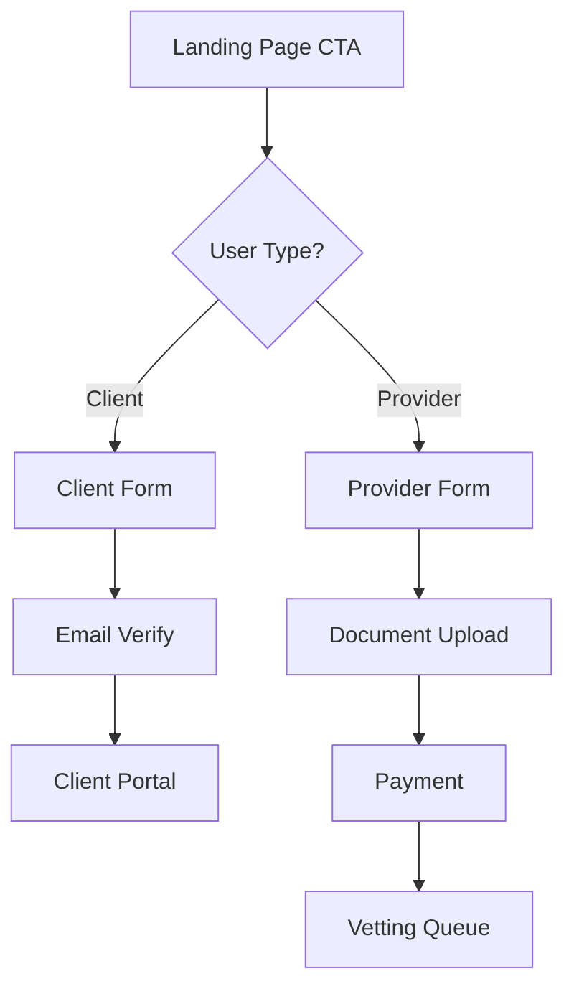

# User Registration

User acquisition and registration flows from the landing page.

## Registration Types

**Client Registration (3 steps):**

1. Basic info: Name, email, password
2. Email verification: Confirmation link
3. Welcome survey: Service interests (optional)

**Provider Registration (5 steps):**

1. Pre-qualification: Basic eligibility check
2. Application: Business details and services
3. Documents: Verification documents upload
4. Payment: Registration fee processing
5. Review: TenderSure vetting process

## Registration Flow



## Implementation & Validation

**Client Registration Interface:**

```typescript
interface ClientRegistration {
	step1: {
		firstName: string;
		lastName: string;
		email: string;
		password: string;
		agreeToTerms: boolean;
	};
	step2: {
		emailVerified: boolean;
		verificationToken: string;
	};
	step3?: {
		serviceInterests: string[];
		location: string;
		projectBudget: string;
	};
}
```

**Registration CTAs:**

```typescript
interface RegistrationCTA {
	primary: {
		text: "Get Started";
		userType: "client";
		variant: "primary";
	};
	secondary: {
		text: "Become a Provider";
		userType: "provider";
		variant: "outline";
	};
	tracking: {
		source: "landing_page";
		position: "hero" | "section" | "footer";
	};
}
```

**Validation Rules:**

-   Email: Valid format, not already registered
-   Password: Min 8 chars, mixed case, numbers
-   Terms: Must accept to proceed
-   Provider: Business license, tax ID, insurance required

**Error Handling:**

```typescript
interface RegistrationErrors {
	client: {
		EMAIL_EXISTS: "Account already exists";
		WEAK_PASSWORD: "Password too weak";
		VERIFICATION_FAILED: "Email verification failed";
	};
	provider: {
		INELIGIBLE: "Does not meet requirements";
		DOCUMENT_INVALID: "Invalid document format";
		PAYMENT_FAILED: "Payment processing failed";
	};
}
```

**E2E Testing:**

```gherkin
Feature: User registration from landing page
  Scenario: Successful client registration
    Given I visit the landing page
    When I click "Get Started"
    And I fill the client registration form
    Then I should receive verification email
    And I should be redirected to email confirmation

  Scenario: Provider registration flow
    Given I visit the landing page
    When I click "Become a Provider"
    And I complete pre-qualification
    Then I should proceed to detailed application
    And I should be able to upload documents
```

---

_Next: [Testing](../testing/) →_

## Implementation

### Client Registration

````typescript
interface ClientRegistration {
  step1: {
    firstName: string;
    lastName: string;
    email: string;
    password: string;
    agreeToTerms: boolean;
  };

  step2: {
    emailVerified: boolean;
    verificationToken: string;
  };

  step3?: {
    serviceInterests: string[];
    location: string;
    projectBudget: string;
  };
}
## Landing Page CTAs

### Registration Entry Points
- **Hero CTA** - "Get Started" primary button
- **Provider CTA** - "Become a Provider" secondary button
- **Category Cards** - "Find Providers" (leads to client registration)
- **Footer CTA** - "Join Today" link

### CTA Implementation
```typescript
interface RegistrationCTA {
  primary: {
    text: "Get Started";
    userType: "client";
    variant: "primary";
  };

  secondary: {
    text: "Become a Provider";
    userType: "provider";
    variant: "outline";
  };

  tracking: {
    source: "landing_page";
    position: "hero" | "section" | "footer";
    campaign?: string;
  };
}
````

## Form Validation

### Client Validation Rules

-   **Email** - Valid format, not already registered
-   **Password** - Min 8 chars, mixed case, numbers
-   **Terms** - Must accept to proceed

### Provider Validation Rules

-   **Business License** - Required for verification
-   **Tax ID** - Valid format for jurisdiction
-   **Insurance** - Current coverage required
-   **Portfolio** - Minimum 3 work samples

## Error Handling

### Common Registration Errors

```typescript
interface RegistrationErrors {
	client: {
		EMAIL_EXISTS: "Account already exists";
		WEAK_PASSWORD: "Password too weak";
		VERIFICATION_FAILED: "Email verification failed";
	};

	provider: {
		INELIGIBLE: "Does not meet requirements";
		DOCUMENT_INVALID: "Invalid document format";
		PAYMENT_FAILED: "Payment processing failed";
	};
}
```

## Testing

### Registration E2E Tests

```gherkin
Feature: User registration from landing page

  Scenario: Successful client registration
    Given I visit the landing page
    When I click "Get Started"
    And I fill the client registration form
    Then I should receive verification email
    And I should be redirected to email confirmation

  Scenario: Provider registration flow
    Given I visit the landing page
    When I click "Become a Provider"
    And I complete pre-qualification
    Then I should proceed to detailed application
    And I should be able to upload documents
```

---

_Next: [Analytics](../analytics/) →_

    variants: {
    	id: string;
    	name: string;
    	traffic: number;
    	changes: {
    		formLayout?: FormLayout;
    		fieldOrder?: string[];
    		validation?: ValidationConfig;
    		styling?: StyleConfig;
    	};
    }[];

    metrics: {
    	primary: "conversion_rate" | "completion_time" | "drop_off_rate";
    	secondary: string[];
    };

    targeting: {
    	userType?: "client" | "provider";
    	geographic?: string[];
    	device?: "mobile" | "desktop";
    	trafficSource?: string[];
    };

}

```

---

_Next: [SEO Features](/home-landing/seo-features/) →_
```
