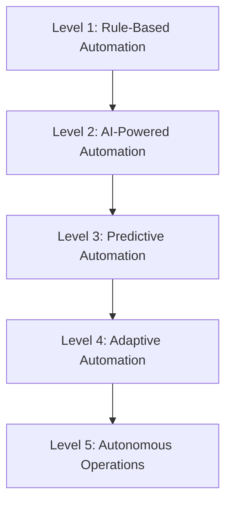

# Automation Workflows

The Trific platform leverages extensive automation to enhance efficiency, improve user experience, and ensure consistent quality across all operations. This documentation outlines the comprehensive automation frameworks that power the platform's intelligent operations.

## Automation Strategy

### Core Principles

-   **Intelligence-First**: AI and machine learning at the core of automation decisions
-   **Human-in-the-Loop**: Strategic human oversight for critical decision points
-   **Scalable Architecture**: Automation systems designed for massive scale
-   **Continuous Learning**: Systems that improve through experience and feedback
-   **Fail-Safe Design**: Robust error handling and graceful degradation

### Automation Hierarchy



## Smart Matching Automation

### Intelligent Provider-Client Matching

#### Multi-Dimensional Matching Algorithm

```typescript
interface SmartMatching {
	matchingCriteria: {
		technicalSkills: {
			requiredSkills: Skill[];
			skillWeighting: SkillWeight[];
			proficiencyThreshold: number;
			certificationRequirements: Certification[];
		};
		experienceFactors: {
			industryExperience: IndustryExperience;
			projectComplexity: ComplexityScore;
			similarProjectHistory: ProjectHistory[];
			successRate: number;
		};
		behavioralFactors: {
			communicationStyle: CommunicationProfile;
			workingStyle: WorkStyleProfile;
			culturalFit: CulturalAlignment;
			collaborationScore: number;
		};
		logisticalFactors: {
			availability: AvailabilitySchedule;
			timezone: TimezoneCompatibility;
			locationPreference: LocationRequirement;
			budgetAlignment: BudgetCompatibility;
		};
	};

	matchingAlgorithm: {
		weightingSystem: CriteriaWeights;
		scoringModel: MatchingScore;
		rankingAlgorithm: RankingFunction;
		diversityFactors: DiversityScoring;
	};
}
```

#### Real-Time Matching Process

1. **Job Analysis**: Automated analysis of job requirements and complexity
2. **Provider Pool Identification**: Dynamic provider pool assembly based on criteria
3. **Compatibility Scoring**: Multi-dimensional compatibility assessment
4. **Ranking and Selection**: Intelligent ranking with diversity and fairness considerations
5. **Match Validation**: Automated validation of match quality and success probability

### Dynamic Match Optimization

#### Continuous Learning System

-   **Historical Success Analysis**: Learning from past matching success and failures
-   **Feedback Integration**: Incorporating client and provider feedback into matching algorithms
-   **Market Trend Adaptation**: Adapting to changing market conditions and requirements
-   **Performance Optimization**: Continuous optimization of matching accuracy and efficiency

#### Machine Learning Models

```typescript
interface MatchingML {
	models: {
		compatibilityModel: MLModel;
		successPredictionModel: MLModel;
		satisfactionPredictionModel: MLModel;
		longTermValueModel: MLModel;
	};

	features: {
		userBehaviorFeatures: BehavioralFeatures;
		projectCharacteristics: ProjectFeatures;
		marketConditions: MarketFeatures;
		historicalPerformance: PerformanceFeatures;
	};

	training: {
		dataCollection: TrainingDataPipeline;
		modelTraining: TrainingPipeline;
		modelValidation: ValidationFramework;
		deploymentAutomation: ModelDeployment;
	};
}
```

## Automated Notifications System

### Intelligent Notification Engine

#### Multi-Channel Notification Delivery

-   **In-Platform Notifications**: Real-time platform notifications with priority queuing
-   **Email Notifications**: Smart email delivery with personalization and optimization
-   **SMS Alerts**: Critical notification SMS delivery with carrier optimization
-   **Mobile Push Notifications**: Native mobile app push notifications with targeting
-   **Integration Webhooks**: Third-party system integration through webhook notifications

#### Smart Notification Logic

```typescript
interface NotificationAutomation {
	triggers: {
		eventBasedTriggers: EventTrigger[];
		timeBasedTriggers: ScheduleTrigger[];
		conditionBasedTriggers: ConditionalTrigger[];
		behaviorBasedTriggers: BehavioralTrigger[];
	};

	personalization: {
		userPreferences: NotificationPreferences;
		contextualRelevance: RelevanceScoring;
		timingOptimization: TimingOptimization;
		contentPersonalization: ContentPersonalization;
	};

	deliveryOptimization: {
		channelSelection: ChannelOptimization;
		frequencyCapping: FrequencyManagement;
		deliveryTiming: DeliveryOptimization;
		performanceTracking: NotificationAnalytics;
	};
}
```

### Notification Categories

#### Project Lifecycle Notifications

-   **Milestone Reminders**: Automated milestone deadline and progress reminders
-   **Status Updates**: Real-time project status change notifications
-   **Payment Alerts**: Payment due, received, and processing notifications
-   **Communication Notifications**: New message alerts and response reminders

#### Platform Activity Notifications

-   **Match Notifications**: New match opportunities and provider interest alerts
-   **Profile Updates**: Provider profile updates and verification status changes
-   **System Notifications**: Platform maintenance, feature releases, and system updates
-   **Security Alerts**: Login attempts, password changes, and security-related notifications

## Quality Monitoring Automation

### Automated Quality Assessment

#### Multi-Layered Quality Evaluation

```typescript
interface QualityAutomation {
	automatedAssessment: {
		technicalQuality: {
			codeQualityAnalysis: CodeQualityMetrics;
			designComplianceCheck: DesignStandards;
			performanceBenchmarking: PerformanceMetrics;
			securityAssessment: SecurityScan;
		};

		deliverableQuality: {
			completenessCheck: CompletenessValidation;
			accuracyAssessment: AccuracyMetrics;
			usabilityTesting: UsabilityScore;
			clientRequirementAlignment: RequirementMatch;
		};

		processQuality: {
			timelineAdherence: TimelineCompliance;
			communicationQuality: CommunicationMetrics;
			milestoneCompletion: MilestoneTracking;
			changeManagement: ChangeTracker;
		};
	};

	continuousMonitoring: {
		realTimeTracking: QualityTracker;
		trendAnalysis: QualityTrends;
		predictiveAnalysis: QualityPrediction;
		alertSystem: QualityAlerts;
	};
}
```

#### Intelligent Quality Intervention

-   **Early Warning Systems**: Predictive quality issue detection and early intervention
-   **Automated Coaching**: AI-powered coaching recommendations for quality improvement
-   **Quality Gate Enforcement**: Automated enforcement of quality standards and checkpoints
-   **Corrective Action Triggers**: Automatic initiation of corrective actions for quality issues

### Performance Analytics Automation

#### Real-Time Performance Monitoring

-   **System Performance Tracking**: Continuous monitoring of platform performance metrics
-   **User Experience Analytics**: Real-time user experience measurement and optimization
-   **Business Performance Monitoring**: Automated business KPI tracking and analysis
-   **Predictive Performance Analysis**: Predictive analytics for performance optimization

#### Automated Performance Optimization

```typescript
interface PerformanceAutomation {
	monitoring: {
		systemMetrics: SystemPerformanceTracker;
		userExperienceMetrics: UXAnalytics;
		businessMetrics: BusinessKPITracker;
		qualityMetrics: QualityPerformanceTracker;
	};

	optimization: {
		automaticScaling: AutoScalingRules;
		loadBalancing: LoadBalancingOptimization;
		cacheOptimization: CacheManagement;
		resourceOptimization: ResourceAllocation;
	};

	alerting: {
		performanceThresholds: PerformanceThresholds;
		anomalyDetection: AnomalyDetection;
		escalationProcedures: EscalationAutomation;
		incidentManagement: IncidentAutomation;
	};
}
```

## Data Processing Automation

### Intelligent Data Pipeline

#### Automated Data Collection

-   **User Interaction Tracking**: Comprehensive user behavior data collection and analysis
-   **System Event Logging**: Automated system event capture and structured logging
-   **Business Process Monitoring**: Real-time business process data collection and analysis
-   **External Data Integration**: Automated integration of external data sources and APIs

#### Real-Time Data Processing

```typescript
interface DataProcessingAutomation {
	dataIngestion: {
		realTimeStreaming: StreamProcessor;
		batchProcessing: BatchProcessor;
		eventProcessing: EventProcessor;
		dataValidation: DataValidator;
	};

	dataTransformation: {
		dataEnrichment: DataEnrichmentEngine;
		dataNormalization: DataNormalizer;
		dataAggregation: AggregationEngine;
		featureEngineering: FeatureProcessor;
	};

	dataAnalysis: {
		statisticalAnalysis: StatisticalProcessor;
		machinelearningAnalysis: MLProcessor;
		predictiveAnalysis: PredictiveProcessor;
		anomalyDetection: AnomalyProcessor;
	};

	dataOutput: {
		reportGeneration: ReportGenerator;
		dashboardUpdates: DashboardAutomation;
		alertGeneration: AlertProcessor;
		apiDataService: DataAPIService;
	};
}
```

### Business Intelligence Automation

#### Automated Reporting and Analytics

-   **Executive Dashboards**: Automated generation of executive-level business intelligence
-   **Operational Reports**: Real-time operational reporting and performance dashboards
-   **Financial Analytics**: Automated financial performance analysis and reporting
-   **Predictive Business Analytics**: AI-powered business forecasting and trend analysis

#### Market Intelligence Automation

-   **Competitive Analysis**: Automated competitive landscape monitoring and analysis
-   **Market Trend Detection**: AI-powered market trend identification and analysis
-   **Customer Insight Generation**: Automated customer behavior analysis and insight generation
-   **Opportunity Identification**: Automated identification of business opportunities and threats

## Workflow Automation Engine

### Business Process Automation

#### End-to-End Process Automation

```typescript
interface WorkflowAutomation {
	processDefinition: {
		workflowSteps: WorkflowStep[];
		decisionPoints: DecisionPoint[];
		automationRules: AutomationRule[];
		escalationProcedures: EscalationRule[];
	};

	executionEngine: {
		taskScheduler: TaskScheduler;
		workflowEngine: WorkflowEngine;
		ruleEngine: BusinessRuleEngine;
		integrationEngine: IntegrationEngine;
	};

	monitoring: {
		processTracking: ProcessTracker;
		performanceMetrics: ProcessMetrics;
		exceptionHandling: ExceptionHandler;
		optimizationEngine: ProcessOptimizer;
	};
}
```

#### Smart Process Optimization

-   **Process Mining**: Automated analysis of process execution and optimization opportunities
-   **Bottleneck Detection**: Intelligent identification of process bottlenecks and inefficiencies
-   **Resource Optimization**: Automated resource allocation and process optimization
-   **Continuous Improvement**: AI-driven continuous process improvement recommendations

### Integration Automation

#### API and System Integration

-   **Automated API Management**: Dynamic API integration and management
-   **Data Synchronization**: Real-time data synchronization across integrated systems
-   **Workflow Integration**: Seamless workflow integration between internal and external systems
-   **Error Handling and Recovery**: Automated error handling and system recovery procedures

#### Third-Party Service Automation

-   **Payment Processing**: Automated payment processing and reconciliation
-   **Communication Services**: Automated email, SMS, and communication service integration
-   **Storage and Backup**: Automated data storage, backup, and recovery services
-   **Security Services**: Automated security service integration and monitoring

## Advanced Automation Capabilities

### Artificial Intelligence Integration

#### AI-Powered Decision Making

```typescript
interface AIAutomation {
	decisionEngines: {
		matchingDecisionEngine: AIDecisionEngine;
		pricingDecisionEngine: PricingAI;
		qualityDecisionEngine: QualityAI;
		riskDecisionEngine: RiskAI;
	};

	learningModels: {
		userBehaviorModel: UserBehaviorAI;
		marketTrendModel: MarketTrendAI;
		performanceModel: PerformanceAI;
		predictionModel: PredictiveAI;
	};

	automationCapabilities: {
		intelligentRouting: SmartRouting;
		dynamicOptimization: DynamicOptimizer;
		predictiveActions: PredictiveAutomation;
		adaptiveResponses: AdaptiveAutomation;
	};
}
```

#### Natural Language Processing

-   **Automated Content Analysis**: AI-powered analysis of job descriptions, proposals, and communications
-   **Sentiment Analysis**: Real-time sentiment analysis of user interactions and feedback
-   **Language Translation**: Automated translation services for international users
-   **Chatbot and Virtual Assistants**: AI-powered customer support and user assistance

### Robotic Process Automation (RPA)

#### Administrative Task Automation

-   **Document Processing**: Automated document processing and data extraction
-   **Data Entry Automation**: Intelligent data entry and form processing
-   **Report Generation**: Automated report compilation and distribution
-   **Compliance Checking**: Automated compliance verification and reporting

#### Financial Process Automation

-   **Invoice Processing**: Automated invoice generation, processing, and reconciliation
-   **Payment Processing**: Automated payment workflows and financial reconciliation
-   **Tax Calculation**: Automated tax calculation and reporting compliance
-   **Financial Reporting**: Automated financial report generation and distribution

## Automation Governance and Control

### Automation Monitoring and Management

#### Automation Performance Tracking

```typescript
interface AutomationGovernance {
	performanceMetrics: {
		automationEfficiency: EfficiencyMetrics;
		errorRates: ErrorRateTracking;
		processingTimes: ProcessingTimeAnalytics;
		resourceUtilization: ResourceMetrics;
	};

	qualityControl: {
		automationQuality: QualityAssurance;
		outputValidation: OutputValidator;
		exceptionHandling: ExceptionManager;
		continuousImprovement: ImprovementEngine;
	};

	governance: {
		complianceMonitoring: ComplianceTracker;
		auditTrails: AuditLogger;
		accessControls: AccessManager;
		changeManagement: ChangeController;
	};
}
```

#### Risk Management and Control

-   **Automation Risk Assessment**: Continuous assessment of automation risks and mitigation
-   **Fail-Safe Mechanisms**: Robust fail-safe systems for automation failure scenarios
-   **Human Oversight**: Strategic human oversight for critical automation decisions
-   **Rollback Capabilities**: Automated rollback capabilities for automation failures

### Continuous Improvement Framework

#### Automation Optimization

-   **Performance Analysis**: Continuous analysis of automation performance and effectiveness
-   **Optimization Opportunities**: Identification and implementation of automation improvements
-   **Technology Advancement**: Integration of new automation technologies and capabilities
-   **Best Practice Evolution**: Development and sharing of automation best practices

#### Innovation and Experimentation

-   **Automation Innovation Labs**: Dedicated spaces for automation experimentation and development
-   **Pilot Programs**: Systematic piloting of new automation technologies and approaches
-   **Technology Partnerships**: Strategic partnerships for automation technology advancement
-   **Knowledge Sharing**: Cross-industry knowledge sharing and collaboration on automation

## Future-Ready Automation

### Emerging Technologies Integration

#### Next-Generation Automation

-   **Quantum Computing Integration**: Exploration of quantum computing for complex optimization problems
-   **Edge Computing Automation**: Distributed automation capabilities for improved performance
-   **Blockchain Automation**: Integration of blockchain technology for trust and transparency
-   **IoT Integration**: Internet of Things integration for expanded automation capabilities

#### Autonomous Systems Evolution

-   **Self-Healing Systems**: Autonomous systems that can detect and repair issues automatically
-   **Self-Optimizing Platforms**: Platforms that continuously optimize themselves without human intervention
-   **Predictive Automation**: Systems that anticipate needs and take proactive automated actions
-   **Adaptive Intelligence**: Automation systems that evolve and adapt to changing conditions

### Scalability and Growth

#### Global Automation Strategy

-   **Multi-Region Automation**: Automation capabilities designed for global scale and distribution
-   **Cultural Adaptation**: Automation systems that adapt to different cultural and regulatory environments
-   **Language and Localization**: Multilingual automation capabilities for global market penetration
-   **Regulatory Compliance**: Automation systems designed for multi-jurisdiction regulatory compliance

#### Future-Proof Architecture

-   **Modular Automation Design**: Flexible, modular automation architecture for easy expansion
-   **API-First Approach**: API-centric automation design for maximum integration flexibility
-   **Cloud-Native Automation**: Cloud-native automation capabilities for scalability and resilience
-   **Microservices Architecture**: Microservices-based automation for maximum flexibility and maintainability
