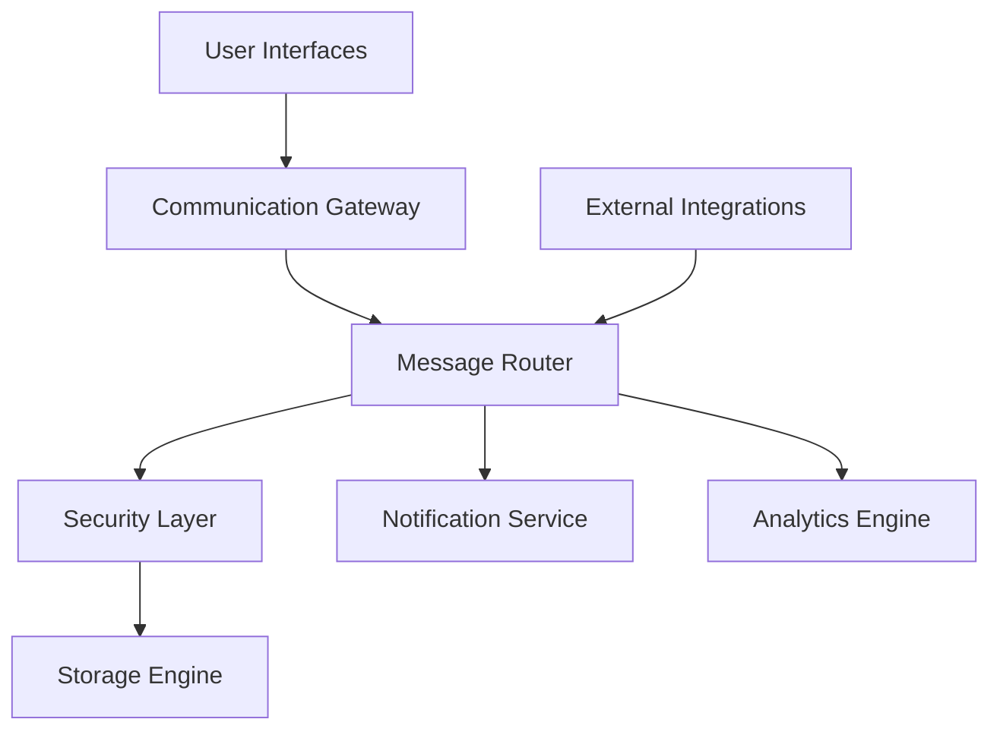
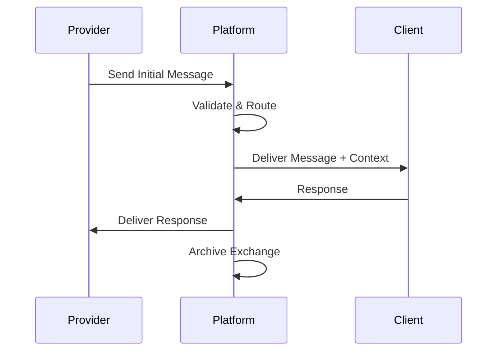
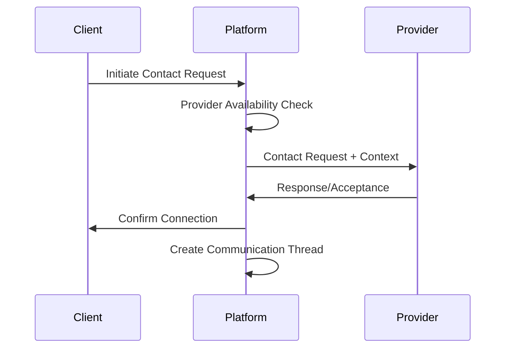
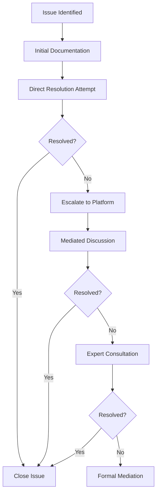

# Communication Flows

Effective communication is fundamental to the success of the TRIFIC platform. This documentation outlines the structured communication workflows that ensure clear, secure, and documented interactions between all platform participants.

## Overview

The TRIFIC platform implements a multi-layered communication system designed to facilitate:

-   **Secure Messaging**: End-to-end encrypted communication channels
-   **Structured Workflows**: Predefined communication patterns for common scenarios
-   **Documentation**: Comprehensive conversation history and archival
-   **Integration**: Seamless integration with project management and business processes
-   **Compliance**: Regulatory compliance and audit trail maintenance

## Communication Architecture



### Core Components

#### Message Router

-   **Channel Management**: Dynamic channel creation and management
-   **Priority Routing**: Message prioritization and routing logic
-   **Integration Hooks**: External system integration points
-   **Load Balancing**: Message processing load distribution

#### Security Layer

-   **Encryption**: End-to-end message encryption and decryption
-   **Authentication**: User identity verification and authorization
-   **Access Control**: Permission-based message access management
-   **Audit Logging**: Complete communication audit trail

## Communication Channels

### 1. Direct Messaging

#### Client-Provider Communication

**Use Cases:**

-   Initial project discussions and requirement clarification
-   Ongoing project updates and status communication
-   Issue resolution and problem-solving discussions
-   Final delivery and feedback exchanges

**Features:**

-   Real-time messaging with typing indicators
-   File attachment support with virus scanning
-   Message history with search functionality
-   Mobile and desktop notification system

```typescript
interface DirectMessage {
	messageId: string;
	threadId: string;
	senderId: string;
	recipientId: string;
	content: {
		text?: string;
		attachments?: MessageAttachment[];
		richContent?: RichMediaContent;
	};
	timestamp: Date;
	status: "sent" | "delivered" | "read";
	priority: "low" | "normal" | "high" | "urgent";
	metadata: {
		projectId?: string;
		contractId?: string;
		milestoneId?: string;
	};
}
```

### 2. Project Channels

#### Structured Project Communication

**Channel Types:**

-   **General Discussion**: Open project-related conversations
-   **Milestone-Specific**: Focused discussions around specific deliverables
-   **Technical Support**: Platform and technical issue resolution
-   **Administrative**: Contract, payment, and administrative matters

**Participant Management:**

-   Dynamic participant addition/removal
-   Role-based permissions and access control
-   Moderation capabilities for complex projects
-   Guest access for external stakeholders

### 3. System Notifications

#### Automated Communication

**Notification Categories:**

-   **Project Updates**: Milestone completions, deadline reminders
-   **Payment Events**: Payment releases, invoice generation
-   **Platform Updates**: System maintenance, feature releases
-   **Security Alerts**: Login attempts, security policy changes

**Delivery Channels:**

-   In-platform notifications with priority queuing
-   Email notifications with customizable frequency
-   SMS alerts for urgent communications
-   Mobile push notifications for real-time updates

## Communication Workflows

### Initial Contact Flow

#### Provider-Initiated Contact



**Process Steps:**

1. **Interest Expression**: Provider expresses interest in posted opportunity
2. **Context Provision**: Platform provides relevant project context and history
3. **Initial Screening**: Automated screening for quality and relevance
4. **Delivery Optimization**: Message delivery timing and priority management
5. **Response Facilitation**: Tools and prompts to encourage timely responses

#### Client-Initiated Contact



**Process Steps:**

1. **Provider Selection**: Client selects provider for direct contact
2. **Availability Verification**: Real-time provider availability confirmation
3. **Context Packaging**: Relevant project and client information compilation
4. **Introduction Facilitation**: Structured introduction and ice-breaking
5. **Channel Establishment**: Secure communication channel creation

### Project Communication Flow

#### Milestone-Based Communication

**Communication Triggers:**

-   **Milestone Start**: Kick-off discussions and clarifications
-   **Progress Updates**: Regular status updates and check-ins
-   **Issue Escalation**: Problem identification and resolution initiation
-   **Milestone Completion**: Delivery notification and review requests
-   **Approval Cycles**: Client review, feedback, and approval processes

**Structured Templates:**

```typescript
interface MilestoneUpdate {
	milestoneId: string;
	status: "started" | "in-progress" | "completed" | "blocked";
	progress: {
		percentComplete: number;
		completedTasks: Task[];
		remainingTasks: Task[];
		blockers: Issue[];
	};
	communication: {
		summary: string;
		detailedUpdate: string;
		questions: Question[];
		attachments: File[];
	};
	nextSteps: {
		plannedActions: Action[];
		timeline: Timeline;
		requiredApprovals: Approval[];
	};
}
```

#### Issue Resolution Flow

**Escalation Levels:**

1. **Direct Resolution**: Provider-client direct problem solving
2. **Mediated Discussion**: Platform-facilitated resolution with guidance
3. **Expert Consultation**: Subject matter expert involvement
4. **Formal Mediation**: Structured mediation process
5. **Arbitration**: Final resolution through binding arbitration

**Resolution Workflow:**



### Administrative Communication

#### Contract and Payment Communication

**Contract Lifecycle Communication:**

-   **Negotiation Phase**: Terms discussion and modification communication
-   **Approval Process**: Multi-party review and approval coordination
-   **Amendment Requests**: Contract change request and approval workflow
-   **Renewal Discussions**: Contract extension and renewal negotiations

**Payment Communication:**

-   **Invoice Generation**: Automated invoice creation and delivery
-   **Payment Processing**: Payment status updates and confirmations
-   **Dispute Management**: Payment dispute resolution communication
-   **Financial Reporting**: Regular financial summary and reporting

```typescript
interface PaymentCommunication {
	type: "invoice" | "payment_confirmation" | "dispute" | "report";
	participants: {
		client: User;
		provider: User;
		platform: SystemUser;
	};
	paymentDetails: {
		amount: number;
		currency: string;
		milestoneId?: string;
		invoiceId: string;
		dueDate: Date;
	};
	status: PaymentStatus;
	communicationLog: CommunicationEntry[];
}
```

## Security and Compliance

### Message Security

#### Encryption Standards

-   **End-to-End Encryption**: AES-256 encryption for all message content
-   **Key Management**: Automated key rotation and secure key storage
-   **Forward Secrecy**: Message security even if keys are compromised
-   **Zero-Knowledge Architecture**: Platform cannot decrypt user communications

#### Access Controls

-   **Role-Based Permissions**: Message access based on user roles and project involvement
-   **Time-Based Access**: Message access windows and expiration policies
-   **Geographic Restrictions**: Location-based access controls where required
-   **Audit Trail**: Complete access logging and monitoring

### Compliance Framework

#### Regulatory Compliance

-   **GDPR Compliance**: European data protection regulation adherence
-   **CCPA Compliance**: California Consumer Privacy Act requirements
-   **Industry Standards**: Sector-specific compliance (HIPAA, SOX, etc.)
-   **International Regulations**: Multi-jurisdiction regulatory compliance

#### Data Management

-   **Retention Policies**: Message retention and automatic deletion schedules
-   **Data Portability**: User data export and transfer capabilities
-   **Right to Deletion**: Complete message history deletion upon request
-   **Backup and Recovery**: Secure backup with compliance-aware recovery procedures

## Performance and Analytics

### Communication Metrics

#### Response Time Analytics

```typescript
interface CommunicationMetrics {
	responseTime: {
		average: number; // Average response time in minutes
		median: number; // Median response time
		percentile95: number; // 95th percentile response time
		byUserType: {
			clients: number;
			providers: number;
			support: number;
		};
	};
	volumeMetrics: {
		messagesPerDay: number;
		activeThreads: number;
		averageThreadLength: number;
		attachmentCount: number;
	};
	qualityMetrics: {
		resolutionRate: number; // Percentage of issues resolved through communication
		escalationRate: number; // Percentage requiring escalation
		satisfactionScore: number; // Communication satisfaction rating
	};
}
```

#### Communication Effectiveness

**Quality Indicators:**

-   **Resolution Rate**: Percentage of issues resolved through direct communication
-   **Escalation Rate**: Rate of communication requiring platform intervention
-   **Satisfaction Scores**: User satisfaction with communication experience
-   **Response Quality**: Message relevance and helpfulness ratings

**Performance Optimization:**

-   **Response Time Improvement**: Automated prompts and reminders for timely responses
-   **Template Optimization**: Smart template suggestions based on context
-   **Language Processing**: AI-powered communication clarity and tone analysis
-   **Workflow Automation**: Automated routine communication and updates

### Intelligent Communication Features

#### AI-Powered Enhancements

**Smart Suggestions:**

-   **Response Recommendations**: AI-suggested responses based on context and history
-   **Tone Analysis**: Communication tone analysis and improvement suggestions
-   **Language Translation**: Real-time translation for international collaborations
-   **Sentiment Monitoring**: Automatic sentiment analysis and escalation triggers

**Automated Workflows:**

-   **Smart Routing**: Intelligent message routing based on content and urgency
-   **Follow-up Reminders**: Automatic reminder system for pending responses
-   **Template Suggestions**: Context-aware communication template recommendations
-   **Priority Classification**: Automatic message prioritization and urgent escalation

#### Communication Analytics Dashboard

**Real-Time Monitoring:**

-   **Active Conversations**: Live view of ongoing communication threads
-   **Response Time Tracking**: Real-time response time monitoring and alerting
-   **Issue Detection**: Automatic identification of communication problems
-   **Quality Scoring**: Continuous communication quality assessment

**Historical Analysis:**

-   **Communication Trends**: Long-term communication pattern analysis
-   **User Behavior Insights**: Communication preference and pattern identification
-   **Performance Benchmarking**: Comparative analysis against platform averages
-   **Improvement Recommendations**: Data-driven communication enhancement suggestions

## Integration and Extensibility

### External System Integration

#### CRM Integration

-   **Contact Synchronization**: Automatic contact and communication history sync
-   **Lead Management**: Communication-driven lead scoring and management
-   **Sales Pipeline**: Communication integration with sales process workflows
-   **Customer Support**: Integrated customer support ticket and communication system

#### Project Management Integration

-   **Task Communication**: Direct integration with project management tools
-   **Timeline Coordination**: Communication integration with project timelines
-   **Resource Allocation**: Communication-driven resource planning and allocation
-   **Progress Reporting**: Automated progress reporting through communication analysis

### API and Webhook Support

#### Communication API

```typescript
interface CommunicationAPI {
	sendMessage(message: MessageRequest): Promise<MessageResponse>;
	getThread(threadId: string): Promise<CommunicationThread>;
	createChannel(channelConfig: ChannelConfiguration): Promise<Channel>;
	manageParticipants(
		channelId: string,
		participants: ParticipantUpdate[]
	): Promise<void>;
	searchMessages(query: SearchQuery): Promise<SearchResults>;
	getAnalytics(timeframe: TimeRange): Promise<CommunicationAnalytics>;
}
```

#### Webhook Integration

-   **Message Events**: Real-time message delivery and status webhooks
-   **Thread Events**: Thread creation, modification, and closure notifications
-   **User Events**: User online/offline status and availability updates
-   **System Events**: Platform maintenance and system status communications

## Best Practices and Guidelines

### Communication Best Practices

#### For Clients

-   **Clear Requirements**: Provide detailed, specific project requirements and expectations
-   **Timely Responses**: Maintain prompt response times to keep projects moving
-   **Constructive Feedback**: Provide specific, actionable feedback during review cycles
-   **Professional Tone**: Maintain professional communication throughout project lifecycle

#### For Providers

-   **Proactive Updates**: Regular progress updates and proactive issue communication
-   **Clear Documentation**: Document all decisions and changes in communication threads
-   **Professional Communication**: Maintain high standards of professional communication
-   **Issue Escalation**: Prompt escalation of issues that cannot be resolved directly

#### For Platform Operations

-   **Monitoring**: Continuous monitoring of communication quality and effectiveness
-   **Intervention**: Timely intervention in communication issues and conflicts
-   **Improvement**: Regular analysis and improvement of communication tools and processes
-   **Support**: Comprehensive support for communication-related user issues

### Communication Guidelines

#### Content Standards

-   **Professional Language**: Maintain professional tone and language in all communications
-   **Respectful Interaction**: Ensure all communications are respectful and inclusive
-   **Clear Expression**: Use clear, concise language to avoid misunderstandings
-   **Document Decisions**: Record all important decisions and agreements in communication threads

#### Security Guidelines

-   **Sensitive Information**: Proper handling and protection of sensitive business information
-   **Authentication**: Verify identity for sensitive communications and transactions
-   **Compliance**: Adhere to all relevant compliance and regulatory requirements
-   **Incident Reporting**: Prompt reporting of any security incidents or concerns
