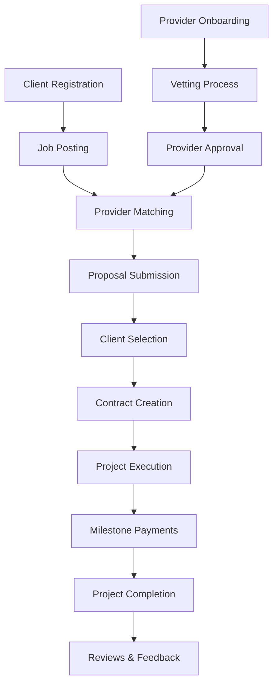

# Platform Workflows

This section provides comprehensive documentation of all key workflows in the Trific platform, covering the complete user journeys and business processes that drive the marketplace.

## Core User Workflows

### 🛍️ [Client Journey](./client-journey)

Complete end-to-end experience for clients, from initial discovery to project completion and beyond.

-   **Discovery Phase**: Finding and evaluating service providers
-   **Engagement Phase**: Job posting, proposal review, and provider selection
-   **Project Management**: Contract creation, milestone tracking, and communication
-   **Completion Phase**: Final delivery, payments, and feedback

### 🏢 [Provider Onboarding](./provider-onboarding)

Comprehensive onboarding process for service providers joining the platform.

-   **Application Process**: Initial registration and profile creation
-   **Verification Steps**: Identity verification and credential validation
-   **Vetting Process**: Skills assessment and quality evaluation
-   **Platform Training**: Orientation and best practices education

### ✅ [Vetting Process](./vetting-process)

Detailed documentation of the TenderSure vetting system that ensures provider quality.

-   **Initial Assessment**: Background checks and credential verification
-   **Skills Evaluation**: Technical competency testing and portfolio review
-   **Quality Scoring**: Comprehensive scoring methodology and criteria
-   **Ongoing Monitoring**: Continuous performance evaluation and re-vetting

### 💳 [Payment Flows](./payment-flow)

Secure payment processing workflows including escrow management and milestone-based payments.

-   **Escrow Setup**: Initial payment deposits and fund security
-   **Milestone Management**: Progress-based payment releases
-   **Dispute Resolution**: Conflict management and resolution processes
-   **Financial Settlement**: Final payments and platform fee processing

## Advanced Workflows

### 📋 [Job Lifecycle](./job-lifecycle)

Complete workflow from job posting to project completion and closure.

-   **Job Creation**: Requirement gathering and job specification
-   **Provider Matching**: Automated and manual provider selection
-   **Proposal Process**: Bid submission, evaluation, and selection
-   **Project Execution**: Work delivery, quality assurance, and milestone completion

### 💬 [Communication Flows](./communication-flow)

Structured communication workflows ensuring clear, secure, and documented interactions.

-   **Initial Contact**: First interactions between clients and providers
-   **Project Communication**: Ongoing dialogue during active projects
-   **Issue Resolution**: Escalation and problem-solving workflows
-   **Feedback Collection**: Review and rating processes

## Business Operations

### 🔄 [Platform Operations](./platform-operations)

Internal workflows for platform management and business operations.

-   **User Management**: Account lifecycle and support processes
-   **Quality Assurance**: Ongoing monitoring and improvement workflows
-   **Compliance Management**: Regulatory adherence and audit processes
-   **Performance Analytics**: Data collection, analysis, and reporting

### ⚡ [Automation Workflows](./automation-workflows)

Automated processes that enhance efficiency and user experience.

-   **Smart Matching**: AI-powered provider-client matching
-   **Automated Notifications**: Real-time updates and communication
-   **Quality Monitoring**: Automated performance tracking and alerts
-   **Data Processing**: Background data analysis and reporting

## Workflow Integration

## Cross-Workflow Dependencies

| Primary Workflow    | Dependencies                             | Integration Points                        |
| ------------------- | ---------------------------------------- | ----------------------------------------- |
| Client Journey      | Payment Flows, Communication             | Contract creation, milestone approvals    |
| Provider Onboarding | Vetting Process, Platform Operations     | Quality verification, training completion |
| Payment Flows       | Job Lifecycle, Communication             | Milestone triggers, dispute escalation    |
| Vetting Process     | Provider Onboarding, Platform Operations | Scoring updates, re-evaluation cycles     |

## Implementation Guidelines

### Workflow Documentation Standards

-   **Process Maps**: Visual representation of each workflow step
-   **Decision Points**: Clear criteria for workflow branching
-   **Error Handling**: Exception management and recovery procedures
-   **Performance Metrics**: Key indicators for workflow effectiveness

### Best Practices

-   **User-Centric Design**: Focus on user experience and ease of use
-   **Automation First**: Leverage automation to reduce manual overhead
-   **Quality Gates**: Built-in checkpoints to ensure quality standards
-   **Continuous Improvement**: Regular workflow optimization and updates
