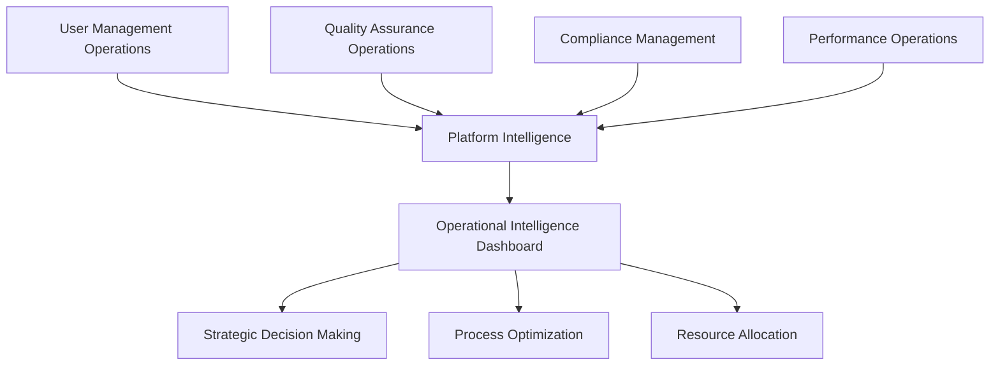
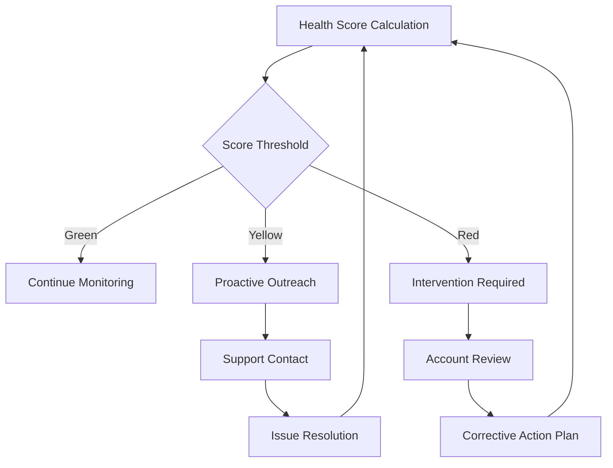

# Platform Operations Workflow

This documentation outlines the comprehensive operational workflows that ensure the Trific platform runs smoothly, maintains high quality standards, and delivers exceptional user experience across all touchpoints.

## Overview

Platform operations encompass the behind-the-scenes processes that maintain platform stability, quality, security, and growth. These workflows are designed to:

-   **Maintain Service Quality**: Ensure consistent, high-quality service delivery
-   **Optimize Performance**: Continuously improve platform performance and user experience
-   **Ensure Compliance**: Maintain regulatory compliance and audit readiness
-   **Scale Operations**: Support platform growth and expansion
-   **Drive Innovation**: Enable continuous platform evolution and improvement

## Operational Framework



## Core Operational Workflows

### 1. User Management Operations

#### User Lifecycle Management

**New User Onboarding:**

```typescript
interface UserOnboardingFlow {
	registration: {
		identityVerification: IdentityCheck;
		documentValidation: DocumentVerification;
		backgroundCheck: BackgroundScreening;
		skillsAssessment: SkillsEvaluation;
	};
	profileCreation: {
		profileCompletion: ProfileBuilder;
		portfolioValidation: PortfolioReview;
		referenceVerification: ReferenceCheck;
		profileOptimization: ProfileEnhancement;
	};
	platformIntegration: {
		orientationProgram: PlatformOrientation;
		toolsTraining: ToolsOnboarding;
		policyAcknowledgment: PolicyAcceptance;
		initialSupport: NewUserSupport;
	};
}
```

**User Support Operations:**

-   **Tier 1 Support**: Basic platform questions and navigation assistance
-   **Tier 2 Support**: Technical issues and advanced platform functionality
-   **Tier 3 Support**: Complex technical problems requiring engineering involvement
-   **Escalation Management**: Structured escalation for critical issues
-   **User Success Management**: Proactive user engagement and success optimization

#### Account Health Monitoring

**Health Indicators:**

-   **Activity Levels**: Login frequency, platform engagement, and feature utilization
-   **Performance Metrics**: Success rates, client satisfaction, and quality scores
-   **Compliance Status**: Documentation completeness, policy adherence, verification status
-   **Financial Health**: Payment history, account standing, and transaction patterns

**Intervention Workflows:**



### 2. Quality Assurance Operations

#### Continuous Quality Monitoring

**Quality Assessment Framework:**

-   **Automated Quality Checks**: Systematic quality evaluation using AI and rule-based systems
-   **Manual Quality Reviews**: Human expert evaluation for complex or high-value projects
-   **Peer Review Systems**: Community-driven quality assessment and validation
-   **Client Feedback Integration**: Systematic collection and analysis of client feedback

**Quality Control Metrics:**

```typescript
interface QualityMetrics {
	projectQuality: {
		deliverableQuality: number; // Quality of final deliverables
		processAdherence: number; // Adherence to platform processes
		timelinessScore: number; // On-time delivery performance
		communicationQuality: number; // Quality of client communication
	};
	userSatisfaction: {
		clientSatisfactionScore: number; // Client satisfaction ratings
		providerSatisfactionScore: number; // Provider satisfaction ratings
		platformUsabilityScore: number; // Platform ease-of-use ratings
		supportSatisfactionScore: number; // Support service quality ratings
	};
	platformReliability: {
		uptimePercentage: number; // System availability
		errorRate: number; // Platform error frequency
		responseTime: number; // Average system response time
		securityIncidents: number; // Security-related incidents
	};
}
```

#### Quality Improvement Workflows

**Issue Identification and Resolution:**

-   **Automated Issue Detection**: AI-powered detection of quality issues and anomalies
-   **Root Cause Analysis**: Systematic investigation of underlying quality problems
-   **Corrective Action Implementation**: Structured approach to quality improvement
-   **Impact Assessment**: Evaluation of quality improvements and their effectiveness

**Provider Quality Management:**

-   **Performance Monitoring**: Continuous tracking of provider quality metrics
-   **Coaching Programs**: Skill development and quality improvement support
-   **Quality Recognition**: Recognition and rewards for high-quality providers
-   **Quality-Based Matching**: Prioritization of high-quality providers in matching algorithms

### 3. Compliance Management Operations

#### Regulatory Compliance Framework

**Multi-Jurisdiction Compliance:**

-   **GDPR Compliance (EU)**: European data protection regulation adherence
-   **CCPA Compliance (California)**: California Consumer Privacy Act compliance
-   **SOX Compliance (US)**: Sarbanes-Oxley Act financial controls and reporting
-   **Industry-Specific Regulations**: Healthcare (HIPAA), Finance (PCI-DSS), etc.

**Compliance Monitoring:**

```typescript
interface ComplianceMonitoring {
	dataProtection: {
		dataCollectionCompliance: boolean;
		dataProceesingLawfulness: boolean;
		userConsentManagement: boolean;
		dataRetentionCompliance: boolean;
		dataPortabilitySupport: boolean;
	};
	financialCompliance: {
		antiMoneyLaunderingChecks: boolean;
		taxReportingCompliance: boolean;
		financialRecordsAccuracy: boolean;
		auditTrailCompleteness: boolean;
	};
	securityCompliance: {
		accessControlCompliance: boolean;
		encryptionStandardsAdherence: boolean;
		incidentResponseProcedures: boolean;
		vulnerabilityManagement: boolean;
	};
}
```

#### Audit Management

**Internal Audit Processes:**

-   **Regular Compliance Audits**: Scheduled internal compliance assessments
-   **Process Audits**: Evaluation of operational process adherence and effectiveness
-   **Security Audits**: Comprehensive security posture assessment and validation
-   **Financial Audits**: Financial controls and reporting accuracy verification

**External Audit Support:**

-   **Audit Preparation**: Systematic preparation for external regulatory audits
-   **Documentation Management**: Comprehensive audit trail maintenance and organization
-   **Auditor Liaison**: Professional interaction and cooperation with external auditors
-   **Remediation Management**: Systematic addressing of audit findings and recommendations

### 4. Performance Operations

#### System Performance Management

**Performance Monitoring:**

-   **Real-Time Performance Metrics**: Continuous system performance monitoring and alerting
-   **Application Performance Management (APM)**: Detailed application performance insights
-   **Infrastructure Monitoring**: Server, database, and network performance tracking
-   **User Experience Monitoring**: End-user experience measurement and optimization

**Performance Optimization:**

```typescript
interface PerformanceOptimization {
	systemOptimization: {
		serverPerformance: {
			cpuUtilization: number;
			memoryUsage: number;
			diskIO: number;
			networkLatency: number;
		};
		databasePerformance: {
			queryResponseTime: number;
			connectionPoolUtilization: number;
			indexOptimization: number;
			cacheHitRatio: number;
		};
		applicationPerformance: {
			responseTime: number;
			throughput: number;
			errorRate: number;
			resourceUtilization: number;
		};
	};
	userExperienceOptimization: {
		pageLoadTime: number;
		interactionDelay: number;
		visualStability: number;
		accessibilityScore: number;
	};
}
```

#### Capacity Planning and Scaling

**Growth Planning:**

-   **Usage Trend Analysis**: Historical usage pattern analysis and future projection
-   **Capacity Forecasting**: Systematic capacity requirement forecasting and planning
-   **Resource Scaling**: Automatic and manual resource scaling based on demand
-   **Performance Impact Assessment**: Evaluation of growth impact on system performance

**Scaling Operations:**

-   **Horizontal Scaling**: Adding more servers and distributed system components
-   **Vertical Scaling**: Increasing individual server capacity and capabilities
-   **Database Scaling**: Database partitioning, replication, and optimization strategies
-   **CDN and Caching**: Content delivery network and caching strategy optimization

### 5. Business Intelligence Operations

#### Data Analytics and Insights

**Platform Analytics:**

-   **User Behavior Analytics**: Comprehensive analysis of user interaction patterns
-   **Business Performance Analytics**: Key business metrics tracking and analysis
-   **Market Intelligence**: Industry trends, competitive analysis, and market positioning
-   **Predictive Analytics**: AI-powered forecasting and trend prediction

**Operational Intelligence:**

```typescript
interface OperationalIntelligence {
	userMetrics: {
		activeUsers: {
			daily: number;
			weekly: number;
			monthly: number;
		};
		userEngagement: {
			sessionDuration: number;
			pageViews: number;
			featureUtilization: number;
			retentionRate: number;
		};
	};
	businessMetrics: {
		revenue: {
			totalRevenue: number;
			revenueGrowthRate: number;
			averageProjectValue: number;
			revenuePerUser: number;
		};
		marketShare: {
			categoryDominance: number;
			competitivePosition: number;
			brandRecognition: number;
			customerLoyalty: number;
		};
	};
	operationalMetrics: {
		efficiency: {
			processAutomation: number;
			operationalCostRatio: number;
			resourceUtilization: number;
			timeToResolution: number;
		};
		quality: {
			errorRate: number;
			customerSatisfaction: number;
			firstCallResolution: number;
			qualityScore: number;
		};
	};
}
```

#### Decision Support Systems

**Strategic Decision Support:**

-   **Executive Dashboards**: High-level strategic metrics and KPI visualization
-   **Predictive Modeling**: Advanced analytics for strategic planning and decision making
-   **Scenario Analysis**: What-if analysis and strategic option evaluation
-   **Competitive Intelligence**: Market position analysis and competitive strategy insights

**Operational Decision Support:**

-   **Real-Time Operational Dashboards**: Live operational metrics and performance indicators
-   **Alert and Notification Systems**: Proactive alerting for operational issues and opportunities
-   **Resource Optimization**: Data-driven resource allocation and optimization recommendations
-   **Process Improvement**: Continuous process optimization based on operational data

## Advanced Operational Capabilities

### Artificial Intelligence Integration

#### AI-Powered Operations

**Intelligent Automation:**

-   **Smart Routing**: AI-powered routing of support requests and operational tasks
-   **Predictive Maintenance**: Predictive system maintenance based on usage patterns and performance metrics
-   **Anomaly Detection**: Automatic detection of unusual patterns and potential issues
-   **Resource Optimization**: AI-driven resource allocation and capacity optimization

**Machine Learning Applications:**

```typescript
interface AIOperations {
	predictiveAnalytics: {
		userBehaviorPrediction: UserBehaviorModel;
		demandForecasting: DemandForecastModel;
		churnPrediction: ChurnPredictionModel;
		qualityPrediction: QualityPredictionModel;
	};
	intelligentAutomation: {
		smartRouting: RoutingAlgorithm;
		dynamicPricing: PricingOptimization;
		matchingOptimization: MatchingAlgorithm;
		contentPersonalization: PersonalizationEngine;
	};
	anomalyDetection: {
		securityAnomalies: SecurityAnomalyDetection;
		performanceAnomalies: PerformanceAnomalyDetection;
		qualityAnomalies: QualityAnomalyDetection;
		financialAnomalies: FinancialAnomalyDetection;
	};
}
```

### Operational Excellence Framework

#### Continuous Improvement

**Operational Maturity Model:**

1. **Reactive Operations**: Basic operational processes and manual intervention
2. **Proactive Operations**: Preventive measures and proactive issue management
3. **Predictive Operations**: Data-driven prediction and preparation for future needs
4. **Adaptive Operations**: Self-adjusting systems and continuous optimization
5. **Autonomous Operations**: Fully automated, self-healing, and self-optimizing systems

**Process Optimization:**

-   **Lean Operations**: Waste elimination and process efficiency optimization
-   **Six Sigma Quality**: Statistical quality control and defect reduction
-   **Agile Operations**: Flexible, responsive operational processes and quick adaptation
-   **DevOps Integration**: Development and operations collaboration for continuous delivery

#### Innovation Management

**Innovation Pipeline:**

-   **Idea Generation**: Systematic collection and evaluation of operational improvement ideas
-   **Innovation Experimentation**: Safe testing and validation of new operational approaches
-   **Innovation Implementation**: Structured rollout of validated operational improvements
-   **Innovation Measurement**: Quantitative assessment of innovation impact and value

**Technology Integration:**

-   **Emerging Technology Evaluation**: Assessment of new technologies for operational enhancement
-   **Pilot Program Management**: Structured piloting of new operational technologies and approaches
-   **Integration Planning**: Systematic integration of new capabilities into existing operations
-   **Change Management**: Professional management of operational changes and transitions

## Operational Governance

### Governance Framework

#### Operational Governance Structure

-   **Operations Committee**: Senior leadership oversight of operational strategy and performance
-   **Process Governance**: Standardized process management and continuous improvement
-   **Quality Governance**: Quality assurance oversight and standards enforcement
-   **Risk Governance**: Risk management and mitigation strategy oversight

#### Performance Management

-   **KPI Management**: Comprehensive key performance indicator tracking and management
-   **SLA Management**: Service level agreement monitoring and enforcement
-   **Performance Reviews**: Regular operational performance assessment and improvement planning
-   **Benchmarking**: Industry and best practice benchmarking for continuous improvement

### Risk Management

#### Operational Risk Assessment

```typescript
interface OperationalRisk {
	riskCategories: {
		systemRisks: SystemRiskAssessment;
		processRisks: ProcessRiskAssessment;
		humanRisks: HumanRiskAssessment;
		externalRisks: ExternalRiskAssessment;
	};
	riskMitigation: {
		preventiveControls: PreventiveControl[];
		detectiveControls: DetectiveControl[];
		correctiveControls: CorrectiveControl[];
		contingencyPlans: ContingencyPlan[];
	};
	riskMonitoring: {
		continuousMonitoring: RiskMonitoringSystem;
		earlyWarningIndicators: RiskIndicator[];
		escalationProcedures: EscalationProcedure[];
		reportingFramework: RiskReporting;
	};
}
```

#### Business Continuity Planning

-   **Disaster Recovery**: Comprehensive disaster recovery planning and testing
-   **Business Continuity**: Operational continuity planning for various disruption scenarios
-   **Crisis Management**: Structured crisis response and management procedures
-   **Recovery Testing**: Regular testing and validation of recovery procedures and capabilities

## Future-Ready Operations

### Scalability and Growth

#### Platform Scaling Strategy

-   **Architectural Scalability**: Scalable architecture design for future growth
-   **Operational Scalability**: Operational processes designed for scale and efficiency
-   **Team Scalability**: Human resources scaling strategy and capability development
-   **Technology Scalability**: Technology infrastructure designed for growth and expansion

#### Global Expansion Operations

-   **Multi-Region Operations**: Global operational capability and management
-   **Cultural Adaptation**: Cultural sensitivity and adaptation in global operations
-   **Regulatory Compliance**: Multi-jurisdiction regulatory compliance management
-   **Local Partnership**: Strategic local partnerships for global market penetration

### Innovation and Adaptation

#### Future Technology Integration

-   **Emerging Technology Roadmap**: Strategic planning for emerging technology adoption
-   **Innovation Labs**: Dedicated innovation and experimentation capabilities
-   **Technology Partnerships**: Strategic partnerships for technology advancement
-   **Continuous Learning**: Organizational learning and capability development programs

#### Market Evolution Response

-   **Market Intelligence**: Continuous market trend monitoring and analysis
-   **Competitive Response**: Proactive competitive strategy and response planning
-   **Product Evolution**: Platform evolution based on market needs and opportunities
-   **Strategic Pivoting**: Capability for strategic direction changes and market adaptation
